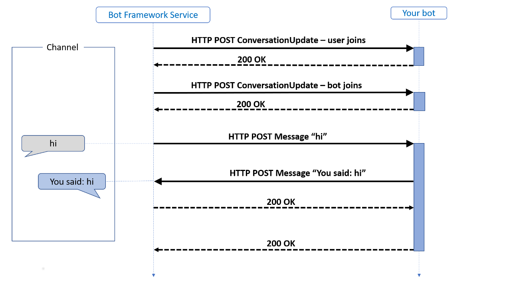
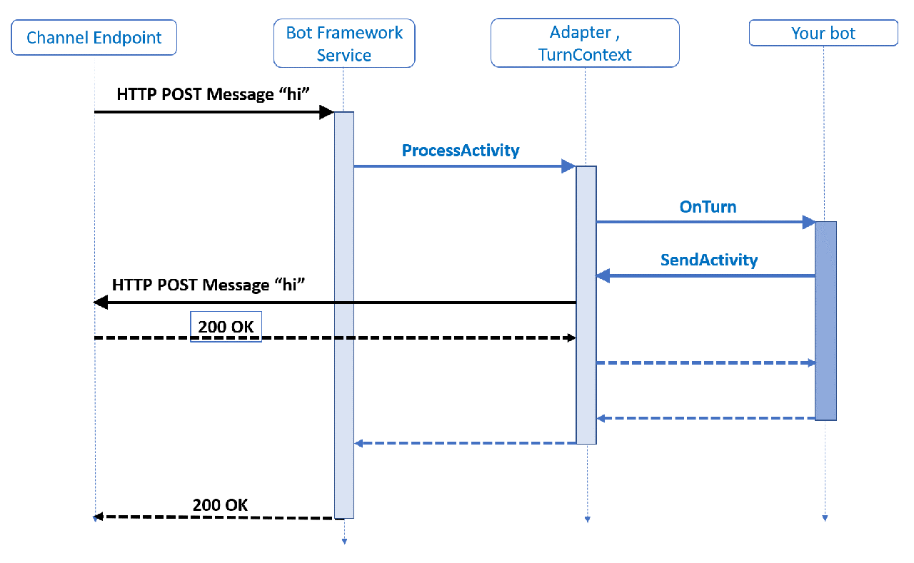

## はじめに
久しぶりに Bot Service について調べてみたら、いろいろ進化していたのでそのメモ。

SDKのドキュメント：[Bot Framework SDK のドキュメント - Bot Service | Microsoft Docs](https://docs.microsoft.com/ja-jp/azure/bot-service/index-bf-sdk?view=azure-bot-service-4.0)

## Virtual Assistant とは
ボットをAzure上で開発する際の、ベストプラクティスを詰め込んだプロジェクトのテンプレート。
つまり、使えばたぶん便利だけど、使わなくても良い。

参考：[What is a Virtual Assistant?](https://microsoft.github.io/botframework-solutions/overview/virtual-assistant-solution/)

## Bot Framework Skills とは
ボットを再利用可能な機能の単位で分けたもの。各ボットから skill を呼び出して利用できる。
Microsoftからすでにいくつかのskillが提供されているが、日本語に対応しているかどうかはskillごとに異なる。おそらくほとんど対応していない。

参考：[What is a Bot Framework Skill?](https://microsoft.github.io/botframework-solutions/overview/skills/)

## 前提条件

* Visual Studio 2019 Community 版で開発
* 言語はC#を選択

## まず始めてみる

参考：[Bot Framework SDK for .NET を使用したボットの作成 - Bot Service | Microsoft Docs](https://docs.microsoft.com/ja-jp/azure/bot-service/dotnet/bot-builder-dotnet-sdk-quickstart?view=azure-bot-service-4.0&tabs=vs)

### Bot Service Emulator をインストール
[Bot Service Emulator](https://github.com/microsoft/BotFramework-Emulator/tree/master)

Bot Service Emulatorは、ローカルでボットをテストするためのツール。
上記サイトの「Download」にある「Github Releases」のページへ移動し、最新版のインストーラを取得し、インストールする。

### Bot Framework v4 SDK Templates をインストール

1. Visual Studioを起動し、メニューの「拡張機能」→「拡張機能の管理」をクリック。
1. 「Bot Framework v4 SDK Templates for Visual Studio」を検索し、ダウンロード。
1. Visual Studioを終了し、インストールを実行させる。
1. 再度 Visual Studioを起動する。

### 新しいプロジェクトの作成
Visual Studioのメニューの「ファイル」→「新規作成」→「プロジェクト」をクリック。
テンプレートとして、「Echo Bot (Bot Framework v4 - .NET Core 3.1)」を選ぶ。※.NET Core 2.1を選ばないように注意。


### プロジェクトを実行
ソリューションエクスプローラーで、プロジェクト名を選択して `F5` を押す。
するとプロジェクトがビルド＆実行される。実行されるとブラウザが起動し、`http://localhost:3978/` として以下のページが表示される。


実行時に起動したブラウザは、開いたままにしておく。不要なので閉じてしまいたいが、そうすると実行が終了してしまう。

### Bot Service Emulator でテストする

1. Bot Service Emulator を起動する。
1. 「Open Bot」のボタンを押す。
1. 「Bot URL」に `http://localhost:3978/api/messages` と入力する。他の項目は空白。
1. 「Connect」ボタンを押す。
1. チャットのテストができる。

Echo Bot は、こちらが送ったメッセージをそのまま返すだけのボットなので、送ったメッセージがそのまま返ってくればOK。

### そのほかのテンプレート
参考：[microsoft/BotBuilder-Samples](https://github.com/microsoft/BotBuilder-Samples/tree/main/generators/dotnet-templates)

Bot Framework v4 SDK Templates をインストールすると、Echo Bot の他にもテンプレートが追加される。
それぞれの名前と概要は以下の通り：

* Echo Bot
  * チャットに応答するだけのシンプルなテンプレート。まず初めにチャットボットを触る人向け。
* Core Bot
  * Bot Serviceにまつわる6つの機能が含まれたテンプレート。LUISとかDialogとか色々。
* Empty Bot
  * 最低限のソースが含まれているテンプレート。接続時に「Hello World!」と返す以外は何もしない。一からボットを構築したい人向け。

## ボットの仕組み
参考：[ボットのしくみ - Bot Service | Microsoft Docs](https://docs.microsoft.com/ja-jp/azure/bot-service/bot-builder-basics?view=azure-bot-service-4.0&tabs=csharp)

ユーザーとボットとの間で行われるやり取りに「アクティビティ」が発生する。
Bot Framework Serviceは、ユーザーがボットとの接続に使っているアプリ(Teamsとかの各チャネル)の情報をボットへ送る。
それぞれのチャネルは、固有の追加情報を含むことがある。
下図は、シンプルなEcho Botがどのようにアクティビティをやり取りするかを示している。

  
引用元：上記参考サイト

図には「conversation update」と「message」のアクティビティが書かれている。

 「conversation update」アクティビティは、ユーザーがボットとの会話を始めたときなどに送られてくる。
 ユーザーとボットの会話が始まった時は、2つの「conversation update」アクティビティが送られてくる。
 1つはユーザーの追加、もう1つはボットの追加である。

「message」アクティビティは、ユーザーとボット間のメッセージを運ぶ。メッセージはシンプルなテキストだったり、画像やカードだったりする。

### HTTPの詳細
アクティビティがBot Framework Serviceからボットに送られる際は、HTTP POSTリクエストの形になっている。
ボットはそのリクエストに対して、HTTP status 200を返す。ボットから返すアクティビティは、別のHTTP POSTリクエストとしてBot Framework Serviceへ送る。
それに対して、Bot Framework Serviceから HTTP status 200が返ってくる。

ボットは、リクエストを受け取ってから15秒以内に HTTP status 200 を返さなくてはいけない。もし返せなかった場合は、HTTP GatewayTimeout(504)がおこる。

### ターン
基本的に、ユーザーとボットのやり取りは、ユーザーのメッセージにボットが応答する形になる。
この行きかえりのやりとりを「ターン」という。
「ターンコンテキスト(turn context)」オブジェクトは、アクティビティに関する情報を提供してくれる(送受信者、チャネルなど)。

### アクティビティの処理スタック

引用元：[ボットのしくみ - Bot Service | Microsoft Docs](https://docs.microsoft.com/ja-jp/azure/bot-service/bot-builder-basics?view=azure-bot-service-4.0&tabs=csharp)

先ほどのEcho Botのやり取りの図をもう少し深入りしたのがこちら。

この例では、ボットが受け取ったメッセージをそのまま送り返している。
処理は、アクティビティ情報が込められたJSON形式のHTTP POSTリクエストが、Webサーバーへ届くところから始まる。
Webサーバーというのは、C#ではASP.NETのプロジェクトで、Node.jsではExpressとかRestifyなどのフレームワークになる。

アダプターは、SDKのコアとなるコンポーネントである。アクティビティはJSON形式でリクエストのボディ部に入っている。
JSONはデシリアライズされ、アクティビティオブジェクトになる。そしてアダプターがアクティビティのメソッドを呼び出したりする。
アダプターはturn contextを生成し、ミドルウェアを呼び出したりする。

turn contextは、ボットがアウトバウンド(ボット→ユーザー)アクティビティを送るための機能を提供する。
他にもアクティビティを更新・削除するためのメソッドも提供していて、それぞれのメソッドは非同期で実行される。

ただ、ボットの処理の終わりにはcontextオブジェクトが破棄されるため、
アクティビティ関連のメソッドを実行する際は、awaitを付けてメソッドの処理が終わるのを確実に待たないといけない。

## Activity Handler
アクティビティは、ActivityHandlerで処理する。ボットを作る場合、このActivityHandlerを拡張して会話を実装していく。
ActivityHandlerには各イベントごとにメソッドがあるので、それぞれをオーバーライドして拡張していく感じ。
C#でテンプレートを使って新しいプロジェクトを作った場合、ActivityHandlerを継承したクラスが既に作られている。`EmptyBot` とか、`EchoBot`がそれにあたる。

### 基本形
Echo Bot のActivityHandlerが参考になる。

```csharp
namespace EchoBot1.Bots
{
    public class EchoBot : ActivityHandler
    {
        protected override async Task OnMessageActivityAsync(ITurnContext<IMessageActivity> turnContext, CancellationToken cancellationToken)
        {
            var replyText = $"Echo: {turnContext.Activity.Text}";
            await turnContext.SendActivityAsync(MessageFactory.Text(replyText, replyText), cancellationToken);
        }

        protected override async Task OnMembersAddedAsync(IList<ChannelAccount> membersAdded, ITurnContext<IConversationUpdateActivity> turnContext, CancellationToken cancellationToken)
        {
            var welcomeText = "Hello and welcome!";
            foreach (var member in membersAdded)
            {
                if (member.Id != turnContext.Activity.Recipient.Id)
                {
                    await turnContext.SendActivityAsync(MessageFactory.Text(welcomeText, welcomeText), cancellationToken);
                }
            }
        }
    }
}
```

### イベントハンドラ
主に使うのは、おそらく以下の2つ。

|メソッド名|説明|
|---|---|
|`OnMembersAddedAsync`|ユーザーが新しくボットに接続した(会話をはじめた)|
|`OnMessageActivityAsync`|メッセージアクティビティを受信した。メッセージのやり取りはここで処理する。|

## ボット側からメッセージを送る
参考：[ユーザーへのプロアクティブな通知の送信 - Bot Service | Microsoft Docs](https://docs.microsoft.com/ja-jp/azure/bot-service/bot-builder-howto-proactive-message?view=azure-bot-service-4.0&tabs=csharp)
チャットボットは、基本的にユーザーから会話が始まりボットは返信するだけだが、ボット側からメッセージを送ることもできる。
「プロアクティブな通知」というらしい。
