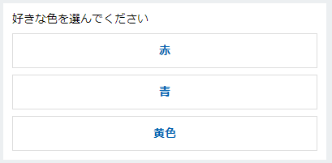

## Adaptive Card とは
ボットからユーザーへ送信できるメッセージの一つで、ボタンとか画像とか色々含めたカードのようなUI。
JSON形式で定義する。

[Adaptive Cardのサイト](https://adaptivecards.io/)

Bot Framework SDK においては、コードでカードを作ることもできるし、JSONをパースしてカードを作ることもできる。

前提条件：

* C#

## JSONからカードを作る

[Adaptive Card の Designer](https://adaptivecards.io/designer/) で、カードを作る。


左上の「Select host app:」の選択肢によって、それぞれの環境でどう見えるかが変化する。

また、host app によって、サポートしている Adaptive Card のバージョンが異なる場合がある。
そのときは、カードのプレビューの下あたりに警告が表示される。
例えば WebChat がサポートするバージョンが 1.2 の場合、Target Version が 1.3 になっている状態でカードを作っても、
いざボットに取り込んだときに空のカードになってしまったりする。

作ったカードのJSONは、ボットのプロジェクトへjsonファイルとして配置する。
今回は、`Cards/AdaptiveCard.json` に置いたと仮定する。

そのjsonファイルを読み込んで送信するサンプルが下記。

```csharp
var paths = new[] { ".", "Cards", "AdaptiveCard.json" };
var adaptiveCardJson = File.ReadAllText(Path.Combine(paths));

var adaptiveCardAttachment = new Attachment()
{
    ContentType = "application/vnd.microsoft.card.adaptive",
    Content = JsonConvert.DeserializeObject(adaptiveCardJson),
};

var message = MessageFactory.Attachment(adaptiveCardAttachment);

await turnContext.SendActivityAsync(message, cancellationToken);
```

## サンプル

### ボタンを表示する

```json
{
  "type": "AdaptiveCard",
  "$schema": "http://adaptivecards.io/schemas/adaptive-card.json",
  "version": "1.2",
  "body": [
    {
      "type": "TextBlock",
      "text": "好きな色を選んでください",
      "wrap": true
    }
  ],
  "actions": [
    {
      "type": "Action.Submit",
      "title": "赤",
      "data": "赤"
    },
    {
      "type": "Action.Submit",
      "title": "青",
      "data": "青"
    },
    {
      "type": "Action.Submit",
      "title": "黄色",
      "data": "黄色"
    }
  ]
}
```

↓WebChatでの見た目：  


このサンプルは、Teamsでは上手く動作しない。詳細は Teams の章を参照。

### ボタンにリンクを貼る

```json
{
  "type": "Action.OpenUrl",
  "title": "Open Url",
  "url": "https://www.yahoo.co.jp/"
}
```

このサンプルは Teams でも動作する。

## Teams
[Add card actions in a bot - Teams | Microsoft Docs](https://docs.microsoft.com/en-us/microsoftteams/platform/task-modules-and-cards/cards/cards-actions)

Teams の場合、`Action.Submit` などが上記サンプルのままでは使用できない。ボタンは表示されるものの、押しても `data` の内容がボット側へ送信されない。
動作させるためには、`data` プロパティに `msteams` と名前の付いたjsonオブジェクトを定義しないといけない。

### imBack を送る
imBack は、`value` プロパティに指定した文字列を、ユーザーが発言したものとして送る。`value` プロパティは、文字列のみ指定可能。

```json
{
  "type": "Action.Submit",
  "title": "Click me for imBack",
  "data": {
    "msteams": {
        "type": "imBack",
        "value": "Text to reply in chat"
    }
  }
}
```

### messageBack を送る
messageBack は、チャットストリームに流すテキスト、ボットへ送るデータ、ボットへ送る文字列、それぞれを指定できる。

```json
{
  "type": "Action.Submit",
  "title": "Click me for messageBack",
  "data": {
    "msteams": {
        "type": "messageBack",
        "displayText": "I clicked this button",
        "text": "text to bots",
        "value": "{\"bfKey\": \"bfVal\", \"conflictKey\": \"from value\"}"
    }
  }
}
```

ボットへ送られるメッセージには `replyToId` プロパティがあり、これがユーザーがボタンをおしたカードのメッセージIDになる。
これを使って、送信済みのメッセージを編集したりできる。

## 参考
[Using Adaptive Cards with the Microsoft Bot Framework - Microsoft Bot Framework](https://blog.botframework.com/2019/07/02/using-adaptive-cards-with-the-microsoft-bot-framework/)
