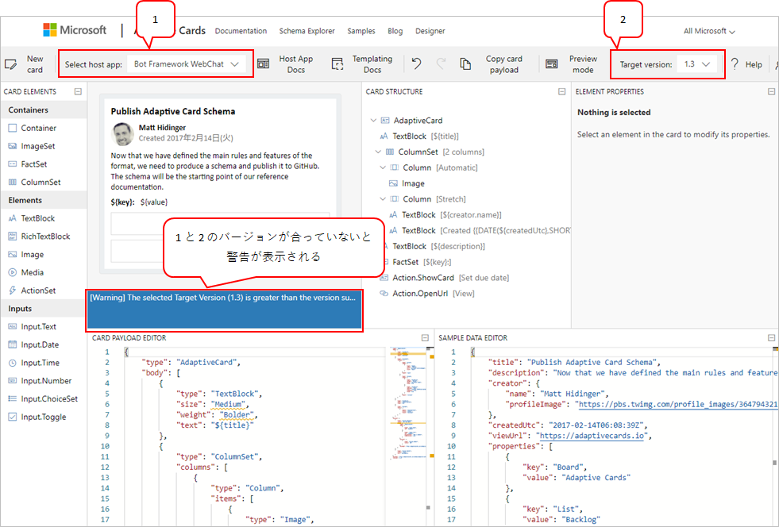
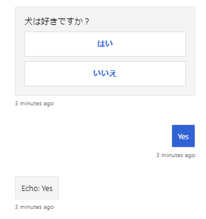
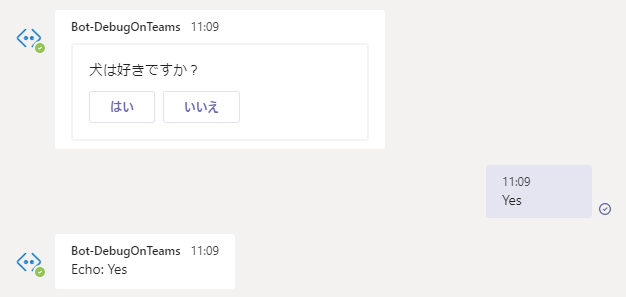
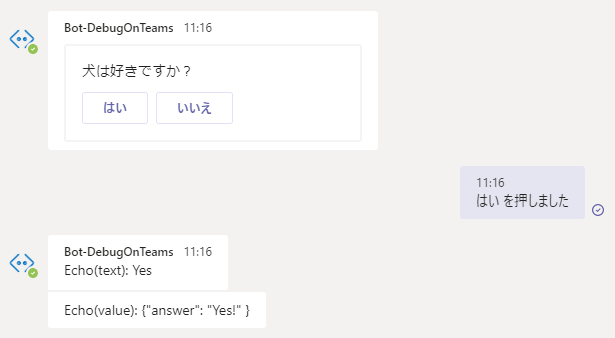
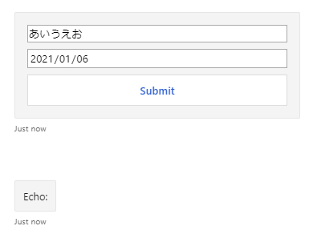
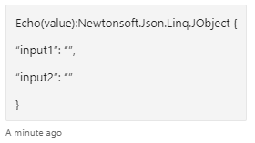

## Adaptive Card とは
ボットからユーザーへ送信できるメッセージの一つで、ボタンとか画像とか色々含めたカードのこと。
JSON形式で定義し、カードは色々なプラットフォームで使用できる。

[Adaptive Cardのサイト](https://adaptivecards.io/)

Bot Framework SDK においては、コードでカードを作ることもできるし、JSONをパースしてカードを作ることもできる。

前提条件：

* Windows 10
* Visual Studio 2019
* C#

## 環境設定

### jsonの文字コードをUTF-8にする
Visual Studio 2019 では、jsonファイルの文字コードが Shift-JIS になっている可能性があるので、その場合は UTF-8 へ変更しておく。
ソリューション or プロジェクト単位で設定するなら、.editorconfig ファイルを作成し、以下の設定を追加しておく。

```
# json files
[*.json]
charset = utf-8
```

## JSON からカードを作る

### カードを設計する
[Adaptive Card の Designer](https://adaptivecards.io/designer/) で、カードを作る。



左上の「Select host app:」の選択肢によって、Teams や WebChat それぞれの環境でどう見えるかを確認できる。

また、host app によって、サポートしている Adaptive Card のバージョンが異なる場合がある。
そのときは、カードのプレビューの下あたりに警告が表示される。
例えば WebChat がサポートするバージョンが 1.2 の場合、Target Version が 1.3 になっている状態でカードを作っても、いざボットから送信したときに空のカードになってしまったりする。

### ボットからカードを送信する

作ったカードのJSONは、ボットのプロジェクトへjsonファイルとして配置する。
今回は、`Cards/AdaptiveCard.json` に置いたと仮定する。

そのjsonファイルを読み込んで送信するサンプルが下記。

```csharp
var paths = new[] { ".", "Cards", "AdaptiveCard.json" };
var adaptiveCardJson = File.ReadAllText(Path.Combine(paths));

var adaptiveCardAttachment = new Attachment()
{
    ContentType = "application/vnd.microsoft.card.adaptive",
    Content = JsonConvert.DeserializeObject(adaptiveCardJson),
};

var message = MessageFactory.Attachment(adaptiveCardAttachment);

await turnContext.SendActivityAsync(message, cancellationToken);
```

## Action.Submit
Adaptive Card に付けられるボタン。カードを受け取ったユーザーがボタンを押すと、ボットへ何かしらのデータを送る機能。入力フィールドと一緒に使ったりする。
submit時に送信できるデータ形式は、文字列とオブジェクトの2種類がある。

### 文字列のsubmit
actions の data プロパティに文字列を指定した場合、その内容がユーザーが通常送るメッセージと同様にボットへ送信される。

例として、下記のようなカードを作成した。

```json
{
  "type": "AdaptiveCard",
  "$schema": "http://adaptivecards.io/schemas/adaptive-card.json",
  "version": "1.2",
  "actions": [
    {
      "type": "Action.Submit",
      "title": "はい",
      "data": "Yes"
    },
    {
      "type": "Action.Submit",
      "title": "いいえ",
      "data": "No"
    }
  ],
  "body": [
    {
      "type": "TextBlock",
      "text": "犬は好きですか？",
      "wrap": true
    }
  ]
}
```

カードに Submit ボタンが2つあり、それぞれ data プロパティに「Yes」と「No」が設定してある。
これを エミュレーターでテストすると、下記のようなカードが表示される。



「はい」のボタンを押すと、ユーザーが「Yes」と発言したのと同様の動作をする。つまり、ユーザーの回答を取得したいなら、Activity の text プロパティを取得すればよい。
下記にボットのサンプルを示す。

```cs
using Microsoft.Bot.Builder;
using Microsoft.Bot.Schema;
using Newtonsoft.Json;
using System.Collections.Generic;
using System.IO;
using System.Threading;
using System.Threading.Tasks;

namespace AdaptiveCards.Bots
{
    public class EchoBot : ActivityHandler
    {
        protected override async Task OnMessageActivityAsync(ITurnContext<IMessageActivity> turnContext, CancellationToken cancellationToken)
        {
            var replyText = $"Echo: {turnContext.Activity.Text}";
            await turnContext.SendActivityAsync(MessageFactory.Text(replyText, replyText), cancellationToken);
        }

        protected override async Task OnMembersAddedAsync(IList<ChannelAccount> membersAdded, ITurnContext<IConversationUpdateActivity> turnContext, CancellationToken cancellationToken)
        {
            var paths = new[] { ".", "Cards", "SubmitString.json" };
            var adaptiveCardJson = File.ReadAllText(Path.Combine(paths));

            var adaptiveCardAttachment = new Attachment()
            {
                ContentType = "application/vnd.microsoft.card.adaptive",
                Content = JsonConvert.DeserializeObject(adaptiveCardJson),
            };

            var message = MessageFactory.Attachment(adaptiveCardAttachment);

            foreach (var member in membersAdded)
            {
                if (member.Id != turnContext.Activity.Recipient.Id)
                {
                    await turnContext.SendActivityAsync(message, cancellationToken);
                }
            }
        }
    }
}
```

EchoBot の Welcome メッセージとして Adaptive Card を送っているだけである。

#### Teams
[Add card actions in a bot - Teams | Microsoft Docs](https://docs.microsoft.com/en-us/microsoftteams/platform/task-modules-and-cards/cards/cards-actions)

Action.Submit を Teams で使う場合、上記サンプルではボタンが表示されるものの、data プロパティの内容がボット側へ送信されない。
動作させるためには、data プロパティに msteams と名前の付いたjsonオブジェクトを定義しないといけない。

msteams の type プロパティによって、ボタンを押したときの挙動が異なる。

imBack は、value プロパティに指定した文字列を、ユーザーが発言したものとして送る。value プロパティは、文字列のみ指定可能。

```json
{
  "type": "Action.Submit",
  "title": "はい",
  "data": {
    "msteams": {
      "type": "imBack",
      "value": "Yes"
    }
  }
}
```



messageBack は、会話履歴に流す文字列、ボットへ送る文字列、ボットへ送るデータ、それぞれを指定できる。

```json
{
  "type": "Action.Submit",
  "title": "はい",
  "data": {
    "msteams": {
      "type": "messageBack",
      "displayText": "はい を押しました",
      "text": "Yes",
      "value": {
        "answer": "Yes!"
      }
    }
  }
}
```



### オブジェクトのsubmit
オブジェクトの submit は、非表示のデータをユーザーからボットへ送信する。
例として、入力フィールドを2つ持つカードを下記に示す。

```json
{
    "type": "AdaptiveCard",
    "$schema": "http://adaptivecards.io/schemas/adaptive-card.json",
    "version": "1.2",
    "body": [
        {
            "type": "Input.Text",
            "placeholder": "Placeholder text",
            "id": "input1"
        },
        {
            "type": "Input.Date",
            "id": "input2"
        }
    ],
    "actions": [
        {
            "type": "Action.Submit",
            "title": "Submit"
        }
    ]
}
```

これを先ほどと同じように、Echo Bot の Welcome メッセージとして送信し、エミュレーターでテストすると下記のようになる。



ユーザーはなにも発言しないし、ボット側で Activity の text プロパティを参照しても何も出てこない。

かわりに Activity の value プロパティにデータが入る。上記カードの場合、下記のような内容になっている。



入力フィールドの内容が json にまとめられ、JObject 型で格納されている。

#### ダイアログでの利用
ユーザーの入力を受け付ける流れを、Adaptive Card を使いつつ Dialog で実装する例を以下に示す。

通常、ボットがユーザーの入力を受け付けるときには Prompt を使用する。Adaptive Card を使う場合でも、同じように Prompt を使用できる。
ただオブジェクトの submit の場合、データは value プロパティ経由で送られてくるので、TextPrompt などに備わっている Validator はうまく機能しない。そのため、Validator も自分で実装する必要がある。

以下に、Dialog クラスのサンプルを示す。

```cs
using Microsoft.Bot.Builder;
using Microsoft.Bot.Builder.Dialogs;
using Microsoft.Bot.Schema;
using Newtonsoft.Json;
using Newtonsoft.Json.Linq;
using System;
using System.Collections.Generic;
using System.IO;
using System.Linq;
using System.Threading;
using System.Threading.Tasks;

namespace AdaptiveCards.Dialogs
{
    public class SubmitObjectDialog : ComponentDialog
    {
        public SubmitObjectDialog() : base("SubmitObjectDialog")
        {
            // dialogの登録
            var steps = new WaterfallStep[] { Step1Async, Step2Async };

            AddDialog(new WaterfallDialog("WaterfallDialog1", steps));
            AddDialog(new TextPrompt("TextPrompt", FormValidator)); // 自分でValidatorを実装する

            // 最初に実行するdialogを指定する
            InitialDialogId = "WaterfallDialog1";
        }

        private async Task<DialogTurnResult> Step1Async(WaterfallStepContext stepContext, CancellationToken cancellationToken)
        {
            var paths = new[] { ".", "Cards", "SubmitObject.json" };
            var adaptiveCardJson = File.ReadAllText(Path.Combine(paths));

            var adaptiveCardAttachment = new Attachment()
            {
                ContentType = "application/vnd.microsoft.card.adaptive",
                Content = JsonConvert.DeserializeObject(adaptiveCardJson),
            };

            var message = MessageFactory.Attachment(adaptiveCardAttachment);

            return await stepContext.PromptAsync("TextPrompt", new PromptOptions { Prompt = (Activity)message }, cancellationToken);
        }

        private async Task<DialogTurnResult> Step2Async(WaterfallStepContext stepContext, CancellationToken cancellationToken)
        {
            JObject value = (JObject)stepContext.Context.Activity.Value;

            var message = MessageFactory.Text($"Echo: {value}");
            await stepContext.Context.SendActivityAsync(message, cancellationToken);

            return await stepContext.EndDialogAsync(cancellationToken: cancellationToken);
        }

        private Task<bool> FormValidator(PromptValidatorContext<string> promptContext, CancellationToken cancellationToken)
        {
            // textプロパティに値は入ってこないのでfalse
            if (promptContext.Recognized.Succeeded)
            {
                return Task.FromResult(false);
            }

            var value = promptContext.Context.Activity.Value;

            if (!(value is JObject))
            {
                return Task.FromResult(false);
            }

            return Task.FromResult(true);
        }
    }
}
```

## 参考
[Using Adaptive Cards with the Microsoft Bot Framework - Microsoft Bot Framework](https://blog.botframework.com/2019/07/02/using-adaptive-cards-with-the-microsoft-bot-framework/)
