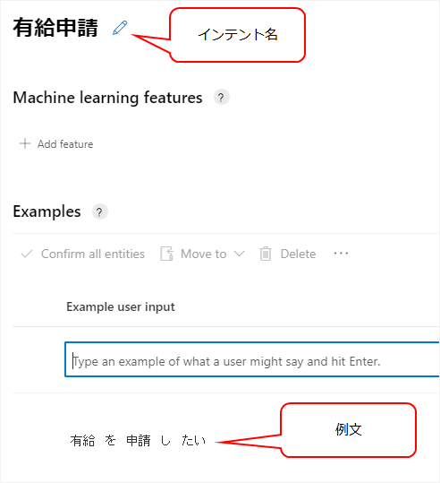
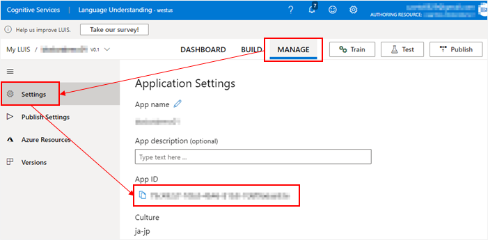
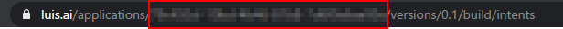
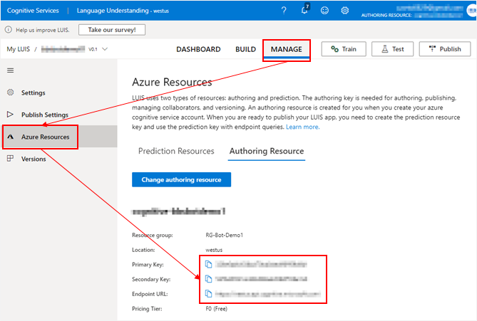

## LUIS を使う
あらかじめ、[LUIS ポータルサイト](https://www.luis.ai/) でアプリケーションとインテント等の定義を作っておく。
今回は、下記のようなシンプルなインテントを作っておいた。



LUIS ポータルサイトで、アプリケーションID、エンドポイント、エンドポイントキーの3つを取得する。

アプリケーションIDは、アプリケーションの設定画面で取得できる。



もしくは、該当アプリケーションのページを見ているときのURLからも取得できる。



エンドポイント、エンドポイントキーは Azure Resources のページで取得できる。この2つは Azure ポータルサイトの Cognitive Service のリソースからも取得できる。



次に、RootDialog.cs に LUIS の Recognizer、Trigger などを追加する。

```cs {hl_lines=["15-20","26-32"]}
namespace AdaptiveDialogs.Dialogs
{
    public class RootDialog : AdaptiveDialog
    {
        public RootDialog(IConfiguration configuration) : base(nameof(RootDialog))
        {
            Recognizer = new RecognizerSet()
            {
                Recognizers =
                {
                    new QnAMakerRecognizer()
                    {
                        // 略
                    },
                    new LuisAdaptiveRecognizer()
                    {
                        ApplicationId = configuration["luis:applicationId"],
                        EndpointKey = configuration["luis:endpointKey"],
                        Endpoint = configuration["luis:endpoint"]
                    }
                }
            };

            Triggers = new List<OnCondition>
            {
                new OnIntent("有給申請")
                {
                    Actions = new List<Dialog>()
                    {
                        new SendActivity("だめ！")
                    }
                },
                new OnQnAMatch()
                {
                    Actions = new List<Dialog>()
                    {
                        new SendActivity()
                        {
                            Activity = new ActivityTemplate("${@answer}"),
                        }
                    }
                },
                new OnQnAMatch()
                {
                    Condition = "count(turn.recognized.answers[0].context.prompts) > 0",
                    Actions = QnAMakerMultiTurnStep()
                },
                new OnUnknownIntent()
                {
                    Actions =
                    {
                        new SendActivity("nothing!")
                    }
                },
            };

            string[] paths = { ".", "Dialogs", "RootDialog.lg" };
            string fullPath = Path.Combine(paths);

            Generator = new TemplateEngineLanguageGenerator(Templates.ParseFile(fullPath));

        }

        // 略
    }
}
```

これで、「有給申請したい」とボットに話しかけると、「だめ！」と返事をしてくれる。
(このサンプルの場合、LUIS に登録した例文が少なすぎて、何を言っても「だめ！」と返すが…)

## .lu ファイル形式
.lu ファイルは、LUISポータルサイトで行う Intent や Entity の定義を Markdown に似た形式で記述するもの。
ボットのソースと一緒に管理できて、Bot Framework の CLI ツールをインストールすれば、CLI から定義をパブリッシュできる。
定義が多くなってくると、ポータルサイトでメンテナンスするより、手元のファイルで管理できた方が楽かもしれない。

参考：[.lu file format - Bot Service | Microsoft Docs](https://docs.microsoft.com/en-us/azure/bot-service/file-format/bot-builder-lu-file-format)

### コメント

```
>
```

### インテント

```
# Greeting
- Hi
- Hello
- Good morning
- Good evening
```

### エンティティ

```
@ <entity-type> <entity-name> [[hasRole[s]] <comma-separated-list-of-roles>] [hasFeature[s] <comma-separated-list-of-features>]
```
