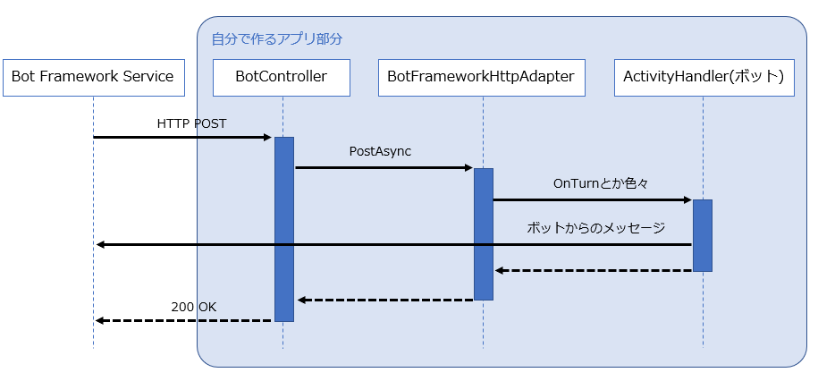

## 前提条件

* Visual Studio 2019 Community 版で開発
* 言語はC#を選択

## ボットのしくみ
参考：[ボットのしくみ - Bot Service | Microsoft Docs](https://docs.microsoft.com/ja-jp/azure/bot-service/bot-builder-basics?view=azure-bot-service-4.0&tabs=csharp)

ユーザーとボットとの間で行われるやり取りの一つ一つを「アクティビティ」と呼ぶ。
Bot Framework Serviceは、ユーザーがボットとの接続に使っているアプリ(Teamsとかの各チャネル)の情報をボットへ送る。
それぞれのチャネルは、固有の追加情報を含むことがある。
下図は、シンプルなEcho Botがどのようにアクティビティをやり取りするかを示している。

  
引用元：上記参考サイト

図には「conversation update」と「message」のアクティビティが書かれている。

 「conversation update」アクティビティは、ユーザーがボットとの会話を始めたときなどに送られてくる。
 ユーザーとボットの会話が始まった時は、2つの「conversation update」アクティビティが送られてくる。
 1つはユーザーの追加、もう1つはボットの追加である。

「message」アクティビティは、ユーザーとボット間のメッセージを運ぶ。メッセージはシンプルなテキストだったり、画像やカードだったりする。

### HTTPの詳細
アクティビティがBot Framework Serviceからボットに送られる際は、HTTP POSTリクエストの形になっている。
ボットはそのリクエストに対して、HTTP status 200を返す。ボットから返すアクティビティは、別のHTTP POSTリクエストとしてBot Framework Serviceへ送る。
それに対して、Bot Framework Serviceから HTTP status 200が返ってくる。

ボットは、リクエストを受け取ってから15秒以内に HTTP status 200 を返さなくてはいけない。もし返せなかった場合は、HTTP GatewayTimeout(504)がおこる。

### ターン
基本的に、ユーザーとボットのやり取りは、ユーザーのメッセージにボットが応答する形になる。
この行きかえりのやりとりを「ターン」という。
「ターンコンテキスト(turn context)」オブジェクトは、アクティビティに関する情報を提供してくれる(送受信者、チャネルなど)。

## アクティビティを処理する流れ
アクティビティをWebアプリケーション側で処理する流れを下図に示した。



Webアプリケーションは、C#のASP.NETのプロジェクトだったり、Node.jsのExpressやRestifyなどのフレームワークを使用したアプリだったりする。
これはAzureポータルでBot Serviceを作るときに選択したSDK言語によって変わる。

Bot Service がユーザーからのメッセージを受け取ると、WebアプリケーションへHTTP POSTリクエストを送る。
リクエストにはJSON形式のデータが含まれている。

WebアプリケーションのControllerクラスがそのリクエストを受け取ると、Adapterクラスの処理を呼び出す。
AdapterクラスがSDKのコアとなるコンポーネントで、このクラスがリクエストをデシリアライズし、TurnContextを生成したり、ActivityHandlerクラスのメソッドを呼び出したりする。

TurnContextは、ボットがアウトバウンド(ボット→ユーザー)アクティビティを送るための機能を提供する。
他にもアクティビティを更新・削除するためのメソッドも提供していて、それぞれのメソッドは非同期で実行される。

ただ、ボットの処理の終わりにはcontextオブジェクトが破棄されるため、
アクティビティ関連のメソッドを実行する際は、awaitを付けてメソッドの処理が終わるのを確実に待たないといけない。

## Activity Handler
いわゆるボットクラス。ここでインバウンドのメッセージを処理して、どんなアウトバウンドのメッセージを返すかを実装する。

アクティビティの処理は、AdapterからActivityHandlerに渡される。ボットを作るときは、このActivityHandlerを拡張してロジックを実装していく。
ActivityHandlerには各イベントごとにメソッドがあるので、それぞれをオーバーライドして拡張していく感じ。
それぞれのメソッドに既存のロジックはないので、シンプルにメソッドをオーバーライドすれば良い(一部例外あり)。

C#でテンプレートを使って新しいプロジェクトを作った場合、ActivityHandlerを継承したクラスが既に作られている。`EmptyBot` とか、`EchoBot`がそれにあたる。

### 基本形
Echo Bot のActivityHandlerが参考になる。

```csharp
namespace EchoBot1.Bots
{
    public class EchoBot : ActivityHandler
    {
        protected override async Task OnMessageActivityAsync(ITurnContext<IMessageActivity> turnContext, CancellationToken cancellationToken)
        {
            var replyText = $"Echo: {turnContext.Activity.Text}";
            await turnContext.SendActivityAsync(MessageFactory.Text(replyText, replyText), cancellationToken);
        }

        protected override async Task OnMembersAddedAsync(IList<ChannelAccount> membersAdded, ITurnContext<IConversationUpdateActivity> turnContext, CancellationToken cancellationToken)
        {
            var welcomeText = "Hello and welcome!";
            // ユーザーとボットが会話に参加した場合、ボットについても当メソッドが呼び出されるので、
            // メンバーidがボットと同一でない場合だけ、挨拶を送信するようになっている。
            foreach (var member in membersAdded)
            {
                if (member.Id != turnContext.Activity.Recipient.Id)
                {
                    await turnContext.SendActivityAsync(MessageFactory.Text(welcomeText, welcomeText), cancellationToken);
                }
            }
        }
    }
}
```

