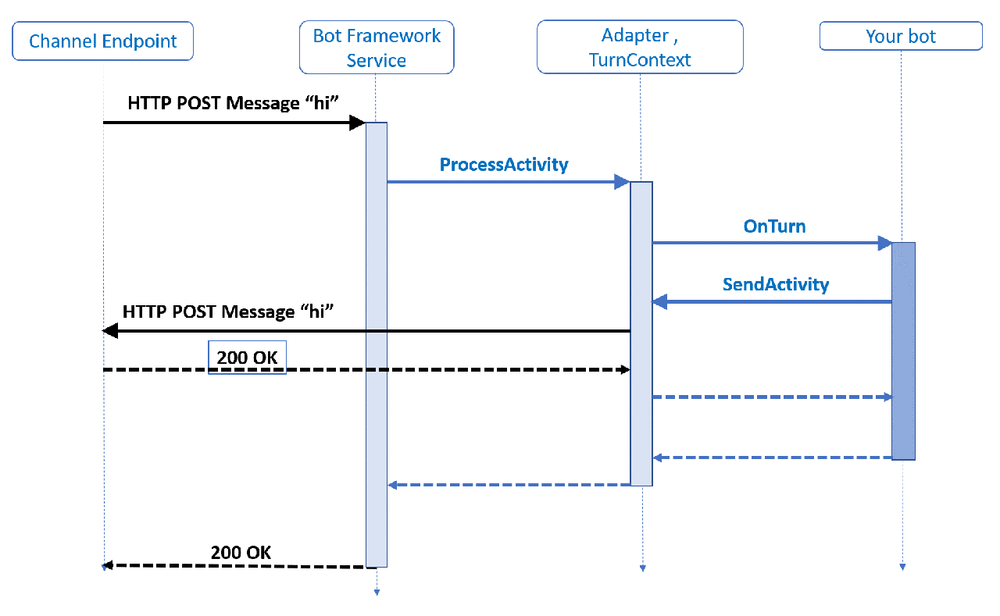

## ボットのしくみ
参考：[ボットのしくみ - Bot Service | Microsoft Docs](https://docs.microsoft.com/ja-jp/azure/bot-service/bot-builder-basics?view=azure-bot-service-4.0&tabs=csharp)

ユーザーとボットとの間で行われるやり取りに「アクティビティ」が発生する。
Bot Framework Serviceは、ユーザーがボットとの接続に使っているアプリ(Teamsとかの各チャネル)の情報をボットへ送る。
それぞれのチャネルは、固有の追加情報を含むことがある。
下図は、シンプルなEcho Botがどのようにアクティビティをやり取りするかを示している。

  
引用元：上記参考サイト

図には「conversation update」と「message」のアクティビティが書かれている。

 「conversation update」アクティビティは、ユーザーがボットとの会話を始めたときなどに送られてくる。
 ユーザーとボットの会話が始まった時は、2つの「conversation update」アクティビティが送られてくる。
 1つはユーザーの追加、もう1つはボットの追加である。

「message」アクティビティは、ユーザーとボット間のメッセージを運ぶ。メッセージはシンプルなテキストだったり、画像やカードだったりする。

### HTTPの詳細
アクティビティがBot Framework Serviceからボットに送られる際は、HTTP POSTリクエストの形になっている。
ボットはそのリクエストに対して、HTTP status 200を返す。ボットから返すアクティビティは、別のHTTP POSTリクエストとしてBot Framework Serviceへ送る。
それに対して、Bot Framework Serviceから HTTP status 200が返ってくる。

ボットは、リクエストを受け取ってから15秒以内に HTTP status 200 を返さなくてはいけない。もし返せなかった場合は、HTTP GatewayTimeout(504)がおこる。

### ターン
基本的に、ユーザーとボットのやり取りは、ユーザーのメッセージにボットが応答する形になる。
この行きかえりのやりとりを「ターン」という。
「ターンコンテキスト(turn context)」オブジェクトは、アクティビティに関する情報を提供してくれる(送受信者、チャネルなど)。

### アクティビティの処理スタック

引用元：[ボットのしくみ - Bot Service | Microsoft Docs](https://docs.microsoft.com/ja-jp/azure/bot-service/bot-builder-basics?view=azure-bot-service-4.0&tabs=csharp)

先ほどのEcho Botのやり取りの図をもう少し深入りしたのがこちら。

この例では、ボットが受け取ったメッセージをそのまま送り返している。
処理は、アクティビティ情報が込められたJSON形式のHTTP POSTリクエストが、Webサーバーへ届くところから始まる。
Webサーバーというのは、C#ではASP.NETのプロジェクトで、Node.jsではExpressとかRestifyなどのフレームワークになる。

アダプターは、SDKのコアとなるコンポーネントである。アクティビティはJSON形式でリクエストのボディ部に入っている。
JSONはデシリアライズされ、アクティビティオブジェクトになる。そしてアダプターがアクティビティのメソッドを呼び出したりする。
アダプターはturn contextを生成し、ミドルウェアを呼び出したりする。

turn contextは、ボットがアウトバウンド(ボット→ユーザー)アクティビティを送るための機能を提供する。
他にもアクティビティを更新・削除するためのメソッドも提供していて、それぞれのメソッドは非同期で実行される。

ただ、ボットの処理の終わりにはcontextオブジェクトが破棄されるため、
アクティビティ関連のメソッドを実行する際は、awaitを付けてメソッドの処理が終わるのを確実に待たないといけない。
