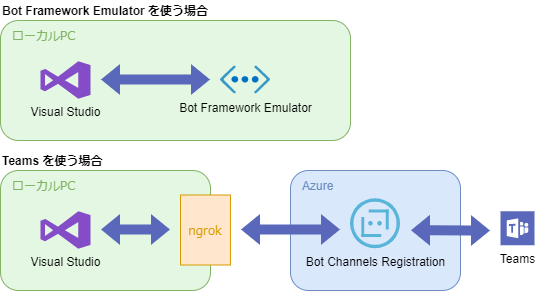
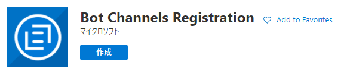
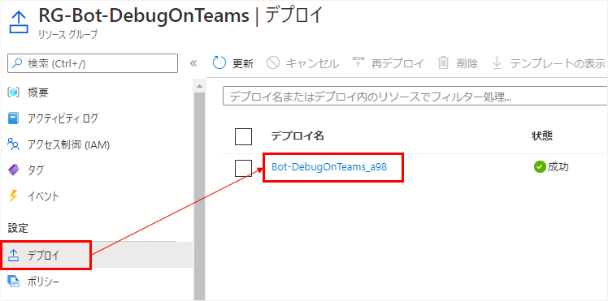
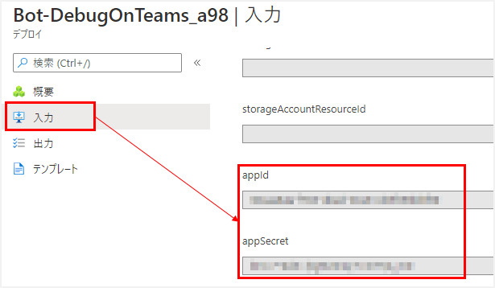
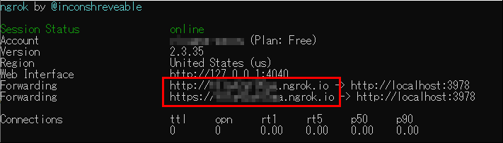
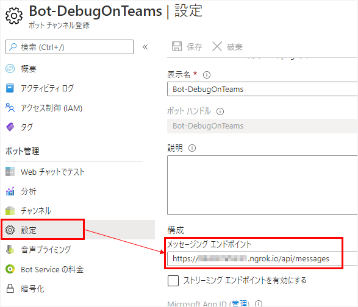

## 概要
ローカルでボットをテストする場合、Bot Framework Emulator を使えば基本的なデバッグは行える。
ただこれでは、Teams など特定のアプリと接続したときの検証はできない。
本記事では、ローカルにあるボットを Teams でデバッグする方法を記載する。

前提条件：

* Windows 10
* Visual Studio 2019
* Bot Framework SDK v4
* C#
* [ngrok](https://ngrok.com/) 登録＆インストール済み

構成のイメージ図は下記の通り。



## Bot Channels Registration の作成
Azure にボットを作成するとき、多くの場合は「Web アプリボット」から作成すると思う。
「Web アプリボット」はボットのチャネル部分(Web アプリボット)とアプリ部分(App Service)の2つを同時に作成するが、「Bot Channels Registration」は、Webアプリボットの部分だけを作成する。



このとき、「メッセージング エンドポイント」は空白で登録する。ngrok は起動のたびにURLが変わるので、その都度Azureに登録するURLも変えなければいけない。  
※ ngrok の有料プランを使っている場合はドメイン名を設定できるようなので、その場合は都度変更する必要がないかもしれない。

### appId などの取得
作成したボットチャネルがあるリソースグループのページへ戻り、「デプロイ」→右側にあるデプロイ名 をクリック。



デプロイのページへ移動するので、左のメニューの「入力」をクリック。
「appId」と「appSecret」の値をコピーする。



### secret.json の作成
Visual Studio のボット用プロジェクトを開き、プロジェクト名で右クリック → 「ユーザー シークレットの管理」をクリック。
すると secrets.json が開くので、下記サンプルのように書いて、先ほどコピーした appId と appSecret を入力する。

```json
{
  "MicrosoftAppId": "[appId]",
  "MicrosoftAppPassword": "[appSecret]"
}
```

参考 secrets.jsonについて：[ASP.NET Core での開発におけるアプリシークレットの安全な保存 | Microsoft Docs](https://docs.microsoft.com/ja-jp/aspnet/core/security/app-secrets?view=aspnetcore-5.0&tabs=windows)

## ボット起動
Visual Studio のボットアプリを起動する。起動と同時にブラウザが起動する設定にしている場合は、開いたブラウザをうっかり閉じたりしないように気を付ける。

## ngrok 起動
コマンドプロンプトで下記を実行。

```
ngrok http -host-header="localhost:3978" 3978
```

`-host-header` のオプションがないと、Webチャットでテストする際にボットから返事が来なかったりする。

### エンドポイントをボットチャネルに設定
ngrok 起動中に表示されるURLをコピーする。



Azure ポータルサイトでボットチャネルのページを開く。
左側のメニューの「設定」をクリック。「メッセージング エンドポイント」に先ほどコピーしたURLに `/api/messages` を付けたものを入力して保存する。



## Webチャットでテスト
ボットチャネルの「Webチャットでテスト」にて、メッセージの送受信が行えるか確認する。
無事に想定通りの動作をすれば、Azureとローカルのボットの間で対話ができている。

## Teams に接続
普通のボットと同じ方法で、Teamsに接続できる。

## 参考

* [Debug a channel using ngrok - Bot Service | Microsoft Docs](https://docs.microsoft.com/en-us/azure/bot-service/bot-service-debug-channel-ngrok)
* [【第4/5】Teams bot をローカル (Visual Studio 2019) で開発し、Azure で無料で動かす【その４：Teams に繋げてデバッグ編】 - Qiita](https://qiita.com/chomado/items/23c66a975e21265d99ae)