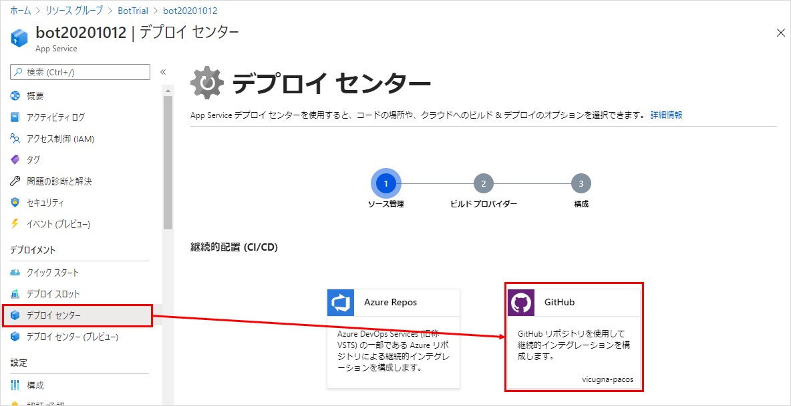

## はじめに
Azureにボットをデプロイできる環境を作る。
MSのドキュメントに掲載されている[CLIでデプロイする方法](https://docs.microsoft.com/ja-jp/azure/bot-service/bot-builder-deploy-az-cli?view=azure-bot-service-4.0&tabs=csharp)は難しそうなので、GitHubと連携してCIできる環境を作る。

前提条件：

* GitHubにボット用のリポジトリを作成して、ローカルへクローンしてある(空もしくはREADME.mdのみの状態)
* SDKの言語はC#を選択
* コード編集には Visual Studio 2019 Community 版を使用

## Azureにボットを作成する
Azureポータルで「リソースの作成」を選択し、「Web App Bot」を探して選択する。


ボット作成の画面になるので、必要事項を入力して「作成」を押す。


* ボットハンドル - ボットの名前。おそらくAzure全体で一意でなければいけない。チャンネルに接続するときなどに表示される名前。
* 価格 - F0(無料)推奨。後で変更可能。
* ボットテンプレート - Echo Bot 推奨。必要であれば別のテンプレートを選択する。
* Application Insights - オンにすると、ボットのログを記録できる。あとで日次データ量の制限をかけておくことを推奨。

作成後、しばらく待つとリソースが作成される。

## ボットのソースコードを取得する
※ ローカルで作成＆テスト済みのソースコードがあるなら、ソースコードの取得は必要ない。

作成された「Web App Bot」のリソースを選択し、「ビルド」→「ボットのソースコードをダウンロードする」をクリックする。


ソースコードにシークレットを含めるかどうか確認したあと、しばらく待つとzipファイルがダウンロードできる。
zipファイルを解凍した後、あらかじめクローンしておいたGitHubリポジトリへコピーする。
その後、ソースコードは全てコミット＆プッシュしておく。

## CIを設定する
Azureポータルにて、ボット作成時に一緒に作成された App Service の方のリソースを選択し、「デプロイ センター」をクリックする。



Azure と GitHub の連携が初めての場合、GitHubにログインしてAzureのアクセスを許可する手順がある。

それが完了した後、ビルドプロバイダーを選択するページになるので「GitHub Actions」を選択する。

次に構成を選択するページになるので、下記の通り選択する：

* 組織 - GitHubの組織、またはアカウントを選択する。
* リポジトリ - ボットのソースコードをコミットしたリポジトリを選択する。
* ブランチ - CIの対象になるブランチを指定。通常、mainになるかと思う。
* ランタイムスタック - アプリの言語を指定。今回は「.NET Core」を選択。
* バージョン - ソースコードのプロジェクトのプロパティを確認して、選択する。


最後に確認画面になるので、内容を確認して確定する。

確定後、GitHub側にデプロイ実行用のファイルが追加され、Actionが実行される。


## csファイルの文字コードを設定する
ソースコードからデプロイまでの流れができたので、ここからボットのカスタマイズに着手できる。
しかし Visual Studio はcsファイルの既定の文字コードがShift_JISなので、コード中に日本語のメッセージを書くと文字化けしてしまう。それを避けるため、プロジェクトに設定ファイルを追加して既定の文字コードを UTF-8 にしておく必要がある。


まず Visual Studio でソリューションを開き、プロジェクト直下で「新しい項目の追加」を選択する(ソリューションエクスプローラーでプロジェクトのフォルダを選択し、`Ctrl` + `Shift` + `A`)。

「新しい項目の追加」画面が開くので、検索欄に「editor」と入力する。そうすると「editorconfig ファイル」が出てくるので、それを選択して「追加」を押す。
ファイル名は既定の「.editorconfig」のままで良い。


プロジェクト直下に「.editorconfig」ファイルが追加されるので、ファイルを開いて内容を確認する。
「# Code files」の下にある `charset` が `utf-8-bom` となっていればOK。


「.editorconfig」はプロジェクトに対するテキストエディターの設定を統一するものなので、Visual Studio の設定より優先して適用される。
他の設定項目が煩わしかったら、下記だけにしても良いと思う。

```
[*.cs]
charset = utf-8-bom
```
