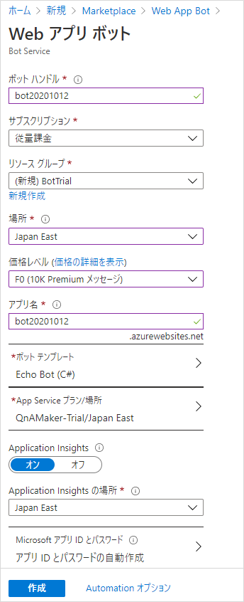
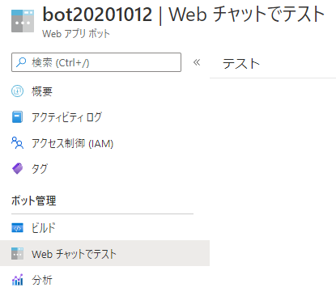

## はじめに
ローカルで開発したボットを、Azure へデプロイする手順を記載する。

前提条件：

* Windows 10
* Visual Studio 2019
* C#
* Azure のアカウント作成済み
* GitHub のアカウント作成済み

## Azure で Web App Bot を作成
Azureポータルで「リソースの作成」を選択し、「Web App Bot」を探して「作成」を押す。

ボット作成の画面になるので、必要事項を入力して「作成」を押す。

* ボットハンドル - ボットの名前。おそらくAzure全体で一意でなければいけない。チャンネルに接続するときなどに表示される名前。
* 価格レベル - F0(無料)推奨。後で変更可能。
* ボットテンプレート - ローカルのソースコードで上書きするのでどれでもいい。言語はC#を選択する。
* App Service プラン/場所 - ボットのアプリを載せるサーバーのようなもの。学習目的なら、他の App Service と同じものを使ってもいいし、新しく作ってもいい。
* Application Insights - オンにすると、ボットのログを記録できる。あとで日次データ量の制限をかけておくことを推奨。

しばらく待つとリソースが作成される。

リソースは最大で4つ作成される。このうち、「Webアプリボット」と「App Service」がボットの中核になる。「App Service」に自分が作ったボットアプリをデプロイする。
そして、「Webアプリボット」がボットアプリとTeamsやLINEといった各チャネルとのやりとりを中継してくれる。

### App Service プランの価格レベルの変更
Webアプリボットを作成した際に一緒に App Service プランを作成した場合、価格レベルが S1 (有料) になっているので注意すること。
学習や検証が目的であれば、F1 (無料) へ変えておいた方がいい。

## Visual Studio からデプロイする
開発ツールに Visual Studio を使っている場合、「発行」の機能からボットアプリをデプロイできる。
CI/CD が使えない場合などに役に立つと思われる。

1. ソリューション エクスプローラーのプロジェクトで右クリック → 「発行」をクリック。
1. ターゲットを「Azure」にして「次へ」。
1. 特定のターゲットを「Azure App Service (Windows)」にして「次へ」。
1. サブスクリプションを選択したりして、Azure に作成済みの App Service インスタンスを選択して「完了」。
1. 発行プロファイルが作成され、表示される。内容に問題なければ「発行」ボタンを押して、アプリをAzureへデプロイする。
1. デプロイが完了すると、ブラウザが起動して Azure 側のスタートページが表示される。

## GitHub からデプロイする

### ソースコードをGitHubへコミット＆プッシュ
GitHubにリポジトリを作成し、ソースコードをコミット＆プッシュする。リポジトリはprivateでも可。

### CI/CD の設定

Azureポータルにて、ボットアプリを載せる App Service のリソースを選択し、「デプロイ センター」→「GitHub」をクリックする。

Azure と GitHub の連携が初めての場合、GitHub にログインして Azure のアクセスを許可する手順がある。

それが完了した後、ビルドプロバイダーを選択するページになるので「GitHub Actions」を選択する。

次に構成を選択するページになるので、下記の通り選択する：

* 組織 - GitHubの組織、またはアカウントを選択する。
* リポジトリ - ボットのソースコードをコミットしたリポジトリを選択する。
* ブランチ - CI/CDの対象になるブランチを指定。通常、mainになるかと思う。
* ランタイムスタック - アプリの言語を指定。今回は「.NET Core」を選択。
* バージョン - ソースコードのバージョンを確認して、選択する。

最後に確認画面になるので、内容を確認して確定する。

確定後、GitHub側にデプロイ実行用のファイルが追加され、Actionが実行される。

Actionが完了すれば、CI/CDの設定とデプロイが完了する。
今後、mainブランチにコミット＆プッシュするたびに、デプロイが実行される。

## デプロイできたか確認する
デプロイしたボットアプリをテストしたい場合、Azure ポータルサイトで「Webアプリボット」のリソースからでもテストできる。
Webチャット(Webサイトにチャットボットを置く場合のチャネル) でのテストになるので、特定のチャネル (Teamsとか) に限定した機能はテストできない。

