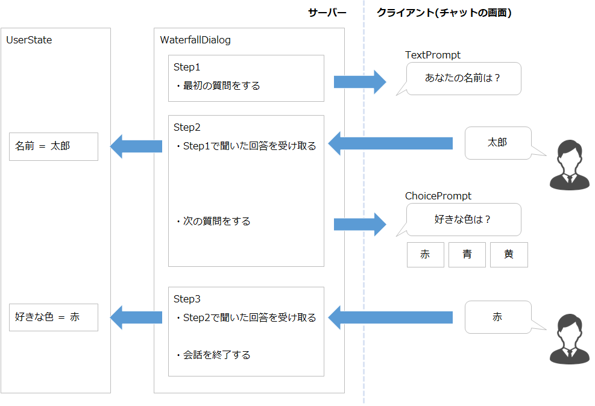
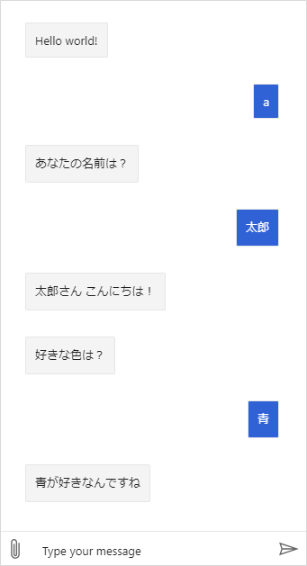

Dialogは、ユーザーとの複数回にわたる会話のやりとりの管理を助けるライブラリである。

ステートレスなWebアプリにおいて、「今どこまで話したか？」を記憶・管理できる。

## ライブラリを参照に追加する
ボットで Dialog を使う前に、プロジェクトにライブラリの参照を追加する。
VS Code でプロジェクトを開いている場合、コンソールで下記コマンドを実行すればよい。

```
dotnet add package Microsoft.Bot.Builder.Dialogs
```

そうすると、プロジェクトの `csproj` ファイルに以下が追加され、Dialogを使用可能になる。

```xml
<ItemGroup>
  <PackageReference Include="Microsoft.Bot.Builder.Dialogs" Version="4.10.3" />
</ItemGroup>
```

## Dialogの種類

|種類|説明|
|---|---|
|Component Dialog|Dialogのセットをひとまとめにして、再利用可能にするためのDialog。単純なWaterfall Dialogを作る場合でも、Component Dialogの中に作成することが推奨っぽい。|
|Waterfall Dialog|ステップの順番を定義して、決まった流れで質問などを行う場合に使うDialog。会話の流れに分岐やループは基本的にない。|
|Prompt Dialog|ユーザーへインプットを求め、回答を受け取るための小さな部品。Promptにはいくつか種類があり、それぞれ有効な入力値が得られるか、キャンセルされるまで自動的に質問を繰り返す。Waterfall Dialogで使用するために設計された。|
|adaptive dialog|柔軟な会話の流れを作れる。adaptive dialogを開始するには、dialog managerから始めないといけない。|
|action dialogs|会話フローをプログラマチックに定義できる。式とかステートメントとか。adaptive dialogでのみ使用できる。|
|input dialogs|ユーザーにインプットを求めるときに使う。adaptive dialog内でのみ使用可能。|
|skill dialog|skillを使う。|
|QnA Maker dialog|QnA Makerを使う。|

## WaterfallDialog
WaterfallDialogとは、決まった順番でユーザーへ質問を行い、回答を収集するようなケースで使用する。
このダイアログでは「ステップ」になるメソッドを定義して、それを順番に並べて定義する。



上記の例では、ステップが3つある。まず1番目のステップで最初の質問を行う。
2番目のステップで、最初の質問の回答を受け取り、保存するなどの処理をする。そして続けて次の質問を行う。

### ComponentDialogを作成する
Dialogを実装する場合、まずラッパーとなる ComponentDialog クラスを作成し、その中にDialogを作りこんでいく。基本的な作り方は下記のサンプルの通り。  
※ `UserData`は UserState に保存するオブジェクト。

```csharp
using Microsoft.Bot.Builder;
using Microsoft.Bot.Builder.Dialogs;

public class WaterfallSampleDialog : ComponentDialog
{
    private static readonly string DIALOG_ID = "WaterfallSampleDialog";

    private readonly IStatePropertyAccessor<UserData> _accessor;

    // コンストラクタ
    // ユーザーから得た回答は何かしら保存する必要があるため、UserStateやConversationStateを引数で受け取ることが多いと思う。
    public WaterfallSampleDialog(UserState userState) : base(DIALOG_ID)
    {
        _accessor = userState.CreateProperty<UserData>("UserData");
    }
}
```

### ステップを作成する
ステップはメソッドとして定義する。メソッドの引数、戻り値は下記サンプルの通り。

```csharp
private async Task<DialogTurnResult> XXXStepAsync(WaterfallStepContext stepContext, CancellationToken cancellationToken)
{
}
```

参考：[WaterfallStep Delegate (Microsoft.Bot.Builder.Dialogs) | Microsoft Docs](https://docs.microsoft.com/ja-jp/dotnet/api/microsoft.bot.builder.dialogs.waterfallstep?view=botbuilder-dotnet-stable)

ステップのメソッドは、必ず `DialogTurnResult` を返す。
`DialogTurnResult` に持たせるパラメータによって、次のステップへ進むか、Dialogの流れを終わらせるか、などを指定できる。

以下に戻り値のパターンのサンプルを示す：

```csharp
// ユーザーにPromptを送りつつ、次のステップへ進む(ユーザーの回答が正しくない場合、Promptによって当ステップが繰り返される)
return await stepContext.PromptAsync("TextPrompt", promptOptions, cancellationToken);

// 当ステップを飛ばす
return await stepContext.NextAsync(null, cancellationToken);

// 次のステップを飛ばす
return await stepContext.NextAsync(-1, cancellationToken);

// Dialogを終わらせる。最後のステップの戻り値はこれでないといけない
return await stepContext.EndDialogAsync(cancellationToken: cancellationToken);
```

今回のサンプルの場合、最初のステップでユーザーの名前を聞く。テキストの回答を受け付ける場合は、`TextPrompt` を使用する。

```csharp
private async Task<DialogTurnResult> Step1Async(WaterfallStepContext stepContext, CancellationToken cancellationToken)
{
    var prompt = MessageFactory.Text("あなたの名前は？");
    var options = new PromptOptions
    {
        Prompt = prompt
    };
    return await stepContext.PromptAsync("TextPrompt", options, cancellationToken);
}
```

2番目のステップでは、名前を受け取りつつ次の質問をする。

```csharp
private async Task<DialogTurnResult> Step2Async(WaterfallStepContext stepContext, CancellationToken cancellationToken)
{
    // 回答を保存する
    var name = (string)stepContext.Result;

    var userData = await _accessor.GetAsync(stepContext.Context, () => new UserData());
    userData.name = name;

    // 追加でメッセージを送ることも可能
    var msg = MessageFactory.Text($"{name}さん こんにちは！");
    await stepContext.Context.SendActivityAsync(msg, cancellationToken);

    // 次の質問をする
    var prompt = MessageFactory.Text("好きな色は？");
    var choices = ChoiceFactory.ToChoices(new List<string> { "赤", "青", "黄" });
    var options = new PromptOptions
    {
        Prompt = prompt,
        Choices = choices
    };
    return await stepContext.PromptAsync("ChoicePrompt", options, cancellationToken);
}
```

最後のステップでは、2番目の回答の保存と、会話の終了をさせる。

```csharp
private async Task<DialogTurnResult> Step3Async(WaterfallStepContext stepContext, CancellationToken cancellationToken)
{
    // 回答を保存する
    var choice = (FoundChoice)stepContext.Result;

    var userData = await _accessor.GetAsync(stepContext.Context, () => new UserData());
    userData.color = choice.Value;

    var msg = MessageFactory.Text($"{choice.Value}が好きなんですね");
    await stepContext.Context.SendActivityAsync(msg, cancellationToken);

    // 会話の終わり
    return await stepContext.EndDialogAsync(cancellationToken: cancellationToken);
}
```

### Dialogを定義する
ComponentDialog のコンストラクタで、今まで定義したステップをつかってWaterfallDialogを作成する。作成した Dialog はComponentDialogへ登録し、ステップ中で使用する Prompt も同じように ComponentDialog へ登録する。

```csharp {hl_lines=["6-14"]}
// コンストラクタ
public WaterfallSampleDialog(UserState userState) : base(DIALOG_ID)
{
    _accessor = userState.CreateProperty<UserData>("UserData");

    // dialogの登録
    var steps = new WaterfallStep[] { Step1Async, Step2Async, Step3Async };

    AddDialog(new WaterfallDialog("WaterfallDialog1", steps));
    AddDialog(new TextPrompt("TextPrompt"));
    AddDialog(new ChoicePrompt("ChoicePrompt"));

    // 最初に実行するdialogを指定する
    InitialDialogId = "WaterfallDialog1";
}
```

これで Dialog は完成となる。

### ボットからDialogを呼び出す
できあがった Dialog をボットから実行する。DialogはDIでインスタンスを取得し、`OnMessageActivityAsync` で呼び出す。
その際、Dialog自身の状態管理に ConversationState が必要なので、一緒に渡す。

```csharp
public class SampleBot : ActivityHandler
{
    private readonly ConversationState _conversationState;
    private readonly UserState _userState;
    private readonly WaterfallSampleDialog _dialog;

    public SampleBot(ConversationState conversationState, UserState userState, WaterfallSampleDialog dialog)
    {
        _conversationState = conversationState;
        _userState = userState;
        _dialog = dialog;
    }

    protected override async Task OnMessageActivityAsync(ITurnContext<IMessageActivity> turnContext, CancellationToken cancellationToken)
    {
        var dialogState = _conversationState.CreateProperty<DialogState>(nameof(DialogState));
        await _dialog.RunAsync(turnContext, dialogState, cancellationToken);
    }

    public override async Task OnTurnAsync(ITurnContext turnContext, CancellationToken cancellationToken = default)
    {
        await base.OnTurnAsync(turnContext, cancellationToken);

        // state保存
        await _conversationState.SaveChangesAsync(turnContext, false, cancellationToken);
        await _userState.SaveChangesAsync(turnContext, false, cancellationToken);
    }
}
``` 

### DialogをDIに登録する
`Startup.cs` の `ConfigureServices` メソッドで、Dialogクラスをサービスに登録する。

```csharp
public void ConfigureServices(IServiceCollection services)
{
    services.AddSingleton<WaterfallSampleDialog>();
}
```

### 実行してみる


こちらから話しかけないとDialogが始まらないが、ステップ1～3の会話ができている。

