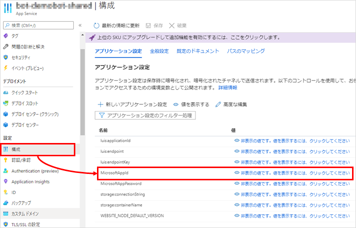

## はじめに
Azure にボットを配置した後、そのボットをTeamsで利用できるようにする手順を記載する。

参考：

* [Connect a bot to Microsoft Teams - Bot Service | Microsoft Docs](https://docs.microsoft.com/en-us/azure/bot-service/channel-connect-teams)
  * Azure のボットにTeamsのチャネルを追加する手順
* [Get started - Build a bot - Teams | Microsoft Docs](https://docs.microsoft.com/en-us/microsoftteams/platform/build-your-first-app/build-bot)
  * Teams に App Studio を追加したりする手順

前提条件：

* 開発 PC に Teams インストール済み
* ボットを Azure へデプロイ済み

## ボットのチャネルにTeamsを追加
※ この方法はテストやデバッグ目的でのみ推奨される。ボットの機能も色々制限されるため、
ボットを本番運用するなら、後続の「マニフェストファイルを配布する」方法か、アプリストアで配布する等の方法をとる方がいい。

Azure ポータルサイトで Web アプリボット のリソースを開き、左側のメニューから「チャンネル」をクリックする。
「おすすめチャンネル」に Teams のアイコンがあるのでクリックする。

いくつか設定項目が表示されるが、すべて既定で良い。
「メッセージング」の選択肢は、「Government」は米国政府が使うTeams(?)のことで、それ以外の人は「Commercial」を選ぶのだと思われる。

「保存」ボタンをクリックしサービス条件に同意した後、ふたたびチャンネルのページへ戻ると、「チャンネルに接続」のところに Teams が追加されている。

この「Microsoft Teams」のリンクをクリックすると、Teams が起動し「チャット」の画面にボットが追加される。

これでボットと会話できるようになった。

## マニフェストファイルを配布する
前述の方法では、Azure ポータルサイトにアクセスできる人しかボットを Teams に追加できない (最後にクリックするリンクのURLを共有すれば他の人も追加できるが)。
ボットを利用者へ配布する際は、マニフェストファイルを作成し配布すると良い。

配布用のファイルは、ボットの情報や権限が書かれた json ファイルと、ボットのアイコン画像が含まれた zip ファイルの形式。
json ファイルは一から書いてもいいが、Teams の App Studio というアプリを使うと、GUIで作成できる。以下にその手順を示す。

### ボットの App ID の取得
Azure ポータルサイトで、ボットの App Service のリソースを開く。「構成」のページのアプリケーション設定に、名前が MicrosoftAppId の設定値をコピーして控えておく。

### マニフェストファイルの作成

まず Teams のアプリから App Studio を探して追加する。

チャット の中に App Studio が追加されるので、チャット画面の上部のタブの「Manifest editor」をクリック → 「Create a new app」をクリック。

アプリの情報を色々入力する画面が表示されるので、必要なところを入力していく。

このうち、App ID は Azure ポータルサイトで取得したものを使用する。

* App names - ボットの名前の短いverと長いverを入力する。
* Identification
  * App ID - Azure ポータルサイトで取得したもの
  * Package name - C# の名前空間のような感じのもの。「jp.co.xxxxx」とか。
* Descriptions - アプリの説明。短いものと長いもの両方を入力する。両方に同じ文章を入れると、マニフェストファイルを発行する際に警告がでる。
* Developer Information - 開発者の名前やWebサイトのURLを載せる。
* App URLs - プライバシーポリシーや利用規約へのURLを載せる。
* Branding - ボットのアイコン

ボットの場合、重要なのが「Capabilities」の「Bots」のページで、ここでボットを使える範囲などを設定する。
初めにこのページにアクセスしたときは「Set up」というボタンしか表示されていないので、これをクリックする。

セットアップのダイアログが表示されるので、ボットができることや使用可能な範囲を設定して「Save」をクリックする。

「Finish」→「Test and Distribute」のページで、自分のTeamsにこのアプリをインストールしたり、配布用 zip ファイルのダウンロードができる。
ただ、会社などで Teams を使っている場合、アプリのインストールが組織によって制限されている場合がある。その場合は、Teams の管理者と要相談。

