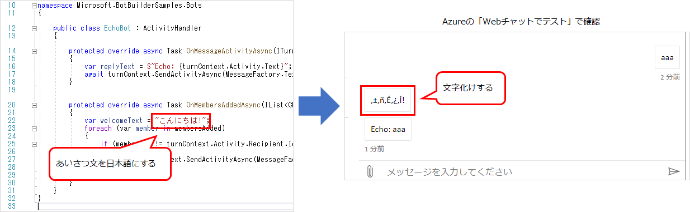
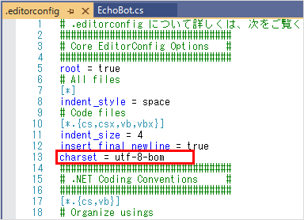

## はじめに

前提条件：

* Windows 10
* Visual Studio 2019
* C#

参考：[Bot Framework SDK for .NET を使用したボットの作成 - Bot Service | Microsoft Docs](https://docs.microsoft.com/ja-jp/azure/bot-service/dotnet/bot-builder-dotnet-sdk-quickstart?view=azure-bot-service-4.0&tabs=vs)

Bot Framework SDK を使ってチャットボットを開発するのに必要な準備の手順を記載する。
本記事では、ローカルでテストするための環境の準備なので、Azureに実際にデプロイするための手順は別記事を参照。

## Bot Framework Emulator をインストール
[Bot Framework Emulator](https://github.com/microsoft/BotFramework-Emulator/tree/master)

Bot Framework Emulator は、ローカルでボットをテストするためのツール。
上記サイトの「Download」にある「Github Releases」のページへ移動し、最新版のインストーラを取得し、インストールする。

## Bot Framework v4 SDK Templates をインストール

1. Visual Studio を起動し、メニューの「拡張機能」→「拡張機能の管理」をクリック。
1. 「Bot Framework v4 SDK Templates for Visual Studio」を検索し、ダウンロード。
1. Visual Studio を終了し、インストールを実行させる。
1. 再度 Visual Studio を起動する。

## ngrok 利用登録とインストール
ngrok は、localhost に外部から接続できるURLを用意してくれるサービス。
Bot Framework Emulator を使ったテストでは必要ないが、ローカルにあるボットアプリをTeamsやSlackのチャネルと接続するときに必要。

利用開始までの手順は下記の通り。

1. [Webサイト](https://ngrok.com/) で利用登録し、Windows用のアプリケーションをダウンロードする。
1. ダウンロードした zip ファイルを解凍すると、exeファイルが1つ入っているので、任意のフォルダへ置いておく。
1. ngrok.exe を置いたフォルダでコマンドプロンプトを起動する。
1. 下記コマンドを実行する。キーの部分は、サインインした状態で [Setup](https://dashboard.ngrok.com/get-started/setup) のページを見るとスニペットに書いてある。

```
ngrok authtoken [キー]
```

実行に成功すると、ユーザーフォルダ配下にngrokのキーが作成される。

## ファイルの文字コードを設定する
Visual Studio でのcsファイルの既定の文字コードは UTF-8-bom で、ボットのソースコードも UTF-8-bom である必要がある。
そうしないと、コード中に書いたボットのメッセージが文字化けしてしまう。これは lg ファイルなど他のテキストファイルについても同じ。
もし Visual Studio の設定が他の文字コードになっている場合、プロジェクトに設定ファイルを追加して既定の文字コードを UTF-8 にしておく必要がある。



まず Visual Studio でソリューションを開き、プロジェクト直下で「新しい項目の追加」を選択する(ソリューションエクスプローラーでプロジェクトのフォルダを選択し、`Ctrl` + `Shift` + `A`)。

「新しい項目の追加」画面が開くので、検索欄に「editor」と入力する。そうすると「editorconfig ファイル」が出てくるので、それを選択して「追加」を押す。
ファイル名は既定の「.editorconfig」のままで良い。


プロジェクト直下に「.editorconfig」ファイルが追加されるので、ファイルを開いて内容を確認する。
「# Code files」の下にある `charset` が `utf-8-bom` となっていればOK。



「.editorconfig」はプロジェクトに対するテキストエディターの設定を統一するものなので、Visual Studio の設定より優先して適用される。
他の設定項目が煩わしかったら、下記だけにしても良いと思う。

```
[*.cs]
charset = utf-8-bom
```
