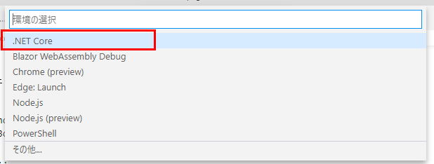

## はじめに
開発ツールに VS Code を使用する場合の手順。

前提条件：

* Windows 10
* SDKはC#を選択
* Bot Framework Emulator インストール済
* VS Code インストール済

参考：[Bot Framework SDK for .NET を使用したボットの作成 - Bot Service | Microsoft Docs](https://docs.microsoft.com/ja-jp/azure/bot-service/dotnet/bot-builder-dotnet-sdk-quickstart?view=azure-bot-service-4.0&tabs=vc)

## 準備
### .NET Core のインストール

[.NET Core SDK](https://dotnet.microsoft.com/download) をダウンロードし、インストールする。
Runtimeではなく、SDKが必要。

インストール後、コマンドプロンプトで `dotnet --version` を実行し、インストールされていることを確認する。

```
C:\xxx>dotnet --version
3.1.402
```

### テンプレートのインストール
コマンドプロンプトで、下記3つのうち、必要なものを実行する。

```
dotnet new -i Microsoft.Bot.Framework.CSharp.EchoBot
dotnet new -i Microsoft.Bot.Framework.CSharp.CoreBot
dotnet new -i Microsoft.Bot.Framework.CSharp.EmptyBot
```

インストール後の確認は、`dotnet new --list` で行える。

```
C:\xxx>dotnet new --list
(略)

Templates                                         Short Name               Language          Tags
--------------------------------------------------------------------------------------------------------------------------------------------
Bot Framework Echo Bot (v4.10.3)                  echobot                  [C#]              Bot/Bot Framework/Echo Bot/Conversational AI/AI
```

### VS Code に C# プラグインを追加
[C# 拡張機能](https://marketplace.visualstudio.com/items?itemName=ms-dotnettools.csharp)をインストールする。
これがないと VS Code でデバッグできない。

## ボットの作成
### 新しいプロジェクトを作成
コマンドプロンプトで、プロジェクトを作りたいフォルダまで移動する。
cdを使ってもいいが、エクスプローラーで目的のフォルダを開き、アドレス欄に `cmd` と入力してエンターキーを押すと早い。

その後、コマンドプロンプトで下記コマンドを実行する。

```
dotnet new [テンプレートのShort Name] -n [プロジェクト名]
```

今回は、EchoBotをひな型としてプロジェクトを作成した。しばらく待つと、指定したフォルダにプロジェクトが作成される。

```
C:\bot>dotnet new echobot -n MyEchoBot
The template "Bot Framework Echo Bot (v4.10.3)" was created successfully.

Processing post-creation actions...
No Primary Outputs to restore.
```

### VS Code で実行する
VS Code でプロジェクトフォルダを開き、メニューの「実行」から「デバッグの開始」または「デバッグなしで実行」をクリック。
はじめての場合は環境を選択するダイアログが開くので、「.NET Core」を選択する。



ビルドが実施され、アプリが実行される。ブラウザで「http://localhost:3978/」が開かれると起動完了。

Bot Framework Emulatorで `http://localhost:3978/api/messages` を開くとテストできる。

