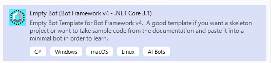
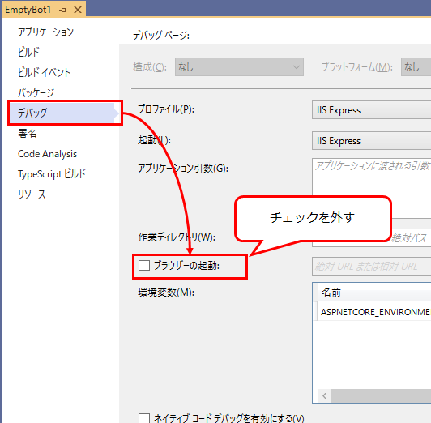

## はじめに

EmptyBot をテンプレートとして、新しいボットを作成する手順を記載する。Adaptive Dialog を使い、単一のメッセージを返すボットができるまでを目指す。

前提条件：

* Windows 10
* Visual Studio 2019
* C#

参考：[Bot Framework SDK for .NET を使用したボットの作成 - Bot Service | Microsoft Docs](https://docs.microsoft.com/ja-jp/azure/bot-service/dotnet/bot-builder-dotnet-sdk-quickstart?view=azure-bot-service-4.0&tabs=vs)

## 新しいプロジェクトの作成
Visual Studioのメニューの「ファイル」→「新規作成」→「プロジェクト」をクリック。
テンプレートとして、「Empty Bot (Bot Framework v4 - .NET Core 3.1)」を選ぶ。※.NET Core 2.1など古い方を選ばないように注意。



### 出力フォルダへコピーする設定の変更
Adaptive Dialog では、lg ファイルなどテキストファイルを使用することが多い。lg ファイルはすべてビルド時に「出力フォルダへコピーする」設定にしなければいけない。
そこで、csproj ファイルを編集し、lg ファイルはすべて既定で出力フォルダへコピーするように設定しておくと良い。

ソリューション エクスプローラーで、プロジェクトを右クリック → 「プロジェクトファイルの編集」をクリック。csproj ファイルが開く。
 appsettings.json の設定があるあたりに、lg ファイルの設定を追加する。Always か PreserveNewest かはどちらでもいい。 

```xml {hl_lines=[5,6,7]}
<ItemGroup>
  <Content Update="appsettings.json">
    <CopyToOutputDirectory>Always</CopyToOutputDirectory>
  </Content>
  <Content Include="**/*.lg">
    <CopyToOutputDirectory>PreserveNewest</CopyToOutputDirectory>
  </Content>
</ItemGroup>
```

### デバッグ時にブラウザを起動しない
Web アプリケーションの場合、デバッグ時に自動的にブラウザが起動してスタートページが表示されるが、ボットアプリの場合はスタートページは必要ない。
実行時に勝手にブラウザが起動しないように設定できる。

プロジェクトで右クリック → 「プロパティ」 → 「デバッグ」タブ → 「ブラウザーの起動」のチェックを外す。



## NuGet パッケージの追加
プロジェクトへ `Microsoft.Bot.Builder.Dialogs.Adaptive` を追加する。

追加で、必要に応じて下記のパッケージを追加する：

* LUIS：`Microsoft.Bot.Builder.AI.LUIS`
* QnA Maker： `Microsoft.Bot.Builder.AI.QnA`
* Adaptive Dialog の単体テスト： `Microsoft.Bot.Builder.Dialogs.Adaptive.Testing`

## コンポーネントの登録
※ .dialog ファイルを使う場合に必要。csファイルで Adaptive Dialog を作る場合は必要ない。

Startup.cs の `ConfigureServices` メソッドに、下記を追加してコンポーネントの登録を行う。

必須：

```cs
ComponentRegistration.Add(new AdaptiveComponentRegistration()); // Components common to all adaptive dialogs.
ComponentRegistration.Add(new DialogsComponentRegistration()); // Common memory scopes and path resolvers.
```

任意：

```cs
ComponentRegistration.Add(new AdaptiveTestingComponentRegistration()); // Components used to unit test adaptive dialogs.
ComponentRegistration.Add(new DeclarativeComponentRegistration()); // Components used to consume declarative dialogs.
ComponentRegistration.Add(new LanguageGenerationComponentRegistration()); // Components used for language generation features.
ComponentRegistration.Add(new LuisComponentRegistration()); // Components used for LUIS (language understanding) features.
ComponentRegistration.Add(new QnAMakerComponentRegistration()); // Components used for QnA Maker (language understanding) features.
ComponentRegistration.Add(new TeamsComponentRegistration()); // Components specific to the Teams channel.
```

## State の追加
Startup.cs の `ConfigureServices` メソッドに UserState と ConversationState を追加する。

```cs
services.AddSingleton<IStorage, MemoryStorage>();
services.AddSingleton<UserState>();
services.AddSingleton<ConversationState>();
```

次に、AdapterWithErrorHandler.cs に下記を追加する。

```cs {hl_lines=[4,7,8,9]}
public class AdapterWithErrorHandler : BotFrameworkHttpAdapter
{
    public AdapterWithErrorHandler(IConfiguration configuration, ILogger<BotFrameworkHttpAdapter> logger
        , IStorage storage, UserState userState, ConversationState conversationState)
        : base(configuration, logger)
    {
        this.UseStorage(storage);
        this.UseBotState(userState);
        this.UseBotState(conversationState);

        OnTurnError = async (turnContext, exception) =>
        {
            // 略
        };
    }
}
```

これを追加すると、turnContext から Storage と State を参照できるようになる。これがないと、DialogManager が動作しない。

## RootDialog の追加
Adaptive Dialog となる RootDialog を作成する。例では Dialogs/RootDialog.cs に作成した。
サンプルは下記の通り。

```cs
using Microsoft.Bot.Builder.Dialogs.Adaptive;
using Microsoft.Bot.Builder.Dialogs.Adaptive.Actions;
using Microsoft.Bot.Builder.Dialogs.Adaptive.Conditions;
using System;
using System.Collections.Generic;
using System.Linq;
using System.Threading.Tasks;

namespace AdaptiveDialogs.Dialogs
{
    public class RootDialog : AdaptiveDialog
    {
        public RootDialog() : base(nameof(RootDialog))
        {
            Triggers = new List<OnCondition>
            {
                new OnUnknownIntent
                {
                    Actions =
                    {
                        new SendActivity("Hello!"),
                    }
                },
            };
        }
    }
}
```

RootDialog を作成したら、Startup.cs の `ConfigureServices` メソッドに下記を追加する。

```cs
services.AddSingleton<RootDialog>();
```

## ボットの編集
EmptyBot.cs を編集し、DialogManager を介して RootDialog を呼び出す処理を追加する。

```cs
using AdaptiveDialogs.Dialogs;
using Microsoft.Bot.Builder;
using Microsoft.Bot.Builder.Dialogs;
using Microsoft.Bot.Schema;
using System.Collections.Generic;
using System.Threading;
using System.Threading.Tasks;

namespace AdaptiveDialogs
{
    public class EmptyBot : ActivityHandler
    {
        private readonly DialogManager _dialogManager;

        public EmptyBot(RootDialog rootDialog)
        {
            _dialogManager = new DialogManager(rootDialog);
        }

        public override async Task OnTurnAsync(ITurnContext turnContext, CancellationToken cancellationToken = default)
        {
            await _dialogManager.OnTurnAsync(turnContext, cancellationToken: cancellationToken).ConfigureAwait(false);
        }
    }
}
```

EmptyBot.cs にすでに書かれている `OnMembersAddedAsync` メソッドの記述は削除する。AdaptiveDialog を使う場合、同じ処理を AdaptiveDialog に実装できる。

## プロジェクトを実行
Visual Studio 上で F5 キーを押す。
するとプロジェクトがビルド＆実行される。「デバッグ時にブラウザを起動しない」設定をしていない場合、ブラウザが起動し、`http://localhost:3978/` として以下のページが表示される。


## Bot Framework Emulator でテストする

1. Bot Framework Emulator を起動する。
1. 「Open Bot」のボタンを押す。
1. 「Bot URL」に `http://localhost:3978/api/messages` と入力する。他の項目は空白。
1. 「Connect」ボタンを押す。
1. チャットのテストができる。

こちらからメッセージを送り、「Hello!」と返事が返ってくればOK。

## そのほかのテンプレートプロジェクト
参考：[microsoft/BotBuilder-Samples](https://github.com/microsoft/BotBuilder-Samples/tree/main/generators/dotnet-templates)

Bot Framework v4 SDK Templates をインストールすると、Echo Bot の他にもテンプレートが追加される。
それぞれの名前と概要は以下の通り：

* Echo Bot
  * チャットに応答するだけのシンプルなテンプレート。まず初めにチャットボットを触る人向け。
* Core Bot
  * Bot Serviceにまつわる6つの機能が含まれたテンプレート。LUISとかDialogとか色々。
* Empty Bot
  * 最低限のソースが含まれているテンプレート。接続時に「Hello World!」と返す以外は何もしない。一からボットを構築したい人向け。

