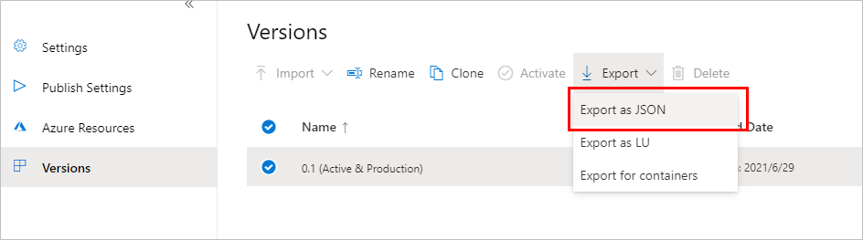
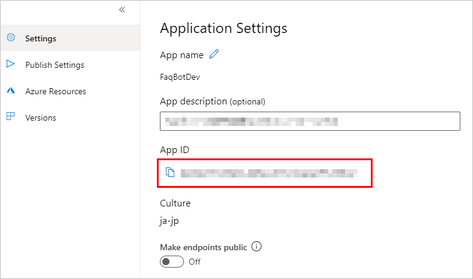
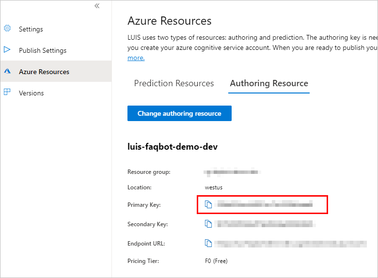

## はじめに
ボットに LUIS を追加する手順を記載する。
Bot Framework のドキュメントから Adaptive Dialog での実装方法が消えているため、Adaptive Dialog なしでの実装方法である。

## botframework-cli のインストール
LUIS アプリケーションのインテントなどを、ソースコードで扱いやすくするためのクラスを自動生成するために使う。

[公式サイト](https://github.com/microsoft/botframework-cli)

当ツールを使うには、Node.js がインストールされている必要がある。
Node.js インストール後、コマンドプロンプトで下記コマンドを実行しcliツールをインストールする。

```
npm i -g @microsoft/botframework-cli
```

インストールが終わった後、下記コマンドを実行するとヘルプが表示される。

```
bf
```

## LUIS アプリケーションを作る
LUIS ポータルサイトで、LUIS アプリケーションを作る。詳細は割愛。

## json ファイルをエクスポートする
LUIS ポータルサイトで作ったアプリケーションの設定内容をエクスポートする。


## コマンド実行
下記コマンドを実行する。

```
bf luis:generate:cs -i FaqBotDev.json -o C:\test --className=FaqBot.FaqBotModel
```

* `-i` - LUIS ポータルサイトからエクスポートしたjsonファイルのパスを指定する。
* `-o` - 自動生成されるクラスの出力先。ファイル名またはフォルダ名を指定する。フォルダ名を指定した場合は、クラス名＋`.cs` でファイルが作成される。
* `--className` - 自動生成されるクラス名を指定する。名前空間も一緒に指定可能。これだけオプション名と値を `=` で繋げる。

コマンドを実行すると下記のようなファイルが作成されるので、ボットのプロジェクトへ取り込む。

```cs
// <auto-generated>
// Code generated by luis:generate:cs
// Tool github: https://github.com/microsoft/botframework-cli
// Changes may cause incorrect behavior and will be lost if the code is
// regenerated.
// </auto-generated>
using Newtonsoft.Json;
using Newtonsoft.Json.Serialization;
using System;
using System.Collections.Generic;
using Microsoft.Bot.Builder;
using Microsoft.Bot.Builder.AI.Luis;
namespace FaqBot
{
    public partial class FaqBotModel: IRecognizerConvert
    {
        [JsonProperty("text")]
        public string Text;

        [JsonProperty("alteredText")]
        public string AlteredText;

        public enum Intent {
            None,
            AAA,
            BBB
        };
// 略
```

## nuget パッケージの追加
Visual Studio などでボットのソースコードを開き、プロジェクトに
`Microsoft.Bot.Builder.AI.Luis` を追加する。

## 設定値の追加
appsettings.json に LUISアプリケーションへの接続情報を追加する。

```json
{
  "LuisAppId": "xxx",
  "LuisAPIKey": "yyy",
  "LuisAPIHostName": "https://<region>.api.cognitive.microsoft.com"
}
```
App ID は LUIS ポータルサイトの下記から取得する。



API key は下記から取得する。



APIHostName は上記URLの `region` の部分を Azure のリソースを作成したときのリージョンにする。
日本から使う場合、推奨は `westus` なのでそれを指定する。

## Recognizer の作成
ボットのプロジェクトに
`Microsoft.Bot.Builder.IRecognizer` インターフェイスを実装したクラスを作成する。
内部で `Microsoft.Bot.Builder.AI.Luis.LuisRecognizer` クラスを生成してラップしているだけ。

```cs
using System;
using System.Collections.Generic;
using System.Linq;
using System.Threading;
using System.Threading.Tasks;
using Microsoft.Bot.Builder;
using Microsoft.Bot.Builder.AI.Luis;
using Microsoft.Extensions.Configuration;

namespace FaqBot.Recognizers
{
    public class FaqBotLuisRecognizer : IRecognizer
    {
        private readonly LuisRecognizer _recognizer;

        public FaqBotLuisRecognizer(IConfiguration configuration)
        {
            var luisApplication = new LuisApplication(
                configuration["LuisAppId"],
                configuration["LuisAPIKey"],
                configuration["LuisAPIHostName"]);

            var recognizerOptions = new LuisRecognizerOptionsV3(luisApplication)
            {
                PredictionOptions = new Microsoft.Bot.Builder.AI.LuisV3.LuisPredictionOptions
                {
                    IncludeInstanceData = true,
                }
            };

            _recognizer = new LuisRecognizer(recognizerOptions);
        }

        public Task<RecognizerResult> RecognizeAsync(ITurnContext turnContext, CancellationToken cancellationToken)
        {
            return _recognizer.RecognizeAsync(turnContext, cancellationToken);
        }

        public Task<T> RecognizeAsync<T>(ITurnContext turnContext, CancellationToken cancellationToken) where T : IRecognizerConvert, new()
        {
            return _recognizer.RecognizeAsync<T>(turnContext, cancellationToken);
        }
    }
}
```

作成したクラスは、Startup.cs で DI に登録しておく。

```cs
services.AddSingleton<FaqBotLuisRecognizer>();
```

## Recognizer を使う
ボット、ダイアログなど、LUIS を使いたいところで Recognizer を使う。
`RecognizeAsync` メソッドの型引数には、コマンドで自動生成したクラスを指定する。

```cs
var luisResult = await _recognizer.RecognizeAsync<FaqBotModel>(stepContext.Context, cancellationToken);

switch (luisResult.TopIntent().intent)
{
    case FaqBotModel.Intent.None:
        // なにか処理する
        break;
    case FaqBotModel.Intent.AAA:
        // なにか処理する
        break;
    case FaqBotModel.Intent.BBB:
        // なにか処理する
        break;
    case FaqBotModel.Intent.CCC:
        // なにか処理する
        break;
    default:
        // なにか処理する
        break;
}

```
