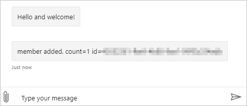
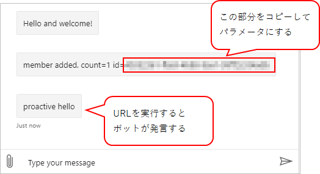

## 前提条件

* Windows 10
* Bot Framework SDK v4
* .NET Core C#

## ボット側からメッセージを送る
チャットボットは、基本的にユーザーから会話が始まりボットは返事をするだけだが、ボット側からメッセージを送ることもできる。
ボットから話しかけることを、「プロアクティブな」メッセージという。

基本的には、ボットに接続したことのあるユーザーにしか話しかけることができない。
ただし、Teamsの場合、組織単位でボットをアプリとして許可していれば、組織内の一度も会話したことのないユーザーへ話しかけられるらしい。
その際は、Graph API を使ってユーザー情報を取得するらしい。

参考：

* [Send proactive notifications to users - Bot Service | Microsoft Docs](https://docs.microsoft.com/en-us/azure/bot-service/bot-builder-howto-proactive-message?view=azure-bot-service-4.0&tabs=csharp)
* [Send proactive messages - Teams | Microsoft Docs](https://docs.microsoft.com/en-us/microsoftteams/platform/bots/how-to/conversations/send-proactive-messages?tabs=dotnet)


## ConversationReference を保存
ユーザーがボットに接続すると、`ConversationReference` という情報が作られる。これを保存しておけば、接続済みのユーザーに対してメッセージを送れる。

本サンプルでは、ユーザーが会話に参加した時点で `ConversationReference` を保存する。

### Startup.cs
まず、`ConversationReference` を保存するオブジェクトをDIに登録する。
サンプルでは、ユーザーごとに振られるIDをキーとして、Dictionary型で保持するようにしている。

実運用の際は、オブジェクトをただDIに登録するのではなく、追加でストレージに保存した方が良いと思う。

```cs
namespace ProactiveBot
{
    public class Startup
    {
        // 略
        public void ConfigureServices(IServiceCollection services)
        {
            // 略

            // ConversationReferenceを保存しておくオブジェクト
            // (実際はどこかStorageに保存したほうが良い)
            services.AddSingleton<ConcurrentDictionary<string, ConversationReference>>();
        }

        // 略
    }
}
```

### ボット (ActiveHandler)
サンプルでは、ユーザーがボットに接続したときに `ConversationReference` を保存し、ユーザーがボットから離れたときに `ConversationReference` を削除する。
ただ、`OnMembersAddedAsync`, `OnMembersRemovedAsync` の両メソッドが呼び出されるかどうかはチャネルによって違うため、
環境によっては保存した `ConversationReference` が削除されずにずっと残るかもしれない。

```cs
using Microsoft.Bot.Builder;
using Microsoft.Bot.Schema;
using Microsoft.Extensions.Logging;
using System;
using System.Collections.Concurrent;
using System.Collections.Generic;
using System.Threading;
using System.Threading.Tasks;

namespace ProactiveBot.Bots
{
    public class EchoBot : ActivityHandler
    {
        private readonly ConcurrentDictionary<string, ConversationReference> _references;
        private readonly ILogger<EchoBot> _logger;

        public EchoBot(ConcurrentDictionary<string, ConversationReference> references, ILogger<EchoBot> logger)
        {
            _references = references;
            _logger = logger;
        }

        protected override async Task OnMembersAddedAsync(IList<ChannelAccount> membersAdded, ITurnContext<IConversationUpdateActivity> turnContext, CancellationToken cancellationToken)
        {
            var welcomeText = "Hello and welcome!";

            foreach (var member in membersAdded)
            {
                if (member.Id != turnContext.Activity.Recipient.Id)
                {
                    await turnContext.SendActivityAsync(MessageFactory.Text(welcomeText, welcomeText), cancellationToken);

                    // 追加されたメンバーのConversationReference を保存
                    var reference = turnContext.Activity.GetConversationReference();
                    _references.AddOrUpdate(member.Id, reference,(key, oldValue) => reference );

                    await turnContext.SendActivityAsync(MessageFactory.Text($"member added. count={_references.Count} id={member.Id}"), cancellationToken);
                }
            }
        }

        protected override async Task OnMembersRemovedAsync(IList<ChannelAccount> membersRemoved, ITurnContext<IConversationUpdateActivity> turnContext, CancellationToken cancellationToken)
        {
            foreach (var member in membersRemoved)
            {
                if (member.Id != turnContext.Activity.Recipient.Id)
                {
                    // いなくなったメンバーのConversationReference を削除
                    _references.TryRemove(member.Id, out var removedValue);

                    await turnContext.SendActivityAsync(MessageFactory.Text($"member removed. id={member.Id}"), cancellationToken);

                    _logger.LogInformation($"member removed. count={_references.Count} id={member.Id}");
                }
            }
        }

    }
}
```

### テストする
ここまで実装したボットを Bot Framework Emulator でテストすると、ボットに接続した後に下記のようなメッセージが表示される。



ここに書かれている `id=` 以降の文字列がユーザーのIDとなる。

## メッセージの受け口を作る
次に、プロアクティブなメッセージを受け付ける場所を作る。
ボットから発言するといっても、実態はWebアプリなので勝手には動き出さない。
トリガーは外部にあるため、メッセージを受け付けるためのURLをボットに用意する。

### Controller を追加
サンプルでは、URL `api/proactive` を追加して、パラメータでメッセージ送信先のユーザーIDを受け取る。
IDに一致する `ConversationReference` がある場合、そのユーザーに対してメッセージを送っている。

```cs
using Microsoft.AspNetCore.Mvc;
using Microsoft.Bot.Builder;
using Microsoft.Bot.Builder.Integration.AspNet.Core;
using Microsoft.Bot.Schema;
using Microsoft.Extensions.Configuration;
using System.Collections.Concurrent;
using System.Threading;
using System.Threading.Tasks;

namespace ProactiveBot.Controllers
{
    [Route("api/proactive")]
    [ApiController]
    public class ProactiveController : ControllerBase
    {
        private readonly IBotFrameworkHttpAdapter _adapter;
        private readonly ConcurrentDictionary<string, ConversationReference> _references;
        private readonly string _appId;

        public ProactiveController(IBotFrameworkHttpAdapter adapter,ConcurrentDictionary<string, ConversationReference> references, IConfiguration config)
        {
            _adapter = adapter;
            _references = references;
            _appId = config["MicrosoftAppId"];
        }

        [HttpPost, HttpGet]
        public async Task PostAsync()
        {
            var memberId = Request.Query["memberId"];
            _references.TryGetValue(memberId, out ConversationReference reference);

            if (reference != null)
            {
                await ((BotAdapter)_adapter).ContinueConversationAsync(_appId, reference, BotCallback, default);
            }

        }

        private async Task BotCallback(ITurnContext turnContext, CancellationToken cancellationToken)
        {
            await turnContext.SendActivityAsync("proactive hello");
        }
    }
}
```

### テストする
ボットを起動し、Bot Framework Emulator で接続する。Welcomeメッセージとともに自分のIDをボットが発言するので、IDをコピーする。
そしてブラウザなどで `http://localhost:3978/api/proactive?memberId=[ユーザーのID]` を実行する。
ブラウザには何も表示されないが、Bot Framework Emulator を見ると「proactive hello」とボットが発言する。


