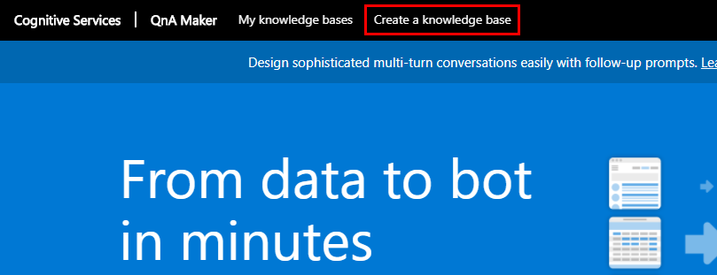
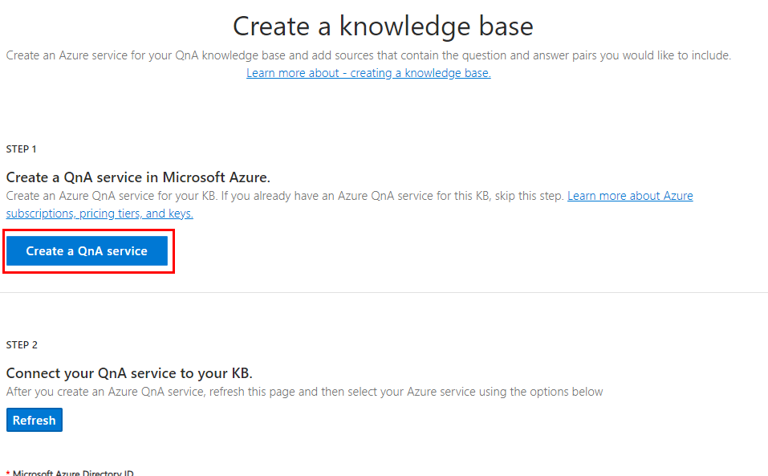
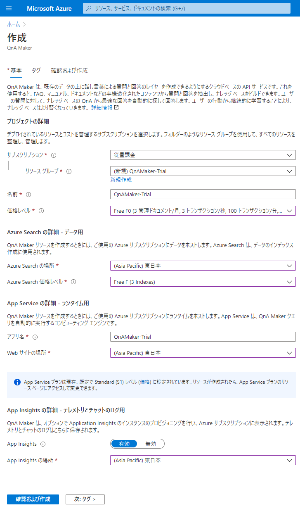
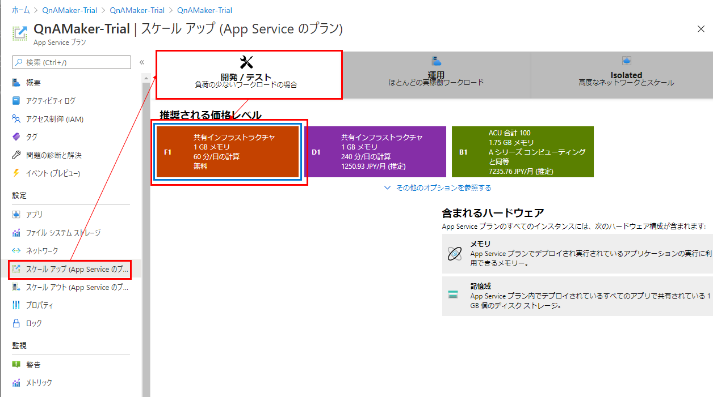
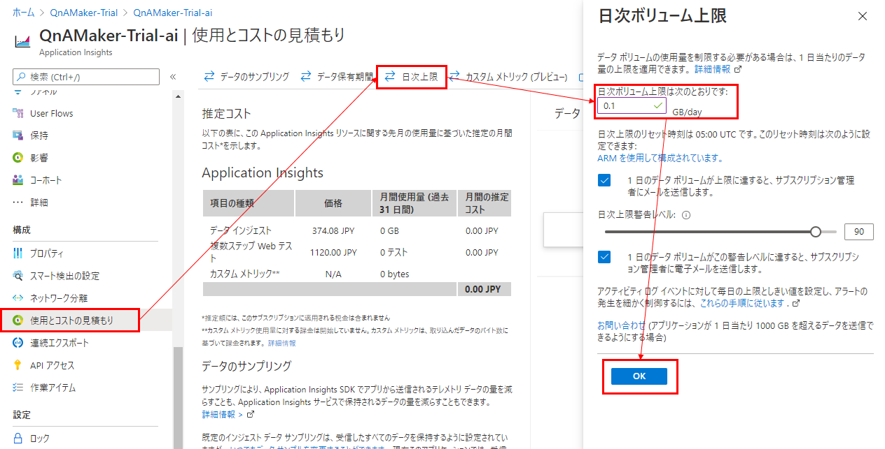
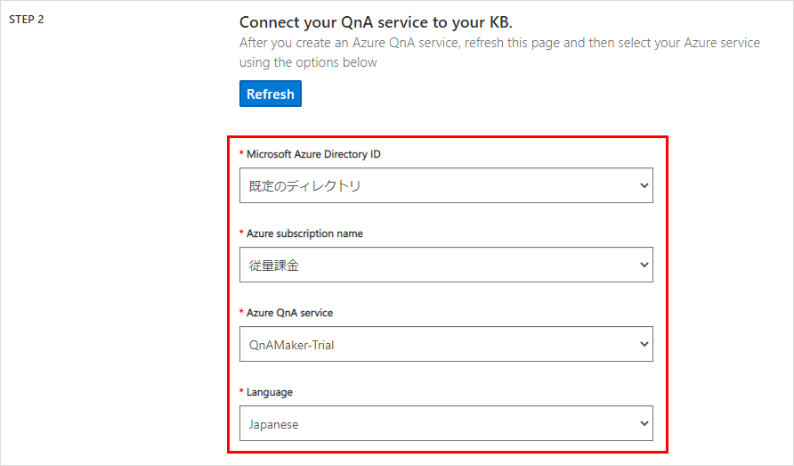
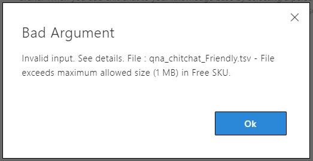

## 前提条件

* Azureのアカウントを持っている

## ナレッジベースを作成する
[QnA Makerのサイト](https://www.qnamaker.ai/)へ移動し、メニューの「Create a knowledge base」をクリック。

### QnAサービスを作成する

STEP 1 として、AzureポータルサイトでQnAサービスを作るように促されるので、「Create a QnA Service」をクリック。

AzureポータルサイトのQnAサービスを作るページへ移動するので、必要情報を入力し、サービスを作成する。

* リソースグループ - 特に決まりやこだわりがない場合、QnA Maker用に新しいリソースグループを作ると分かりやすい。
* 価格レベル - お試しの場合、Freeを選ぶのを忘れずに。
* App Insights - 会話のログを残したい場合は、「有効」にする。

「確認および作成」を押したあと、しばらく待つと各リソースが作成される。

#### App Service プランを変更する
前の手順で自動作成された App Service プランは、有料の「S1」になっているので、トライアル目的ならこれを無料の「F1」へ変えておく。

手順は下記の通り：
Azureポータルサイトにて、App Service プランのリソースを選択し、「スケールアップ」→「開発/テスト」→「F1」とクリック。その後、「適用」を押して確定させる。

#### App Insights の上限を設定する
App Insightsを有効にした場合、データ量などの上限を設定しておいた方がいい。
データ転送量は1ヶ月あたり5GBまでが無料だが、それ以上はお金がかかる。

参考：[価格 - Azure Monitor | Microsoft Azure](https://azure.microsoft.com/ja-jp/pricing/details/monitor/)

上限を設定する手順は以下の通り：

Azureポータルサイトにて、App Insights のリソースを選択し、「使用とコストの見積もり」→「日次上限」とクリック。
日次ボリュームの上限の欄に、「0.1」と入力して、OKをクリックする。こうしておけば1ヶ月当たりの上限を3GBへ制限できる(5GBギリギリを目指すなら、0.16か？)。

### QnAサービスとナレッジベースをつなげる
QnA Maker のサイトへ戻り、STEP 2 へ進む。さきほど作成した QnAサービスを指定し、次へ進む。

STEP 3 のナレッジベースの名前を入力する。

STEP 4 は初期データとして登録したいFAQのデータがあれば指定する。
Chit-chatは、雑談のQ&Aのデータ。日本語版があるようなので、必要なら追加する。
ただ、無料プランでQnAサービスを作った場合は、ファイルサイズが最大(1MB)を超えて登録できない場合がある。

## QnA Maker で作られるリソース

参考：[Azure リソース - QnA Maker - Azure Cognitive Services | Microsoft Docs](https://docs.microsoft.com/ja-jp/azure/cognitive-services/qnamaker/concepts/azure-resources)

QnAサービスで作られるリソースについては、上記サイトを参照。
求めるパフォーマンスに合わせて、どのリソースの価格レベルを上げればよいか等の参考になると思われる。
