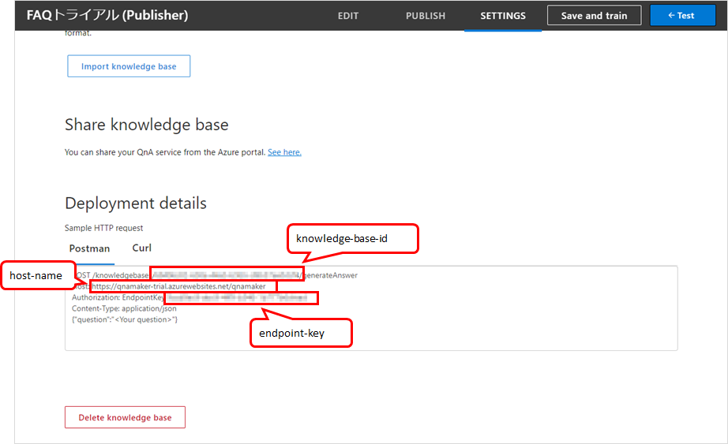

## はじめに
テンプレートから作成した Empty Bot に QnA Maker を追加する。

QnA Maker ポータルサイトから「Create Bot」のボタンを使ってボットを作成できるが、
ボットの挙動をカスタマイズしたい場合、空のボットから QnA Maker へ接続する手順を踏んで実装したほうが分かりやすいかもしれない。
(QnA Maker から作ったボットは、場合によっては必要なさそうなファイルが入っていたりして分かりづらい)

シンプルなボットに QnA Maker を追加するサンプルはMSのドキュメントにもあるが、このサンプルだと follow-up prompt に対応していない。

参考：[質問に回答するボットの Azure Bot Service チュートリアル - Bot Service | Microsoft Docs](https://docs.microsoft.com/ja-jp/azure/bot-service/bot-builder-tutorial-add-qna?view=azure-bot-service-4.0&tabs=csharp)

そのため、自分でググりつつ試しつつでたどり着いた実装手順を記載する。

### 前提条件

* SDK v4 (C#)
* Windows 10 + VS Code で開発
* QnA Maker のナレッジベース作成済み
* Empty Bot のテンプレートからプロジェクトを作成済み

## ボットに QnA Maker を追加する

### ナレッジベースへの接続情報を取得
QnA Maker ポータルへログインし、使用したい QnA Maker の「SETTINGS」のページを開く。
ページ下部の「Deployment Detail」にある `knowledge-base-id`、`endpoint-key`、`host-name` の3つを控えておく。



### ナレッジベースの情報をボットに追加
ボットの `appsettings.json` に、前の手順で取得した情報を追加する。

```json {hl_lines=["4-6"]}
{
  "MicrosoftAppId": "",
  "MicrosoftAppPassword": "",
  "QnAKnowledgebaseId": "kowledge-base-id",
  "QnAEndpointKey": "endpoint-key",
  "QnAEndpointHostName": "https://xxxx.azurewebsites.net/qnamaker"
}
```

### Conversation State を追加
ダイアログが自身の状態管理ができるように、Conversation State を Startup.cs とボットに追加する。

Startup.cs のサンプルは下記の通り。

```csharp {hl_lines=["5-8"]}
public class Startup
{
    public void ConfigureServices(IServiceCollection services)
    {
        var storage = new MemoryStorage();
        var conversationState = new ConversationState(storage);

        services.AddSingleton(conversationState);
    }
}
```

ボットはコンストラクタで Conversation State を受け取る。

```csharp
public class QnABot : ActivityHandler
{
    private ConversationState _conversationState;

    public QnABot(ConversationState conversationState)
    {
        _conversationState = conversationState;
    }
}
```
### QnAMakerDialog を追加

まず、`Microsoft.Bot.Builder.AI.QnA` をパッケージに追加する。
コマンドラインで下記コマンドを実行する。

```
dotnet add package Microsoft.Bot.Builder.AI.QnA
```

つぎに、Startup.cs とボットにダイアログを追加する。

Startup.cs では、`QnAMakerDialog` クラスの生成をDIに登録する。

```csharp {hl_lines=["5-12"]}
public class Startup
{
    public void ConfigureServices(IServiceCollection services)
    {
        // QnA Maker Dialog
        services.AddTransient<QnAMakerDialog>(dialog =>
        {
            return new QnAMakerDialog(
                knowledgeBaseId: Configuration["QnAKnowledgebaseId"],
                endpointKey: Configuration["QnAEndpointKey"],
                hostName: Configuration["QnAEndpointHostName"]);
        });
    }
}
```

ボットでは、コンストラクタでダイアログのインスタンスを受け取り、`OnMessageActivityAsync` メソッドでダイアログを使う。

```csharp {hl_lines=[4,7,10,15,16]}
public class QnABot : ActivityHandler
{

    private QnAMakerDialog _dialog;
    private ConversationState _conversationState;

    public QnABot(ConversationState conversationState, QnAMakerDialog dialog)
    {
        _conversationState = conversationState;
        _dialog = dialog;
    }

    protected override async Task OnMessageActivityAsync(ITurnContext<IMessageActivity> turnContext, CancellationToken cancellationToken)
    {
        var dialogState = _conversationState.CreateProperty<DialogState>(nameof(DialogState));
        await _dialog.RunAsync(turnContext, dialogState, cancellationToken);

    }
}
```
