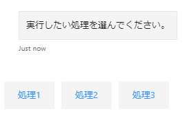

## メッセージの受信
ユーザーが送ってきたメッセージは、以下のようにして受け取る。

```csharp
var responseMessage = turnContext.Activity.Text;
```

## メッセージの送信
ボットからシンプルなテキストを送るには、以下のようにする。

```csharp
await turnContext.SendActivityAsync("Welcome!");
```

または、以下のようにする。

```csharp
var text = "Welcome!";
var msg = MessageFactory.Text(text, text);
await turnContext.SendActivityAsync(msg);
```

`MessageFactory`は、ボットから送るメッセージを作るためのユーティリティクラス。
添付ファイルとかボタンとか色々追加できるので、たくさん使うことになる。

## 「入力しています」のメッセージの送信
もし即座に返事を返せない場合、Teamsで出てくるような「○○が入力しています」のようなメッセージを返すことができる。
以下のサンプルは、ユーザーが「wait」と送ってきたときに、まず「入力しています」を送り、3秒後にメッセージを送信する。

※ Bot Framework Emulatorは非対応のためテストできない

```csharp
private async Task SendTypingAsync(ITurnContext<IMessageActivity> turnContext, CancellationToken cancellationToken)
{
    if (string.Equals(turnContext.Activity.Text, "wait", System.StringComparison.InvariantCultureIgnoreCase))
    {
        await turnContext.SendActivitiesAsync(
            new Activity[] {
                new Activity { Type = ActivityTypes.Typing },
                new Activity { Type = "delay", Value= 3000 },
                MessageFactory.Text("Finished typing", "Finished typing"),
            },
            cancellationToken);
    }
    else
    {
        var replyText = $"Echo: {turnContext.Activity.Text}. Say 'wait' to watch me type.";
        await turnContext.SendActivityAsync(MessageFactory.Text(replyText, replyText), cancellationToken);
    }
}
```

## いろいろなメッセージ

### 候補を提示する



`MessageFactory` で作成したメッセージに `SuggestedActions` を追加すると、ボットのメッセージの下にユーザーが押せるボタンが出てくる。
ユーザーがボタンを押すと、ボタンに設定した値がそのままユーザーの発言として返ってくる。

```csharp
var reply = MessageFactory.Text("実行したい処理を選んでください。");

reply.SuggestedActions = new SuggestedActions()
{
    Actions = new List<CardAction>()
    {
        new CardAction() { Title = "処理1", Type = ActionTypes.ImBack, Value = "処理1" },
        new CardAction() { Title = "処理2", Type = ActionTypes.ImBack, Value = "処理2" },
        new CardAction() { Title = "処理3", Type = ActionTypes.ImBack, Value = "処理3" },
    }
};

await stepContext.Context.SendActivityAsync(reply, cancellationToken);
```

厳密にいうと、`CardAction` のプロパティ `Type` によりボタンが押された時の動作が変わる。

参考：[Add media to messages - Bot Service | Microsoft Docs](https://docs.microsoft.com/en-us/azure/bot-service/bot-builder-howto-add-media-attachments?view=azure-bot-service-4.0&tabs=csharp#process-events-within-rich-cards)
