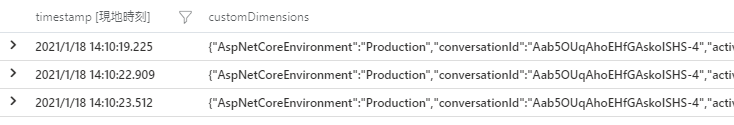
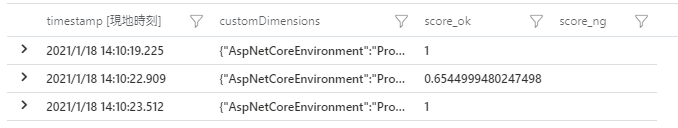
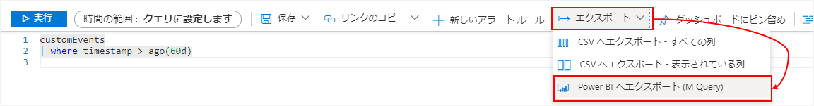
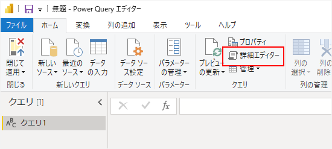
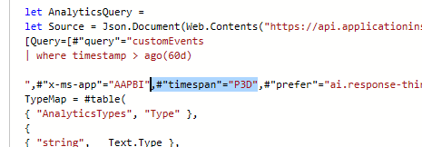
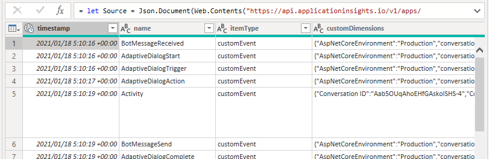
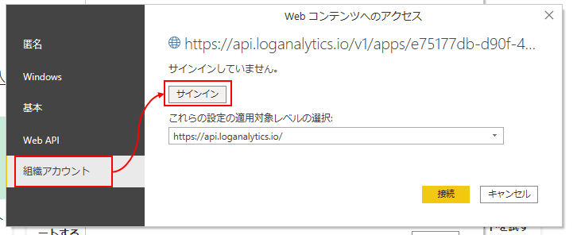

## はじめに

参考：

* [Add telemetry to your bot - Bot Service | Microsoft Docs](https://docs.microsoft.com/en-us/azure/bot-service/bot-builder-telemetry)

Azure に Web アプリを置く場合、ログは Application Insights に記録するのが一つの方法である。
Application Insights にログを記録しておくと、あとから検索・分析ができたりする。
Bot Framework SDK にも、Application Insights へログを記録する機能が備わっていて、後述の編集を行うと大体必要なログが自動的に記録される。

ちなみに、Azure ポータルサイトで Web アプリボットのリソースを作成する際、「Application Insights を有効にする」かどうかのオプションがある。
しかし、これを有効にした際に記録されるログはあまり役に立たない気がするので、リソース作成時は無効にしておき、あとで自分で Application Insights のリソースを作成しておくとよい。

また、ボットが QnAMaker を使っている場合、QnAMaker のリソース作成時にも Application Insights を有効するかどうかのオプションがある。
本記事の手順で QnAMaker の結果もログ記録できるので、QnAMaker 側の Application Insights は必要ないと思われる。

## 環境設定

### NuGet パッケージの追加

`Microsoft.Bot.Builder.Integration.ApplicationInsights.Core` を追加する。

### Startup.cs の編集
Startup.cs の ConfigureServices メソッドに下記を追加する。

```cs
public void ConfigureServices(IServiceCollection services)
{
    ...
        // Add Application Insights services into service collection
        services.AddApplicationInsightsTelemetry();

        // Create the telemetry client.
        services.AddSingleton<IBotTelemetryClient, BotTelemetryClient>();

        // Add telemetry initializer that will set the correlation context for all telemetry items.
        services.AddSingleton<ITelemetryInitializer, OperationCorrelationTelemetryInitializer>();

        // Add telemetry initializer that sets the user ID and session ID (in addition to other bot-specific properties such as activity ID)
        services.AddSingleton<ITelemetryInitializer, TelemetryBotIdInitializer>();

        // Create the telemetry middleware to initialize telemetry gathering
        services.AddSingleton<TelemetryInitializerMiddleware>();

        // Create the telemetry middleware (used by the telemetry initializer) to track conversation events
        services.AddSingleton<TelemetryLoggerMiddleware>();
    ...
}
```

#### ユーザーが送ったメッセージをログに含める
上記の通りに実装すると、アクティビティの送受信がログに記録されるようになるが、ユーザーが送ってきたメッセージやユーザーIDなど、個人的な情報は既定では記録されない。
それらを有効にするには、`TelemetryLoggerMiddleware` のインスタンス生成時の引数の指定を追加する。

```cs
// 変更前
services.AddSingleton<TelemetryLoggerMiddleware>();
// ↓
// 変更後
services.AddSingleton<TelemetryLoggerMiddleware>(sp =>
{
    var telemetryClient = sp.GetService<IBotTelemetryClient>();
    return new TelemetryLoggerMiddleware(telemetryClient, logPersonalInformation: true);
});
```

このオプションを有効にする場合、ボットがメッセージやユーザーIDなどを収集することを、あらかじめユーザーに通知しておくとよさそう。
ボットのウェルカムメッセージにその旨を載せておくのが簡単かと思われる。

### AdapterWithErrorHandler.cs の編集
AdapterWithErrorHandler.cs のコンストラクタ引数に `TelemetryInitializerMiddleware` を追加し、`Use` メソッドの呼び出しを追加する。

```cs {hl_lines=2,6}
public AdapterWithErrorHandler(IConfiguration configuration, ILogger<BotFrameworkHttpAdapter> logger, ConversationState conversationState = null
    , TelemetryInitializerMiddleware telemetryInitializerMiddleware
    ) : base(configuration, logger)
{
    ...
    Use(telemetryInitializerMiddleware);
}
```

### appsettings.json の編集
appsettings.json またはユーザーシークレットに、Application Insights のインストルメンテーションキーを追加する。

```json
{
    "ApplicationInsights": {
        "InstrumentationKey": "xxxxxxxx-xxxx-xxxx-xxxx-xxxxxxxxxxxx"
    }
}
```

これで、ログを Application Insights に記録する準備が整った。

## Dialog に Application Insights を追加
ComponentDialog や AdaptiveDialog のコンストラクタ引数に `IBotTelemetryClient` を追加してフィールド変数に代入しておくと、Dialog のログが出力されるようになる。

```cs
public MainDialog(IConfiguration configuration, ILogger<MainDialog> logger, IBotTelemetryClient telemetryClient)
    : base(nameof(MainDialog))
{
    this.TelemetryClient = telemetryClient;
    ...
}
```

## Recognizer に Application Insights を追加
AdaptiveDialog で使う QnAMaker や LUIS の Recognizer に `IBotTelemetryClient` を渡すと、QnAMaker や LUIS の検証結果がログ出力されるようになる。

下記は、AdaptiveDialog のコンストラクタで、Recognizer に `IBotTelemetryClient` を渡しているサンプル。

```cs {hl_lines=[3,16,23]}
public RootDialog(IConfiguration configuration, IBotTelemetryClient telemetryClient) : base(nameof(RootDialog))
{
    this.TelemetryClient = telemetryClient;

    Recognizer = new RecognizerSet()
    {
        Recognizers =
        {
            new QnAMakerRecognizer()
            {
                HostName = configuration["qna:hostname"],
                EndpointKey = configuration["qna:endpointKey"],
                KnowledgeBaseId = configuration["qna:KnowledgeBaseId"],
                QnAId = "turn.qnaIdFromPrompt",
                IncludeDialogNameInMetadata = false,
                TelemetryClient = telemetryClient
            },
            new LuisAdaptiveRecognizer()
            {
                ApplicationId = configuration["luis:applicationId"],
                EndpointKey = configuration["luis:endpointKey"],
                Endpoint = configuration["luis:endpoint"],
                TelemetryClient = telemetryClient
            }
        }
    };
    // 略
}
```

## 分析
※ Bot Framework Solutions を使っているなら、[Power BI のテンプレート](https://microsoft.github.io/botframework-solutions/solution-accelerators/tutorials/view-analytics/1-intro/) を使って Power BI からログを分析できる。ただし、Solutions を使わずにボットを作っている場合は、このテンプレートを使ってもあまり有用なデータは得られない。

集まったログは Azure ポータルサイトの Application Insights のリソースのページで検索できる。
とりあえず直近のログの一覧を見たい場合は、ページ左側のメニューから「トランザクションの検索」を選ぶ。直近24時間のログが表示される。
クエリを使って検索・分析したい場合は、「ログ」を選ぶ。クエリは「Kusto クエリ」というものを使う。SQLと似ているので、SQLを知っているなら応用がききやすいと思う。

参考：[Getting started with Kusto | Microsoft Docs](https://docs.microsoft.com/en-us/azure/data-explorer/kusto/concepts/)

ボットのログはほとんどが customEvents テーブルに蓄積されている。QnAMaker の場合は、name = QnAMakerRecognizerResult にある。それぞれの customEvents の詳しい内容は、customDimentions 列の中に json 形式で格納されている。

↓クエリのサンプルと結果

```
customEvents
| where name == "QnAMakerRecognizerResult" and 
    customDimensions.activityType == "message"
| project
    timestamp,
    customDimensions
```



json は 直下のプロパティであれば `customDimentions.Intents` というようにドットでつなげて参照できる。
ただし、2階層目以降は、都度 `parse_json(tostring(プロパティ))` としないとアクセスできない。

↓クエリのサンプルと結果

```
customEvents
| where name == "QnAMakerRecognizerResult" and 
    customDimensions.activityType == "message"
| extend d = parse_json(tostring(customDimensions))
| extend i = parse_json(tostring(d.Intents))
| project
    timestamp,
    customDimensions,
    score_ok = i.QnAMatch.score,
    score_ng = d.Intents.QnAMatch.score
```



### Power BI Desktop で分析
Azure ポータルサイトのクエリのページで色々検索するのもよいが、Power BI を使って検索するのも良いと思う。
特に customDimensions を目的に合わせてパースしていくのはクエリが煩雑になりがちなので、customEvents テーブルのデータを素のまま Power BI に取り込み、
あとは好みに合わせて Power BI 上でカスタマイズするのも良いと思う。

下記に、Power BI から Application Insights を検索する方法を示す。

まず、Azure ポータルサイトのクエリのページでクエリを入力する。
細かい抽出などは Power BI で行うため、ここではただ customEvents テーブルを全件検索する。
既定では直近3日間くらいのデータしか抽出されないため、下記のようにして検索条件で直近60日のデータが取得されるようにすると良い。

```
customEvents
| where timestamp > ago(60d)
```

クエリができたら、「エクスポート」→「Power BI へエクスポート (M Query)」をクリックする。



クエリが書かれたテキストファイルがダウンロードされる。

次に Power BI を起動し、新しいレポートを作成する。
「データを取得」の画面が表示されたら、「その他」の「空のクエリ」を選ぶ。

クエリエディターが起動するので、リボンの「詳細エディター」をクリックする。



詳細エディターの画面が表示されるので、先ほどダウンロードしたテキストファイルの内容をコピーして置換する。
そのあと、クエリの内容を確認し、下記画像のように `#"timespan"="P3D",` と書かれている部分がある場合は削除する。



これがあると、検索条件で直近60日間を指定していても、結局データが直近3日間に絞られてしまう。なので、これを利用して、クエリの where 句は無くして `#"timespan"="P60D",` としても良いかもしれない。

詳細エディターの「完了」を押すと、customEvents テーブルのデータが表示される。



このとき、Application Insights への接続が初めての場合、資格情報の入力を求められる。
「組織アカウント」→「サインイン」とクリックし、Azure のアカウントを入力すると接続できるようになる。



GitHub アカウントで Azure を使っている場合でも、GitHub アカウントのメールアドレスを入力すると自動的に GitHub 経由でのログインになる。

ちなみに、クエリの結果を見ると、customDimensions の方が文字列になっている。
JSONにするには、クエリエディターで customDimensions を選択し、リボンの「変換」タブ→「解析」→「JSON」とクリックする。
