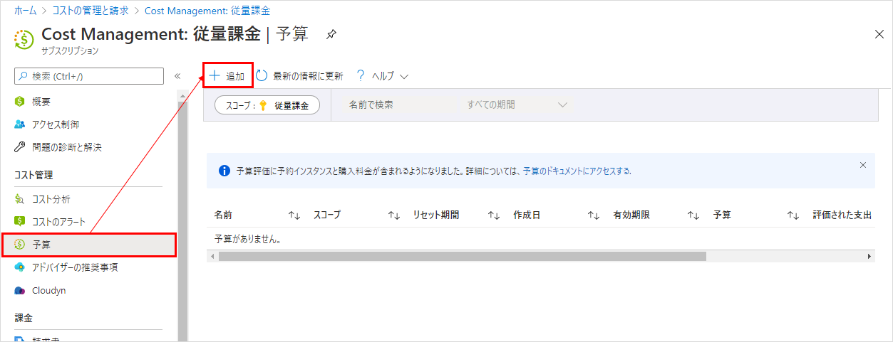
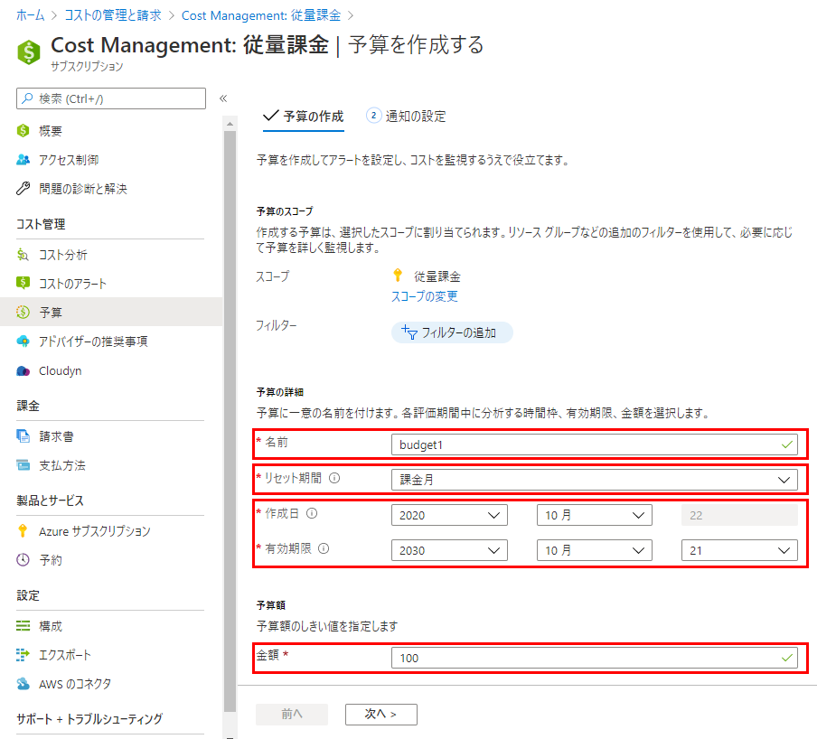
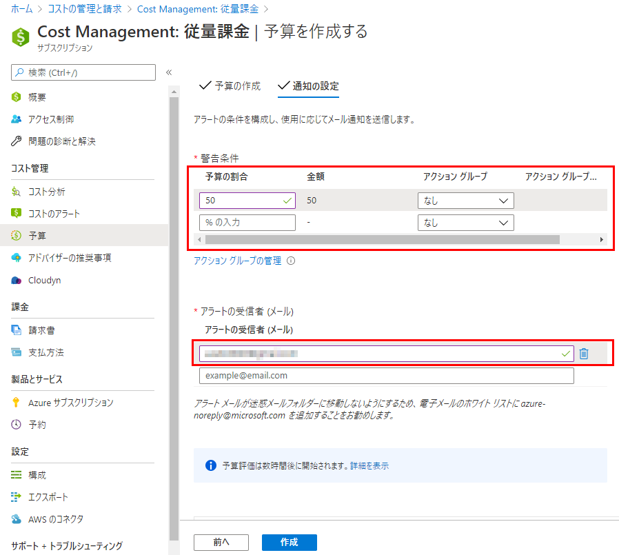

クラウドの課金は怖いので、設定額を超えたらアラートが飛ぶようにする。

Azure ポータルサイトの左上にある「三」→「コストの管理と請求」をクリックする。

各項目を入力して「次へ」をクリック。

* 名前 - 予算の名前を入力する。
* リセット期間 - 予算がリセットされる単位を指定する。
* 作成日、有効期限 - 予算の有効期間を指定する。
* 金額 - 予算の上限額を指定する。この後のステップで「○%を超えたらどうする」を指定するので、最大の予算額を指定しておけばよい。

「警告条件」の欄で、予算の何%を超えたら、の条件を指定する。
「アクショングループ」は条件を超えた際に動作させたいアクションを指定するらしい。
ただメールを送るだけの場合は、下のメールアドレスの欄に送信先を指定する。

最後に「作成」を押して完了。アラートの設定は以上。
