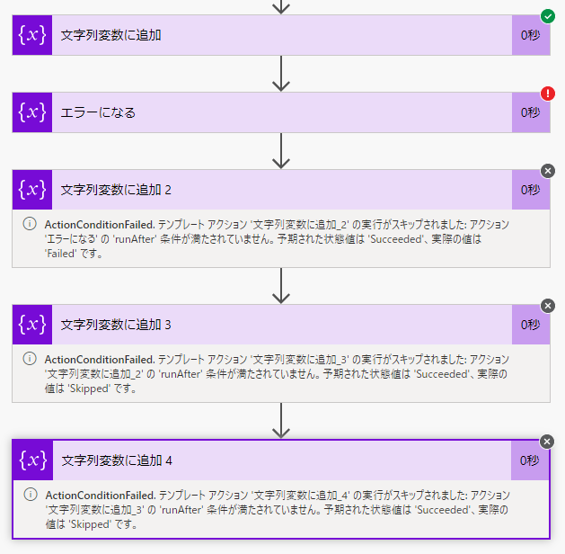
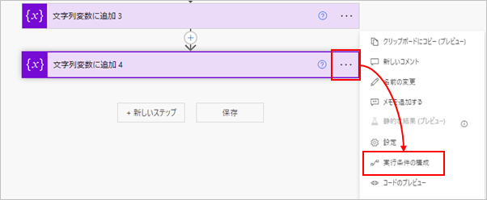
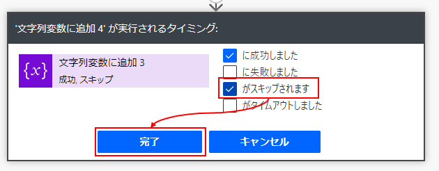
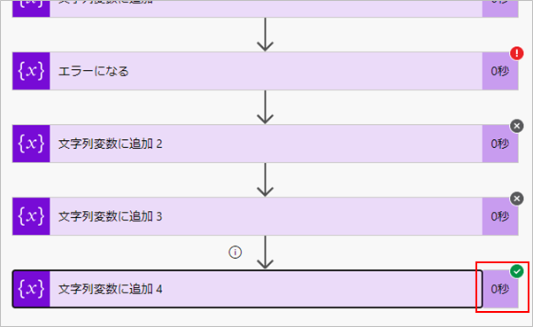
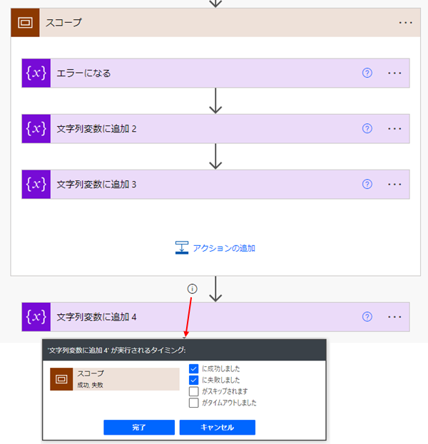
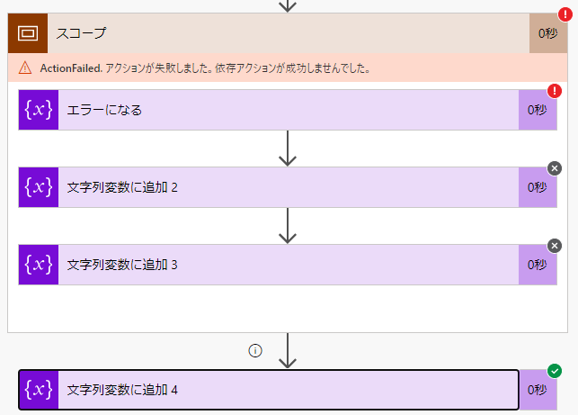

## フローの流れ方
フローは矢印の通り上から下に向かって実行される。上下のアクションは「上のアクションの終了ステータスが 成功 だったら、下アクションを実行する」という感じで繋がっている。
アクションの終了ステータスは 成功, 失敗, スキップ, タイムアウト などがある。
終了ステータスが 成功 以外の場合は、次アクションの実行をスキップする。
アクションの途中でエラーなった場合、フローの実行が強制終了されるわけではなく、アクションがスキップされつづけている。

既定のまま作ったフローの場合、途中でエラーがあったときの実行結果は下記の通り。

エラーの直後のアクションは、前のアクションが 失敗 だったからスキップしている。そしてその次のアクションは、前のアクションが スキップ だったからスキップしている。
アクションを実行するかどうか？の判定が最後のアクションまで行われ続けている。

それを確認するために、次は一番最後のアクションの実行条件を変更してみる。

一番最後のアクションで「…」をクリック → 「実行条件の構成」をクリック。

「がスキップされます」にチェックを入れる → 「完了」をクリック。

これを実行すると、途中のフローがエラーになっても、最後のフローが実行されているのが分かる。

## スコープ
「コントロール」の「スコープ」アクションを使うと、複数のアクションをひとまとめにできる。
フローが見やすくなるのに加え、アクション内の終了ステータスを継承するという特徴もある。これを使って、「ひとまとめにしたアクションのうちいずれかが失敗したとき」の処理を作れる。

例として下記のフローを作った。

スコープの中の1番目に、失敗になるアクションがある。そして、スコープの次のアクションでは、「失敗」の場合も実行するよう実行条件を追加した。

このフローの実行結果が下記の通り。

「エラーになる」アクションで「失敗」となったステータスを、スコープアクションが継承しているのが分かる。

参考：[Run actions based on group status by using scopes in Azure Logic Apps](https://docs.microsoft.com/en-us/azure/logic-apps/logic-apps-control-flow-run-steps-group-scopes)