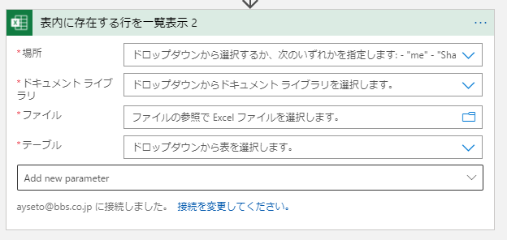
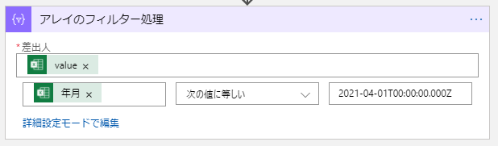
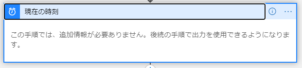
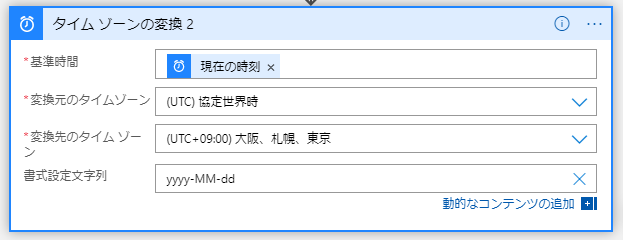
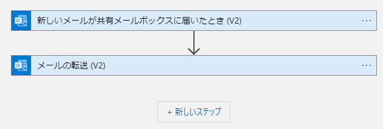

## Excel
SharePoint, OneDrive に保存した Excel ファイルを操作できるが、テーブルの取得やテーブルへの行の追加など、一覧データの取得、更新くらいしかできない。

### テーブル名を指定してデータを取得
「表内に存在する行を一覧表示 (List rows present in a table)」を使う。

テーブル内に日付データがある場合、オプションの「DateTime形式」をどちらにするか検討した方が良い。
既定では「Serial Number」になっていて、日付のシリアル値で取得される。対して「ISO 8601」に変更すると、「2021-04-01T00:00:00.000Z」のような日付形式になる。
Excelの日付にはタイムゾーンがないので、日本時間のつもりで入力していても、末尾にZがついてUTCとして取得される。
Logic App 内で日付を扱いたいときは、replace 関数などで Z を +09:00 に置き換えてから扱うと良い。

オプションの「フィルタークエリ」には ODATA クエリ形式でフィルターを設定できる。
こちらは日付データに対してはシリアル値を指定しないといけない。
Logic App でシリアル値を求めるのが面倒くさい場合は、全データ取得後、「アレイのフィルター処理」でデータを抽出できる。

## 日付

### 現在日時の取得
「現在の時刻」を使う。

タイムゾーンがUTCになっているので、日本時間へ変換してから扱った方がいい場合がある。

### タイムゾーンと書式の変換
「タイムゾーンの変換」を使うと、ついでに書式の変換もできる。

## SharePoint

### 「ファイルの作成」がエラーになる
エラーの内容：

    Bad Request - Invalid URL
    HTTP Error 400. The request URL is invalid.

現象：  
SharePoint の A フォルダにあるファイルを B フォルダにコピーしようとして、「ファイルコンテンツの取得」→「ファイルの作成」をしてエラーになった。

(2022年3月、Power Automateで発生)

原因：  
コピー先のフォルダパス ＋ ファイル名 ＋ ファイルコンテンツの容量が一定以上だとエラーになるっぽい？
詳細不明。

回避策：  
「ファイルの作成」の代わりに「ファイルの更新」を使う。

更新のアクションでも、ファイルが無い場合は新しく作成してくれる。

参考：[Solved: When I create a file in a SharePoint library - Bad... - Power Platform Community](https://powerusers.microsoft.com/t5/Building-Flows/When-I-create-a-file-in-a-SharePoint-library-Bad-Request-error/td-p/683512)

## トラブルシューティング

### メールの添付ファイルを保存できない

現象：  
メール受信をトリガーとしたフローで、添付ファイルの保存がエラーとなるか、保存できても0KBになってしまう。

原因：  
メール受信トリガーで、「添付ファイルを含める」を「はい」にしていない。

## 料金

Logic App のリソースは、従来通りの Consumption と後からできた Standard の二種類がある。
Consumption はマルチテナント または 総合サービス環境 (integration service environment) で実行され、Standard はシングルテナントで実行される。

Consumption (マルチテナント)：

* 簡単に始められる
* 従量課金
* フルマネージド
* 1つの Logic App リソースに対して、ワークフローは1つのみ。

Standard：

* Azure Functions が実行できる場所であれば、ほぼ実行できる。デプロイメントスロットは現在はサポートされていない。
* 1つの Logic App リソースに対して、複数のワークフローを作成できる。ワークフローには ステートレス と ステートフル がある。
* 価格は、Logic App が実行(起動？)されている間の時間で課金される。

制限：
https://docs.microsoft.com/en-us/azure/logic-apps/logic-apps-limits-and-config?tabs=azure-portal

### サンプル
Consumption で作った、特定のメールが届いたら転送するワークフローを例にする。

価格表によると、1アクションが ¥0.003136 、Standard コネクタ が ¥0.014560 なので、
このトリガーでは3分に1回メールをチェックする設定になっているので、1ヶ月あたりの料金は

    ¥0.014560 × 20回 × 24時間 × 31日 ＝ およそ¥217

となる。  
3分に1回トリガーが動いているということなので、たとえメールが1通も届かなくても料金が発生する。