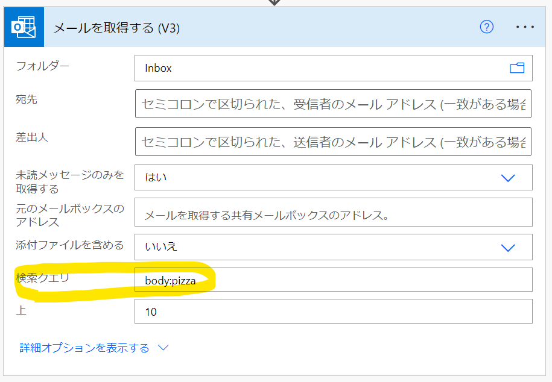

* ---
title: "OData クエリ"
date: 2022-07-28T16:57:23+09:00
draft: true
---

## 概要
Power Automate のいくつかのアクションで使えるクエリ言語。

## Outlook
「[複数のメールの取得 (V3)](https://docs.microsoft.com/ja-jp/connectors/office365/#%E8%A4%87%E6%95%B0%E3%81%AE%E3%83%A1%E3%83%BC%E3%83%AB%E3%81%AE%E5%8F%96%E5%BE%97-(v3))」アクション (操作 ID:GetEmailsV3)

参照：
[Microsoft Graph の $search クエリ パラメーターを使用する - Microsoft Graph | Microsoft Docs](https://docs.microsoft.com/ja-jp/graph/search-query-parameter?tabs=http)

既定の検索プロパティがある。from, subject, body の3つ。なので、単純に `pizza` とした場合は、from, subject, body のいずれかに "pizza" が含まれるものを検索する。
明示的に body を指定する場合は、`body:pizza` と書く。なお、これで pizza が本文に含まれるメッセージを検索できる。

* Received>=2022-07-26T00:00:00+09:00 ×
* Received>=2022-07-26T00:00:00%2B09:00 〇
* Received>=2022-07-26T00:00:00Z 〇