[MS のドキュメント](https://docs.microsoft.com/en-us/connectors/planner/)

## チェックリスト付きのタスクを作成する
「タスクを作成する (CreateTask_V3)」アクションを使う。ただ、このアクションで指定できるのは下記の項目だけで、チェックリストやコメントは付けられない。

* タイトル
* バケットID (どのバケットに作るか)
* 開始日時
* 期限日時
* 担当者
* ラベル

チェックリストを付けたい場合は、タスクを作成した後に「タスクの詳細の更新 (UpdateTaskDetails_V2)」アクションを使う。
チェックリストの数が動的に変化する場合は、アレイ型の変数に、id、title、isChecked の3つをキーに持つオブジェクトを追加していくと良い。

下記は、サンプルのフローの全体。

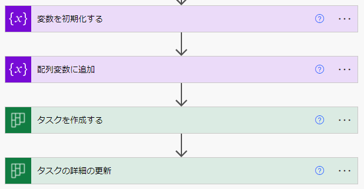

ここからは、上記フローの詳細を1つずつ解説する。

まず初めに、アレイ型の変数を初期化する。

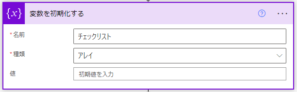

次に「変数」コネクタにある「配列変数に追加」を使う。値には id、title、isChecked の3つのキーを持つオブジェクトをJSON形式で指定する。

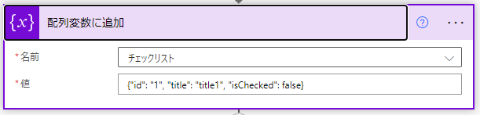

これを追加したい項目の数だけ繰り返す。

そして最後にタスクを作成し、その作成した直後のタスクに対して「タスクの詳細を更新」する。

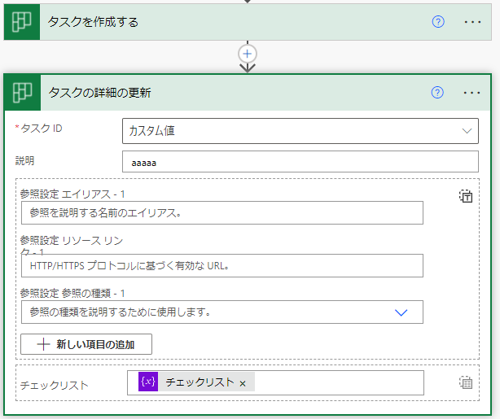

更新対象の「タスクID」はリストから選択するのではなく、「カスタム項目の追加」をクリック → 動的な値を追加 → 「タスクを作成する」の「ID」を指定する。

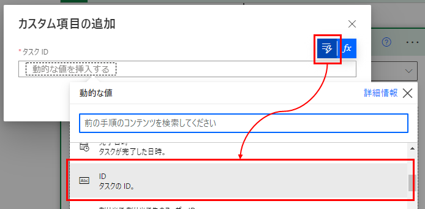

そしてチェックリストは、「アレイ全体の入力へ切り替える」をクリックしてから、先ほど作ったアレイ変数を指定する。

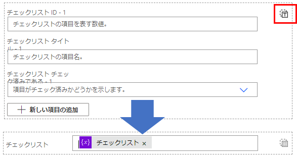

フローの説明は以上。このフローを実行すると、新しいタスクが作成され、チェックリストも付いている。

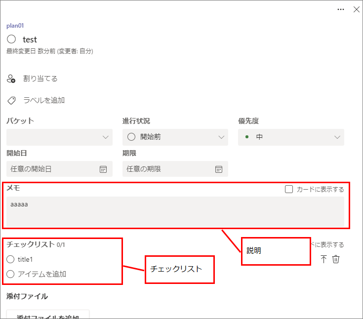

## タスクをコピーする
タスクをコピーするアクションはないので、下記の手順でコピーを実現する。

1. 「タスクを取得する(GetTask_V2)」と「タスクの詳細を取得する(GetTaskDetails_V2)」を使い、コピー元タスクを取得。
    * どちらのアクションを使うかは、コピーしたい項目による。両方使う可能性もある。
1. 「タスクを作成する (CreateTask_V3)」で、コピー先タスクを作成。
1. 「タスクの詳細の更新 (UpdateTaskDetails_V2)」で、前の手順で指定できなかった項目をコピー先へ反映する。

### コピー元のタスクIDを取得する
「タスクの詳細を取得する」アクションには、取得したいタスクの ID が必要。
しかし、コピー元にしたいタスクが「タスクID」のリストに載っていない場合がある。そういうときは、Planner のページを開き、自分で ID を取ってくる必要がある。
手順は下記の通り。

1. Web ブラウザで [Planner のページ](https://tasks.office.com/) を開く。Teams から見た Planner のページではなく、Planner を直接開く。
1. コピー元タスクの「…」をクリック → 「タスクへのリンクをコピー」をクリック。<br>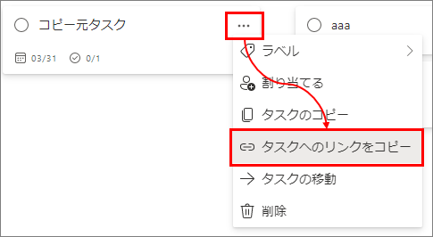
1. URLをテキストエディタ等へ貼り付ける。URL のうち、図で示した部分がタスクIDなので、この部分をコピーする。<br>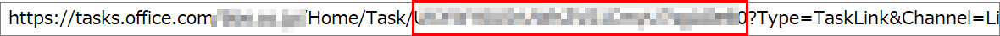

(今のところこれしか方法が分からず、もっといい方法があるなら知りたい…)

取ってきたIDは、「カスタム項目の追加」で追加する。

### チェックリストをコピーする
チェックリストをコピーする場合、「タスクの詳細を取得する」で取得したチェックリストを所定の形へ変換してから、更新アクションへ渡す必要がある。
下図がその加工のサンプル。

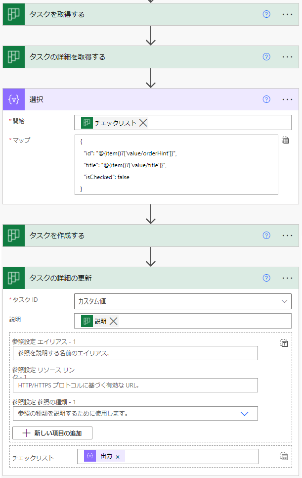

連続データの構造を変えるには、[データ操作 の 選択](https://docs.microsoft.com/en-us/power-automate/data-operations#use-the-select-action) を使う。
「開始」に「タスクの詳細を取得する」で取得したチェックリストを指定し、「マップ」をテキストモードへ切り替え、下記を直接入力する。

```
{
  "id": @{item()?['value/orderHint']},
  "title": @{item()?['value/title']},
  "isChecked": "false"
}
```

id に orderHint を使っているのは、チェックリストの並び順をコピー元と一緒にする方法がこれしかなかったためである。

#### なぜ変換するか

「タスクの詳細を取得する」で取得したチェックリストをそのまま更新アクションで使っても上手くいかない。

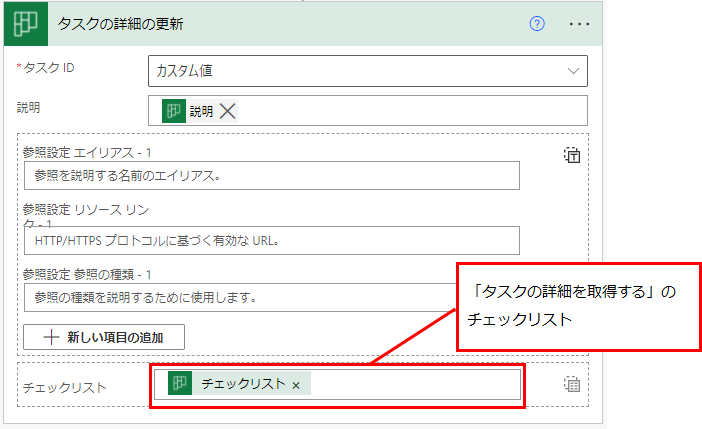

これを実行すると、下記のエラーになる。

    種類 'OpenApiConnection' のワークフロー操作 'タスクの詳細の更新' の 'inputs.parameters' が無効です。
    エラーの詳細: API 操作 'UpdateTaskDetails_V2' に、必要なプロパティ 'body/checklist/0/title' がありません。

これは、更新のアクションでは id、title、isChecked の3つのキーを持つオブジェクトの配列を想定しているのに対し、「詳細を取得」するアクションで取得できるチェックリストの構造が違うため。
下図は、詳細を取得アクションで取得したチェックリストの例。

```json
[
  {
    "id": "1",
    "value": {
      "@odata.type": "#microsoft.graph.plannerChecklistItem",
      "isChecked": false,
      "title": "title1",
      "orderHint": "8585541056016538046",
      "lastModifiedDateTime": "2022-03-17T07:43:02.2291935Z",
      "lastModifiedBy": {
        "user": {
          "displayName": null,
          "id": "xxxx"
        }
      }
    }
  }
]
```

## チェックリストの並び順
「タスクの詳細を取得する(GetTaskDetails_V2)」で取得したチェックリストは、Planner で見た時の並び順と違う順番に並んでいることがある。
並び順の情報は [orderHint](https://docs.microsoft.com/en-us/graph/api/resources/planner-order-hint-format?view=graph-rest-1.0) で分かるが、「タスクの詳細の更新 (UpdateTaskDetails_V2)」に orderHint を渡すことができない。

ただ、新しく追加する分のチェックリストは、id の順番で orderHint も振られるようにみえる。なので、タスクをコピーするときに限っては、id に orderHint を入れるというのも手ではある。

他には、取得したチェックリストを orderHint で並べ直してから、id を改めて振っていく方法が考えられる。
並べ直す部分を Power Automate で作るのは難しいので、Azure Functions や Office スクリプトなど、スクリプトが書けるほうに任せた方がいい。

### Office スクリプトのサンプル
orderHint で並び替えるサンプル。
Office スクリプトは Excel のブックを指定しつつ実行するが、このサンプルは Excel を使わない。
そのため、Power Automate から実行するときは、何かダミー用の Excel ファイルを指定すると良い。

```ts
/**
 * orderHint で a と b を比較する。
 * 1. 先頭から1文字ずつ比較し、小さい方が前になる。
 * 2. 同じ文字が続く場合、文字数が短い方が前になる。
 * 
 * inputJson: キーに orderHint を持つJsonの連続データ
 */
function main(workbook: ExcelScript.Workbook
  , inputJson : string)
{
  let parsedJson: Array<object> = JSON.parse(inputJson);
  let sortedJson = parsedJson.sort((a, b) => {
    let orderHintA = a["orderHint"] as string;
    let orderHintB = b["orderHint"] as string;

    if (orderHintA == null && orderHintB == null) {
      return 0;

    } else if (orderHintA == null) {
      return -1;

    } else if (orderHintB == null) {
      return 1;
    }

    let lengthA = orderHintA.length;
    let lengthB = orderHintB.length;
    let idx = 0;

    while (true) {
      if (idx >= lengthA && idx >= lengthB) {
        return 0;

      } else if (idx >= lengthA) {
        return -1;

      } else if (idx >= lengthB) {
        return 1;
      }

      let charA = orderHintA.charAt(idx);
      let charB = orderHintB.charAt(idx);

      if (charA < charB) {
        return -1;

      } else if (charA > charB) {
        return 1;
      }

      idx++;
    }

    return 0;
  });

  return JSON.stringify(sortedJson);
}
```

↓ パラメータの例

    [
      {
        "id": "1",
        "orderHint": "8585541056016538046",
        "title": "title1",
        "isChecked": "false"
      },
      {
        "id": "2",
        "orderHint": "[8",
        "title": "title2",
        "isChecked": "false"
      },
      {
        "id": "3",
        "orderHint": "8585540Ei",
        "title": "title3",
        "isChecked": "false"
      }
    ]

↓実行結果の例 (orderHint の順番になっている)

    [
      {
        "id": "3",
        "orderHint": "8585540Ei",
        "title": "title3",
        "isChecked": "false"
      },
      {
        "id": "1",
        "orderHint": "8585541056016538046",
        "title": "title1",
        "isChecked": "false"
      },
      {
        "id": "2",
        "orderHint": "[8",
        "title": "title2",
        "isChecked": "false"
      }
    ]