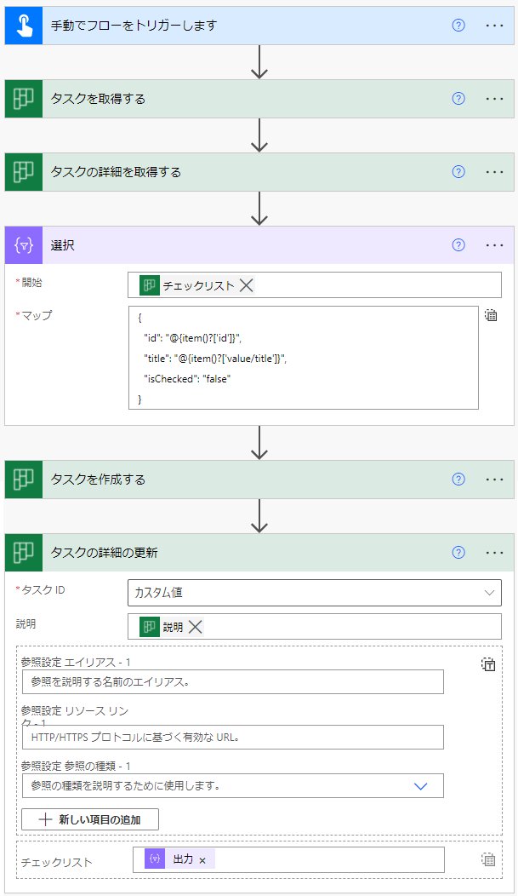
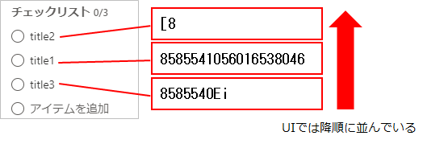
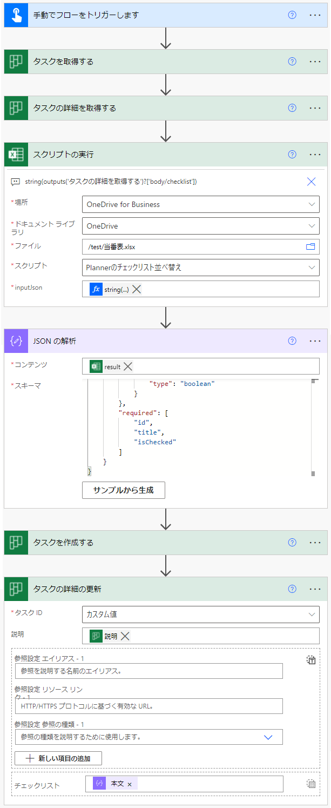

[MS のドキュメント](https://docs.microsoft.com/en-us/connectors/planner/)

## チェックリスト付きのタスクを作成する
「タスクを作成する (CreateTask_V3)」アクションを使う。ただ、このアクションで指定できるのは下記の項目だけで、チェックリストやコメントは付けられない。

* タイトル
* バケットID (どのバケットに作るか)
* 開始日時
* 期限日時
* 担当者
* ラベル

チェックリストを付けたい場合は、タスクを作成した後に「タスクの詳細の更新 (UpdateTaskDetails_V2)」アクションを使う。
チェックリストの数が動的に変化する場合は、アレイ型の変数に、id、title、isChecked の3つをキーに持つオブジェクトを追加していくと良い。

下記は、サンプルのフローの全体。


ここからは、上記フローの詳細を1つずつ解説する。

まず初めに、アレイ型の変数を初期化する。


次に「変数」コネクタにある「配列変数に追加」を使う。値には id、title、isChecked の3つのキーを持つオブジェクトをJSON形式で指定する。


これを追加したい項目の数だけ繰り返す。

そして最後にタスクを作成し、その作成した直後のタスクに対して「タスクの詳細を更新」する。


更新対象の「タスクID」はリストから選択するのではなく、「カスタム項目の追加」をクリック → 動的な値を追加 → 「タスクを作成する」の「ID」を指定する。


そしてチェックリストは、「アレイ全体の入力へ切り替える」をクリックしてから、先ほど作ったアレイ変数を指定する。


フローの説明は以上。このフローを実行すると、新しいタスクが作成され、チェックリストも付いている。


## タスクをコピーする
タスクをコピーするアクションはないので、下記の手順でコピーを実現する。

1. 「タスクを取得する(GetTask_V2)」と「タスクの詳細を取得する(GetTaskDetails_V2)」を使い、コピー元タスクを取得。
    * どちらのアクションを使うかは、コピーしたい項目による。両方使う可能性もある。
1. 「タスクを作成する (CreateTask_V3)」で、コピー先タスクを作成。
1. 「タスクの詳細の更新 (UpdateTaskDetails_V2)」で、前の手順で指定できなかった項目をコピー先へ反映する。

### コピー元のタスクIDを取得する
「タスクの詳細を取得する」アクションには、取得したいタスクの ID が必要。
しかし、コピー元にしたいタスクが「タスクID」のリストに載っていない場合がある。そういうときは、Planner のページを開き、自分で ID を取ってくる必要がある。
手順は下記の通り。

1. Web ブラウザで [Planner のページ](https://tasks.office.com/) を開く。Teams から見た Planner のページではなく、Planner を直接開く。
1. コピー元タスクの「…」をクリック → 「タスクへのリンクをコピー」をクリック。<br>
1. URLをテキストエディタ等へ貼り付ける。URL のうち、図で示した部分がタスクIDなので、この部分をコピーする。<br>

(今のところこれしか方法が分からず、もっといい方法があるなら知りたい…)

取ってきたIDは、「カスタム項目の追加」で追加する。

### チェックリストのコピー (順不同ver)
チェックリストをコピーする場合、「タスクの詳細を取得する」で取得したチェックリストを所定の形へ変換してから更新アクションへ渡す。
下図がその加工のサンプル。



連続データの構造を変えるには、[データ操作 の 選択](https://docs.microsoft.com/en-us/power-automate/data-operations#use-the-select-action) を使う。
「開始」に「タスクの詳細を取得する」で取得したチェックリストを指定し、「マップ」をテキストモードへ切り替え、下記を直接入力する。

```
{
  "id": "@{item()?['id']}",
  "title": "@{item()?['value/title']}",
  "isChecked": "false"
}
```

ただし、この方法ではコピー先のチェックリストの並び順が、コピー元と同じになるとは限らない。

#### なぜ変換するか

「タスクの詳細を取得する」で取得したチェックリストをそのまま更新アクションで使っても上手くいかない。


これを実行すると、下記のエラーになる。

    種類 'OpenApiConnection' のワークフロー操作 'タスクの詳細の更新' の 'inputs.parameters' が無効です。
    エラーの詳細: API 操作 'UpdateTaskDetails_V2' に、必要なプロパティ 'body/checklist/0/title' がありません。

これは、更新のアクションでは id、title、isChecked の3つのキーを持つオブジェクトの配列を想定しているのに対し、「詳細を取得」するアクションで取得できるチェックリストの構造が違うため。
下図は、詳細を取得アクションで取得したチェックリストの例。

```json
[
  {
    "id": "1",
    "value": {
      "@odata.type": "#microsoft.graph.plannerChecklistItem",
      "isChecked": false,
      "title": "title1",
      "orderHint": "8585541056016538046",
      "lastModifiedDateTime": "2022-03-17T07:43:02.2291935Z",
      "lastModifiedBy": {
        "user": {
          "displayName": null,
          "id": "xxxx"
        }
      }
    }
  }
]
```

### チェックリストのコピー (順番揃えるver)
「タスクの詳細を取得する(GetTaskDetails_V2)」で取得したチェックリストの並び順は [orderHint](https://docs.microsoft.com/en-us/graph/api/resources/planner-order-hint-format?view=graph-rest-1.0) で分かる。Planner の UI から見るとチェックリストは orderHint の降順に並んでいる。



しかし、「タスクの詳細の更新 (UpdateTaskDetails_V2)」には orderHint を渡すことができない。
ただ、新しく追加する分のチェックリストは、id の昇順で UI 上も並ぶようなので、以下の手順でコピー元と並び順を揃えられる。

1. 「タスクの詳細を取得する」で取得したチェックリストを orderHint の降順で並べ替える。
1. 先頭から id を 1 から振る。

並べ直したりする部分を Power Automate で作るのは難しいので、Azure Functions や Office スクリプトなど、スクリプトが書けるほうに任せた方がいい。

下記は、Office スクリプトで並べ替え＆idの振り直しをするサンプル。

```ts
/**
 * Plannerのチェックリストを受け取り、orderHint の降順で並べ替えつつ
 * id を1から振りなおす。
 * このスクリプトではExcelブックを使用しない。
 * 
 * inputJson: 「タスクの詳細を取得」で取得したチェックリスト
 * 戻り値：キーに id, title, isChecked を持つJsonの連続データ
 */
function main(workbook: ExcelScript.Workbook
  , inputJson : string)
{
  let parsedJson: Array<object> = JSON.parse(inputJson);

  // ソート始まり
  parsedJson.sort((a, b) => {
    let orderHintA = a["value"]["orderHint"] as string;
    let orderHintB = b["value"]["orderHint"] as string;

    if (orderHintA == null) {
      orderHintA = "";
    }

    if (orderHintB == null) {
      orderHintB = "";
    }

    let lengthA = orderHintA.length;
    let lengthB = orderHintB.length;
    let idx = 0;

    while (idx < lengthA && idx < lengthB) {
      let charA = orderHintA.charCodeAt(idx);
      let charB = orderHintB.charCodeAt(idx);

      if (charA < charB) {
        return -1;

      } else if (charA > charB) {
        return 1;
      }

      idx++;
    }

    if (lengthA == lengthB) {
      return 0;

    } else if (lengthA < lengthB) {
      return -1;

    } else if (lengthA > lengthB) {
      return 1;
    }

    return 0;
  });
  // ソート終わり

  parsedJson.reverse();

  let mappedJson = parsedJson.map((a, index) => {
    return {
      "id": index + 1
      , "title": a["value"]["title"]
      , "isChecked": a["value"]["isChecked"]
    };
  });

  return JSON.stringify(mappedJson);
}
```

そして、このスクリプトをフローから呼び出す。下記がそのフローのサンプル。



タスクの詳細を取得した後、「スクリプトの実行」で先ほどのスクリプトを呼び出す。

* ファイル ： 何でもいい。
* スクリプト ： 先ほどのサンプルスクリプトの名前。
* inputJson ： 「タスクの詳細を取得する」で取得したチェックリストを文字列へ変換する。
   * ```string(outputs('タスクの詳細を取得する')?['body/checklist'])```

次に、「JSON の解析」でスクリプトの実行結果を JSON へパースする。これをしないと、「タスクの詳細の更新」の引数に指定できない。

* コンテンツ ： 「スクリプトの実行」の出力結果。
* スキーマ ：  下記記載。

```
{
    "type": "array",
    "items": {
        "type": "object",
        "properties": {
            "id": {
                "type": "integer"
            },
            "title": {
                "type": "string"
            },
            "isChecked": {
                "type": "boolean"
            }
        },
        "required": [
            "id",
            "title",
            "isChecked"
        ]
    }
}
```

最後に「タスクの詳細の更新」のチェックリストに「JSON の解析」の実行結果を指定する。
