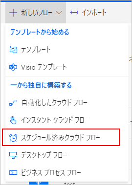
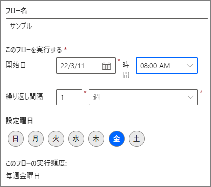
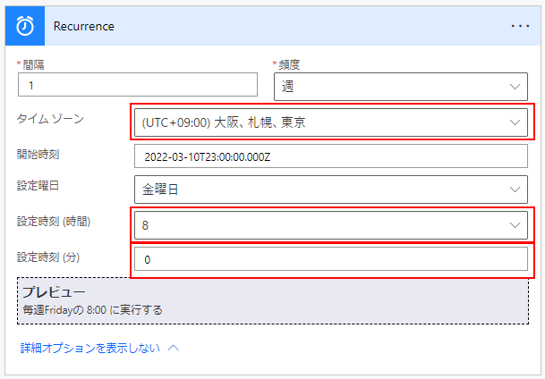
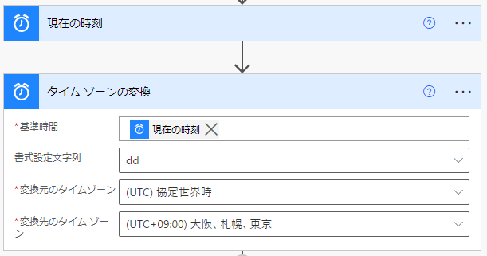
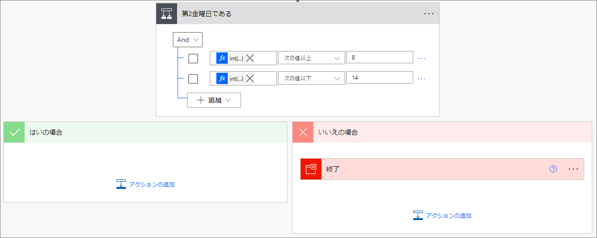
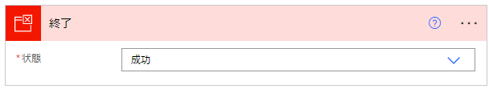
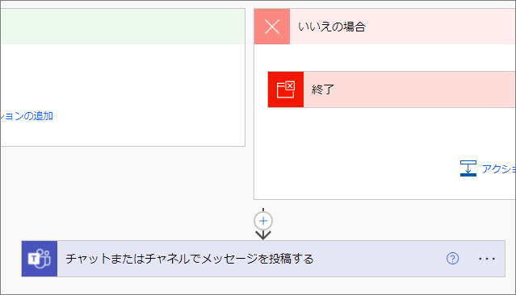

## はじめに
Power Automate のフローを、毎月第2金曜日、のように「第n●曜日」だけ実行したい場合のサンプル。

## スケジュール済みクラウドフローを作成

新しいフローを作成するときに、「スケジュール済みクラウドフロー」を選ぶ。

※ 手動でトリガーを追加する場合は、「Recurrence」を選ぶ。

「スケジュール済みクラウドフロー」を選んだ場合は、フロー名と同時にフローを実行するスケジュールを指定する。ここでは「第2金曜日のAM8:00」に実行すると仮定して、以下のように指定した。

まだ設定が必要な項目があるので、ひとまずこれでフローを作成する。フローの編集画面になったら、Recurrence の詳細を表示する。

以下3つの項目が空白なので、それぞれ値を指定する。

* タイムゾーン ： 日本時間に合わせたい場合は、「(UTC+09:00) 大阪、札幌、東京」を選ぶ。
* 設定時刻 (時間) ：「8」を選ぶ。
* 設定時刻 (分) ： 「0」を入力。

特にタイムゾーンの指定が空白のままだと、日本時間の金曜日AM8:00にフローが実行されない (土曜日のAM8:00に実行される)。
開始時刻をUTCにして日本時間のAM8:00にしているが、これではだめらしい。

## 第2金曜日かチェック

### 現在日付を取得
まず、「現在の時刻」と「タイムゾーンの変換」を置き、現在日付の日の部分を取り出す。

フローは下記の通り。

* 書式設定文字列 ： カスタム値の入力から「dd」を入力。
* 変換元のタイムゾーン ： (UTC) 協定世界時
* 変換先のタイムゾーン ： (UTC+09:00) 大阪、札幌、東京

### 日付で分岐
次に分岐を使い、日付が8～14の間ではない場合にフローを終了させる。

分岐の左辺は `int(body('タイム_ゾーンの変換'))` として、日付を数値に変換している。

「終了」のアクションでは、「状態」を「成功」にしておく。状態が「失敗」のままだとフローがエラーで終了したことになってしまうので、本当にエラーだった時と区別が付きづらくなるのでお勧めしない。

## 分岐の後にフローを続ける
あとは、第2金曜日にやりたいことを、分岐の後に足していけばよい。

## 応用 (日付の考え方)
月の1日目が何曜日で始まっても、第2●曜日は必ず 8日～14日の間になる。そのため、毎週金曜日にフローを起動し、日付が8～14の間のときだけフローを続けている。

同じように、第1●曜日、第3●曜日は下記のようになる。

* 第1●曜日 ： 1日～7日
* 第2●曜日 ： 8日～14日
* 第3●曜日 ： 15日～21日
* 第4●曜日 ： 22日～28日
* 第5●曜日 ： 29日～31日
