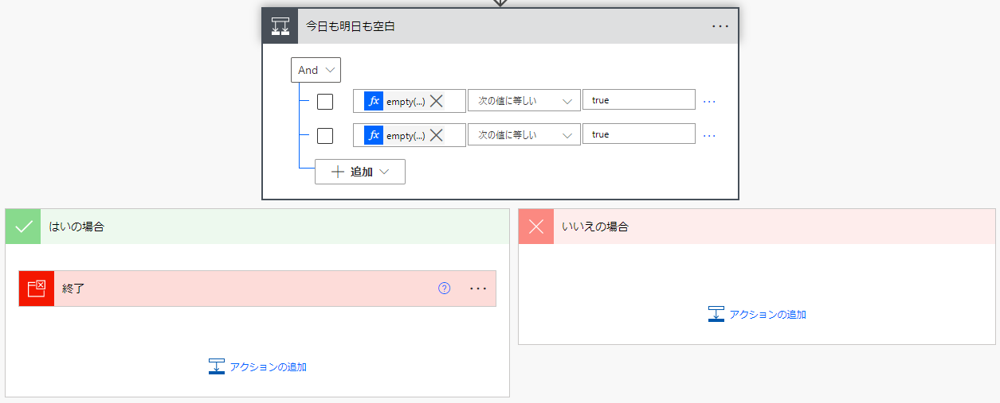

## はじめに
職場の電話当番とか掃除当番の表をExcelで管理して、毎日決まった時間に今日の当番をTeamsへ通知するサンプル。

使うもの：

* Excel
* Office Scripts
* Power Automate
* SharePoint (または OneDrive)
* Teams

## 当番表の作成
当番表と、担当者のメールアドレスの2つの表を用意する。


いずれも「テーブル」にしておく。
このExcelファイルは SharePoint の任意の場所へ置き、Power Automate からアクセスできるようにしておく。

## Office スクリプトの作成
指定した日付で当番表を検索し、担当者の名前とメールアドレスを返す Office スクリプトを作成する。

今日と明日の当番を一度に通知したいので、引数で日付を文字列で受け取り、戻り値として JSON 形式で担当者名とメールアドレスを返す。引数の日付は applyValuesFilter メソッドの仕様上、yyyy-MM-dd 形式でなければならない。

サンプルを下記に記載。

```typescript
function main(workbook: ExcelScript.Workbook
  , dtstr: string)
{
  let tantosha = getTantosha(workbook, dtstr);
  let mailAddress = null as string;

  if (tantosha != null) {
    mailAddress = getMailAddress(workbook, tantosha);
  }

  return {"tantosha": tantosha, "mailAddress": mailAddress};
}

/**
 * 担当者取得
 */
function getTantosha(workbook: ExcelScript.Workbook
  , dtstr: string) {
  let result: string = null;
  let sheet = workbook.getWorksheet("Sheet1");
  let table = sheet.getTable("メール当番");

  // フィルタ
  table.clearFilters();
  let column = table.getColumnByName("日付");
  column.getFilter().applyValuesFilter([{ date: dtstr, specificity: ExcelScript.FilterDatetimeSpecificity.day }]);

  // 結果を取得
  let range = table.getRange().getVisibleView();
  if (range.getRowCount() == 1) {
    table.clearFilters();
    return result;
  }

  // values は Object[][] 型。1行目にヘッダー、2行目以降にデータ行。
  // 担当者の値を返す
  result = range.getValues()[1][1] as string;

  table.clearFilters();
  return result;
}

/**
 * メールアドレス取得
 */
function getMailAddress(workbook: ExcelScript.Workbook
  , tantosha: string) {
  let result: string = null;
  let sheet = workbook.getWorksheet("Sheet1");
  let table = sheet.getTable("担当者メールアドレス");

  // フィルタ
  table.clearFilters();
  let column = table.getColumnByName("担当者");
  column.getFilter().applyValuesFilter([tantosha]);

  // 結果を取得
  let range = table.getRange().getVisibleView();
  if (range.getRowCount() == 1) {
    table.clearFilters();
    return result;
  }

  // values は Object[][] 型。1行目にヘッダー、2行目以降にデータ行。
  // 担当者の値を返す
  result = range.getValues()[1][1] as string;

  table.clearFilters();
  return result;
}
```

## Power Automate でフローの作成
「スケジュール済みクラウドフロー」を新規作成する。繰り返しの頻度や実行時間を必要に応じて設定する。


フローの全体像は下記の通り。


### 今日と明日の日付を取得
「現在の時刻」を使い、実行時の日時を取得する。

そのあと、「タイムゾーンの変換」を使い、現在日時のタイムゾーンと書式を変換する。


* 書式設定文字列：yyyy-MM-dd (リストにはないので、カスタム値として直接入力する)
* 変換元のタイムゾーン：UTC
* 変換先のタイムゾーン：UTC+09:00 大阪、札幌、東京

明日の日付を取得するには「未来の時間の取得」を使う。


こちらの取得結果も同じようにタイムゾーンと書式を変換する。

### 当番表のスクリプトを実行する
今日と明日の日付を引数にして、先に作成した Office スクリプトを実行する。

Excel Online (Business) の「スクリプトの実行 (RunScriptProd)」を使う。


* 場所、ファイル ： 当番表を指定する。
* スクリプト ： 前の手順で作成したスクリプトの名前。
* dtstr ： 書式変換後の今日の日付または明日の日付。

### 担当者の有無で分岐
今日も明日も担当者がいない場合は、ここでフローを終了させている (休日などの場合を考慮)。



Office スクリプトは担当者を取得できない場合は担当者名を null にするので、フローの条件文で empty 関数を使う。

条件式の左側のサンプルを下記に記載する。

    empty(outputs('今日の当番を取得')?['body/result/tantosha'])

実際に入力するときは ```empty()``` だけ入力し、カッコの中は「動的な値」から選択して挿入するとよい。

### チャットメッセージの作成
「変数を初期化する」を使い、「チャットメッセージ」という名前の変数を定義する。種類は文字列、値は空白にする。


今回は、担当者のメールアドレスがある場合はメンションを挿入し、メールアドレスがない場合は担当者名をメッセージに挿入する。


メンションを挿入するには、メールアドレスを ```<at></at>``` で囲む。


変数に文字列を追加するには、「文字列変数に追加」を使う。

### チャットメッセージを送る
Teams コネクタの「チャットまたはチャネルでメッセージを投稿する (PostMessageToConversation)」を使う。


メッセージ欄は動的な値があるときの編集が分かりづらいので、コードビューに切り替えて編集するとよい。


## テストする
作成したフローを実行すると、下記のようなメッセージが Teams に送られる。

