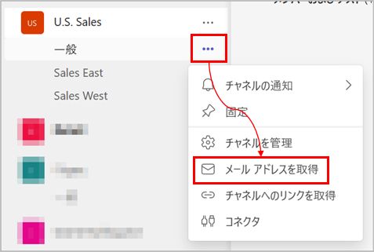
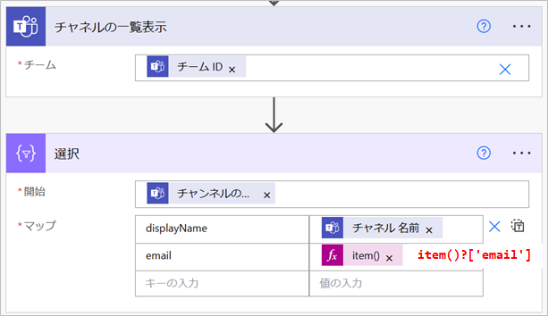

Teams のチャネルで取得できるメッセージ投稿用のメールアドレスを、Power Automate のクラウド フローで取得できるか？



結論：できない。

## Teams コネクタの「チャネルの一覧」アクション
Teams コネクタの「チャネルの一覧」アクションで取得できる email は、一般チャネルの場合のみ、グループのアドレスになる。
他のチャネルは teams.ms で終わるアドレス (投稿用アドレス) が取得できる。
(まだ1度もメールアドレスを取得したことが無い場合は null)

※ フローの例


※ 選択アクションの出力
```json
{
    "body": [
        {
            "displayName": "Sales East",
            "email": "xxxxx.xxxxx.onmicrosoft.com@apac.teams.ms"
        },
        {
            "displayName": "Sales West",
            "email": null
        },
        {
            "displayName": "General",
            "email": "U.S.Sales@xxxxx.onmicrosoft.com"
        }
    ]
}
```
 
## Graph API 
投稿用アドレスを初めて取得するときは、Graph API もしくは GUI でのメールアドレス取得の実施が必要。Graph API は下記ドキュメント参照 (provisionEmail)。

[チャネル: provisionEmail - Microsoft Graph v1.0 | Microsoft Learn](https://learn.microsoft.com/ja-jp/graph/api/channel-provisionemail?view=graph-rest-1.0&tabs=http)

この Graph API、すでにメールアドレス取得済みのチャネルに対して実行すると、 412 Precondition Failed のエラーになる。

エラーの例：
```json
{
    "error": {
        "code": "Conflict",
        "message": "Conflict",
        "innerError": {
            "message": "",
            "code": "EmailAddressAlreadyProvisioned",
            "innerError": {},
            "date": "2023-03-22T10:30:06",
            "request-id": "xxxxx",
            "client-request-id": "xxxxx"
        }
    }
}
```

Graph API の「チャネルを取得」する API も、一般チャネルについてはグループのメールアドレスを返す。

参考：[チャネルを取得する - Microsoft Graph v1.0 | Microsoft Learn](https://learn.microsoft.com/ja-jp/graph/api/channel-get?view=graph-rest-1.0&tabs=http)

つまり、二重の POST 防止もできない。

### おまけ
Graph API の provisionEmail は、Power Automate から実行することもできない。

* HTTP with Azure AD コネクタ → ChannelSettings.ReadWrite.All の許可を持っていないためエラーになる。
* HTTP アクション → 委任のアクセス許可には対応していない。
  * ChannelSettings.ReadWrite.All のアクセス許可は、委任のみサポートしている。
