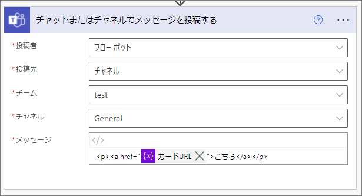
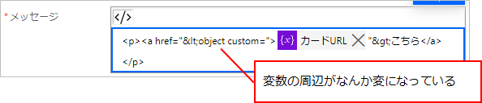
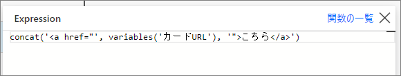

## 発端
Power Automate で Teams のメッセージを送る時に、先のアクションで取得したURLを送りたいときがある。
そんな時、「チャットまたはチャネルでメッセージを投稿する」アクションで以下のようなメッセージを作った。

しかし、このアクションを一度最小化して戻すと、以下のようになってしまう。

## 解決策
concat 関数を挿入し、リンクのタグと変数を結合する。

挿入後の見た目はこんな感じ。

分かりづらくなってしまうが、いたしかたない。

参考：[Flow Bot unable to add clickable URL to Teams - Page 2 - Power Platform Community](https://powerusers.microsoft.com/t5/Power-Automate-Ideas/Flow-Bot-unable-to-add-clickable-URL-to-Teams/idc-p/710571/highlight/true#M23005)