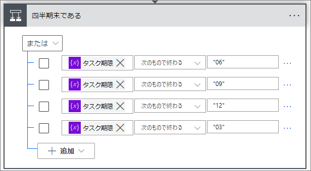

## 発端
Power Automate のクラウドフローで、下記のような分岐を作った。


変数「タスク期限」には「2022-03」という形式で年月が入っているので、その末尾が四半期末の月かチェックしたかった。
しかし、フローを実行したら下記のエラーになってしまった。


    行 '0'、列 '0' のアクション '四半期末である' に対するテンプレート言語式を処理できません: 'テンプレート言語関数 'endsWith' の 2 番目のパラメーターは文字列型である必要があります。指定された値は 'Integer' 型です。使用方法の詳細については、https://aka.ms/logicexpressions#endswith をご覧ください。'。

文字として入力したつもりだけど、「03」は数字しかないので自動的に数値型になってしまった。

## 詳しく調べる方法

エラーが起きたアクションの「…」をクリック → 「クリップボードにコピー」をクリック。


すると、アクションのコードがクリップボードに入る。コードはJSON形式で、下記のようになっている。

```
{
    // 略
    "operationName": "四半期末である",
    "operationDefinition": {
        "type": "If",
        "expression": {
            "or": [
                {
                    "endsWith": [
                        "@variables('タスク期限')",
                        "06"
                    ]
                },
                {
                    "endsWith": [
                        "@variables('タスク期限')",
                        "09"
                    ]
                },
                {
                    "endsWith": [
                        "@variables('タスク期限')",
                        12
                    ]
                },
                {
                    "endsWith": [
                        "@variables('タスク期限')",
                        "03"
                    ]
                }
            ]
        }
        // 略
    }
}
```

よくみると、「12」だけ二重引用符で囲まれておらず、数値として扱われているように見える。

## 解決方法

二重引用符を付けて入力する。下記のような感じ。



もしくは、「式の追加」をクリックし、「'03'」と入力してもいい。こちらの場合は一重引用符で囲む。


入力後、下記のように「undefined」が見えるが問題ない。


ただし、どちらの場合も注意点がある。
それは、このフローの編集画面を離れ、再び編集画面に戻ってくると見た目が「03」に戻っていることである。


もう一度コードを確かめれば分かるが、これでも文字列として扱われているので問題ない。ただ、この値をもう1回編集するときは文字列になるか数値になるか分からないので、入力するときは二重引用符を付けることを習慣にするといい。
