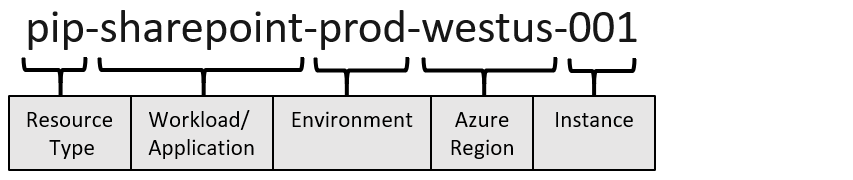

https://docs.microsoft.com/ja-jp/azure/cloud-adoption-framework/ready/azure-best-practices/naming-and-tagging

* [リソース名の略称一覧](https://docs.microsoft.com/ja-jp/azure/cloud-adoption-framework/ready/azure-best-practices/resource-abbreviations)

