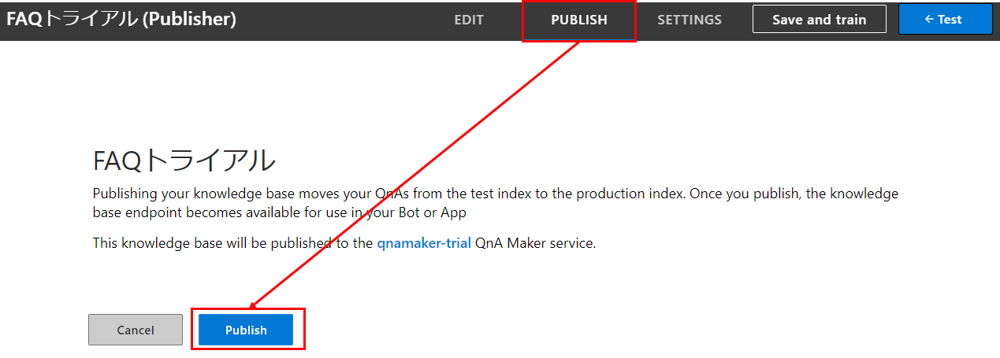
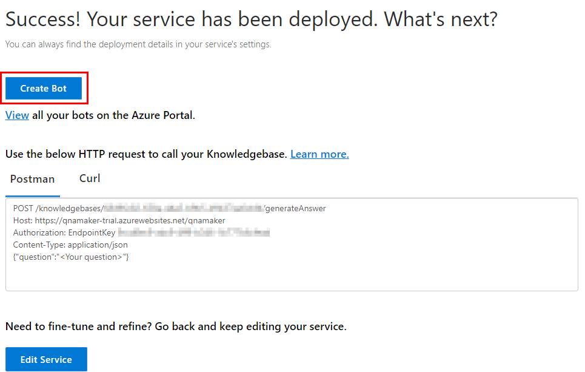
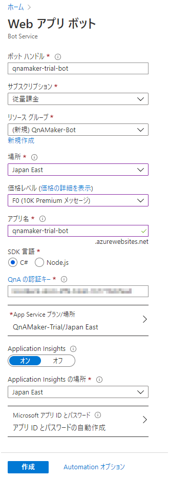
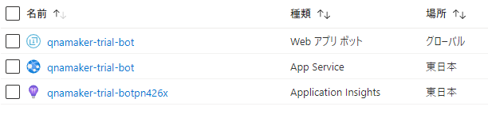
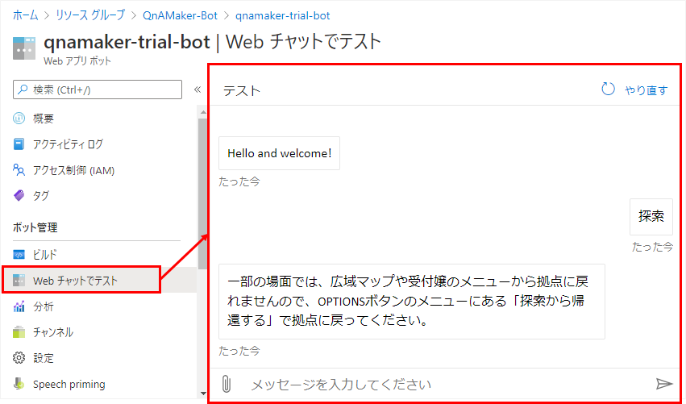

## はじめに
QnA Maker にナレッジを登録した後、publishを行うとボット等からナレッジベースを使えるようになる。

## ボットを作成する
QnA Maker のメニューの「PUBLISH」へ移動し、「Publish」ボタンをクリックしてナレッジベースを発行する。

発行後の画面で、「Create Bot」をクリック。

Azure ポータルサイトへ移動するので、必要事項を入力、選択した後「作成」を押す。

* 場所 - 利用する人がいる場所に近いところが良いらしい。
* 価格 - F0(無料)推奨。本番で稼働させるなら有料プランを検討する。後から変更可能。
* Application Insights - オンにすると、チャットボットの会話ログを残せる。想定外の課金を防ぐために転送量に制限をかけておくことをオススメ。

しばらく待つと、ボットとApp Serviceが作成される。

## ボットをテストする
作成された「Webアプリボット」のリソースを選択し、「Webチャットでテスト」をクリックする。するとチャットの画面が出てくるので、ここでボットをテストできる。
QnA Maker に登録した質問を投げかけ、回答が返ってくるのを確認できる。

## ボットをカスタマイズする
QnA Maker を使うボットをカスタマイズしたい場合は、[こちらの記事]() を参照。
