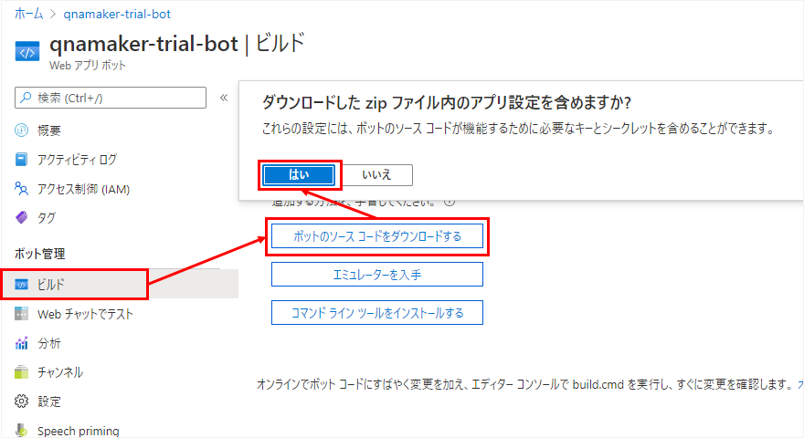
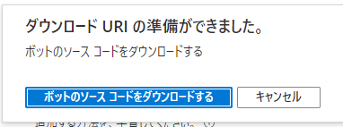

QnA Maker からボットを作成すれば、ひとまずはボットの完成である。
ただ自動作成されたボットはメッセージが英語だったり、ただ単に答えを返すだけなので、
これをカスタマイズしたい場合は、まずソースを取得する必要がある。

## ボットのソースを取得する
Webアプリボットのリソースを選択し、左側の「ビルド」をクリックする。
表示されたページにある「ボットのソースコードをダウンロードする」をクリックし、出てきたダイアログで「はい」を押す。

しばらく待つとダウンロードできるようになるので、「ボットのソースコードをダウンロードする」をクリックする。

zipファイルがダウンロードされるので、回答するとソースコードが入っている。
