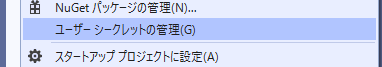
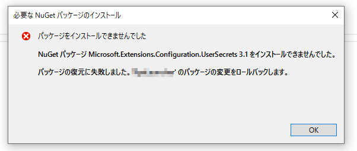
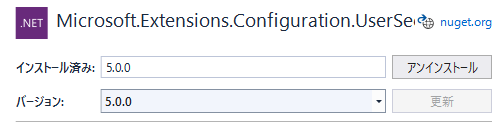

## 概要
.NET Core のコンソールアプリケーションでも設定ファイルを利用できる。

NuGet パッケージの `Microsoft.Extensions.Configuration` とその配下のパッケージを使う。
キーと値のペア かつ キーは複数レベルの階層にわたる設定が作れる。
たとえば、`SampleApp:Users:Tarou`という感じで、階層ごとにコロンで区切って指定する。
設定値はすべてstringで、値をPOCOオブジェクトにバインドする機能もある。
このAPIはASP.NETでは使われてきたが、それ以外のプラットフォームでも使える。

参考：[Configuration in ASP.NET Core | Microsoft Docs](https://docs.microsoft.com/en-us/aspnet/core/fundamentals/configuration/?view=aspnetcore-5.0)

前提条件：

* .NET Core 3.1
* Visual Studio 2019 で開発

## NuGet パッケージの追加
`Microsoft.Extensions.Configuration` から始まるパッケージ群を、目的に合わせて追加する。

設定ファイルの形態によって、以下のいずれかを追加する。

* `Microsoft.Extensions.Configuration.Json`
* `Microsoft.Extensions.Configuration.Ini`
* `Microsoft.Extensions.Configuration.Xml`
* その他の Configuration Provider は [ドキュメント](https://docs.microsoft.com/en-us/aspnet/core/fundamentals/configuration#cp) 参照。

設定値をPOCOオブジェクトへバインドさせたい場合は、以下を追加する。

* `Microsoft.Extensions.Configuration.Binder`

例えば、設定ファイルはjsonファイルにしつつ、POCOオブジェクトへのバインドも利用したい場合は、
`Microsoft.Extensions.Configuration.Json` と `Microsoft.Extensions.Configuration.Binder` の2つを追加する。

## インメモリを使ったサンプル
コード上に設定値を書く、最もシンプルなもの。

NuGet パッケージは以下2つを追加する。

* `Microsoft.Extensions.Configuration`
* `Microsoft.Extensions.Configuration.Binder`

```csharp
using Microsoft.Extensions.Configuration;
using System;
using System.Collections.Generic;

class Program
{
    public static void Main(string[] args = null)
    {
        // コード上で設定値を作る
        var values = new Dictionary<string, string>()
        {
            ["Profile:UserName"] = "太郎",
            ["ConnectionStrings:str1"] = "接続文字列",
            ["AppConfiguration:Model1:param1"] = "400",
            ["AppConfiguration:Model1:param2"] = "600"
        };

        // ビルダーに設定値を渡す
        var builder = new ConfigurationBuilder();
        builder.AddInMemoryCollection(values);

        // Configurationクラスを作る
        IConfiguration config = builder.Build();

        // 設定値を取得する
        Console.WriteLine($"Hello {config["Profile:UserName"]}");

        // 接続文字列は専用の取得メソッドがある
        // 「ConnectionStrings」という階層にある設定値を取得する
        Console.WriteLine(config.GetConnectionString("str1"));

        // POCOオブジェクトにバインド
        var model = new Model1();
        config.GetSection("AppConfiguration:Model1").Bind(model);

        Console.WriteLine(model);
    }
}
```

下記はバインドに使ったPOCOオブジェクトのサンプル。

```csharp
class Model1
{
    public string param1 { get; set; }
    public string param2 { get; set; }

    public override string ToString()
    {
        return $"param1={param1}, param2={param2}";
    }
}
```

下記はサンプルの実行結果。

```
Hello 太郎
接続文字列
param1=400, param2=600
```

## JSONファイルを使ったサンプル
NuGet パッケージは以下3つを追加する。

* `Microsoft.Extensions.Configuration`
* `Microsoft.Extensions.Configuration.Binder`
* `Microsoft.Extensions.Configuration.Json`

下記はJSONファイルのサンプル。

```json
{
  "Profile": {
    "UserName": "太郎"
  },
  "ConnectionStrings": {
    "str1": "接続文字列"
  },
  "AppConfiguration": {
    "Model1": {
      "param1": "400",
      "param2": "600"
    }
  }
}
```

設定ファイルのプロパティの「出力ディレクトリにコピー」を「常にコピーする」または「新しい場合はコピーする」に変更する。

下記はプログラムのサンプル。

```csharp
using Microsoft.Extensions.Configuration;
using System;

class Program
{
    public static void Main(string[] args = null)
    {
        // ビルダーにJSONファイルを追加
        var builder = new ConfigurationBuilder();
        builder.AddJsonFile("appsettings.json");

        // Configurationクラスを作る
        IConfiguration config = builder.Build();

        // 設定値を取得する
        Console.WriteLine($"Hello {config["Profile:UserName"]}");

        // 接続文字列は専用の取得メソッドがある
        // 「ConnectionStrings」という階層にある設定値を取得する
        Console.WriteLine(config.GetConnectionString("str1"));

        // POCOオブジェクトにバインド
        var model = new Model1();
        config.GetSection("AppConfiguration:Model1").Bind(model);

        Console.WriteLine(model);
    }
}
```

出力結果はインメモリのサンプルと同じ。

## UserSecrets を使う
設定ファイルに、DBやクラウドサービスへの接続文字列など、Git等に保存したくない情報が含まれる場合、
その設定値を一部「ユーザーシークレット」に分けて保存できる。
「ユーザーシークレット」はPCのどこか別の場所に保存される。

### UserSecrets を編集する
プロジェクトで右クリック → 「ユーザーシークレットの管理」をクリック。



secrets.json ファイルが表示されるので、編集して保存する。

このとき、プロジェクトが ASP.NET Core のものなら難なく secrets.json が開くが、コンソールアプリ等だと
Visual Studio が自動的に NuGet パッケージの `Microsoft.Extensions.Configuration.UserSecrets` を参照に加えようとする。
ただ、追加しようとするバージョンが低いせいか、私の環境では失敗したというダイアログが出た。



その場合は、手作業で同パッケージをインストールしてから、もう一度「ユーザーシークレットの管理」をクリックするところからやり直す。



↑ 手作業で追加したパッケージ (ダイアログではv3.1と書かれていたが、最新版はv5.0だった)

### UserSecrets を読み込む
ASP.NET や 汎用ホスト(GenericHost) を使っている場合は、自動的に読み込む。

それ以外の場合は、`ConfigurationBuilder` の `AddUserSecrets` メソッドを呼び出す。

```cs {hl_lines=[10]}
using Microsoft.Extensions.Configuration;
using System;

class Program
{
    public static void Main(string[] args = null)
    {
        var builder = new ConfigurationBuilder();
        builder.AddJsonFile("appsettings.json");
        builder.AddUserSecrets<Program>();
    }
}
```

型パラメータには、コンソールアプリのアセンブリに含まれるクラスを指定する。
とりあえずエントリーポイントになる `Program` にしておけば無難だと思われる。
