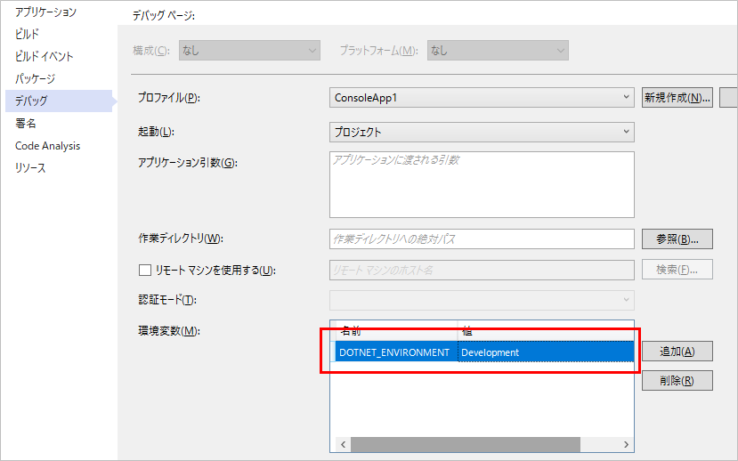

## 概要
汎用ホストとは、ASP.NETで提供されているいくつかの機能を、コンソールアプリでも使えるよう汎用的にしたもの。
使えるようになる機能の例は下記の通り。

* 依存性の注入 (DI)
* ログ
* 設定ファイル
* 起動環境の指定
* etc...

参考：[.NET Generic Host | Microsoft Docs](https://docs.microsoft.com/ja-jp/dotnet/core/extensions/generic-host)

前提条件：

* .NET Core 3.1
* Visual Studio 2019 で開発

## 実装手順
汎用ホストを公式ドキュメントのサンプル通りに実装すると、Webアプリケーションと同じく、一度起動するとアプリケーションが起動しっぱなしになる。
既定では、ユーザーがコンソールウィンドウで Ctrl + C を押すまで終了しない。

当サンプルでは汎用ホストの便利機能は使いつつ、HostedServiceを使わずに処理を起動し終了する手順を示す。  
※といっても、汎用ホストを起動せず、DIに登録したServiceクラスを手動で実行するだけ

常駐型のアプリを作りたい場合は、[WorkerServiceテンプレートからプロジェクトを作る]()のが良いと思う。

### パッケージの追加
コンソールアプリケーションをテンプレートとしたプロジェクトを作成し、下記パッケージをプロジェクトに追加。

```
Microsoft.Extensions.Hosting
```

### エントリーポイントの実装
処理のエントリーポイントとなるServiceクラス(名前は何でもいい)を作成する。
このクラスもDIへ登録するので、コンストラクタでDIに登録されているオブジェクトを受け取れる。

```cs
using Microsoft.Extensions.Logging;
using System;
using System.Collections.Generic;
using System.Text;

namespace ConsoleApp1
{
    class MainService
    {
        private readonly ILogger _logger;

        public MainService(ILogger<MainService> logger)
        {
            _logger = logger;
        }

        public void Execute()
        {
            _logger.LogInformation("Executed!");
        }
    }
}
```

### Program.cs の実装
汎用ホストを `Build` して、`Run` はせずにエントリーポイントとして作った `MainService` を実行するだけ。

```cs
using Microsoft.Extensions.DependencyInjection;
using Microsoft.Extensions.Hosting;

namespace ConsoleApp1
{
    class Program
    {
        public static void Main(string[] args = null)
        {
            var builder = Host.CreateDefaultBuilder(args)
                .ConfigureServices((hostContext, services) =>
                {
                    services.AddSingleton<MainService>();
                });

            var host = builder.Build();
            var service = host.Services.GetService<MainService>();
            service.Execute();
        }
    }
}
```

## 環境の指定
汎用ホストを使うと、テスト環境だとか本番環境だとかを起動時に指定できる。
既定は `Production` 。
環境ごとに `appsettings.{Environment}.json` とappsettingsファイルを分け、異なる設定値でアプリを動かせる。

環境変数 `DOTNET_ENVIRONMENT` に 環境を指定する。
Visual Studio 2019 でデバッグしている場合、プロジェクトのプロパティ → 「デバッグ」タブ → 「環境変数」 で編集可能。


