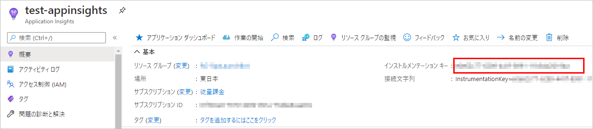

## 概要
コンソールアプリから、Application Insights へログ出力する手順。

前提条件：

* .NET Core 3.1
* Visual Studio 2019 で開発
* 汎用ホストを使用

参考：[Application Insights for Worker Service apps (non-HTTP apps) - Azure Monitor | Microsoft Docs](https://docs.microsoft.com/en-us/azure/azure-monitor/app/worker-service)

## NuGet パッケージの追加
`Microsoft.ApplicationInsights.WorkerService` をプロジェクトへ追加する。

## appsettings.json の編集
Application Insights へ接続するためのインストルメンテーション キーをAzure ポータイルサイトでコピーする。



コピーした値を appsettings.json の `ApplicationInsights:InstrumentationKey` へ記載する。
また、Application Insights 用のログ出力設定は、`Logging:ApplicationInsights` に記載する。特に Application Insights の既定のログレベルは Warning なので、ログレベルを下げたいときは指定が必須。

```json
{
  "Logging": {
    "ApplicationInsights": {
      "LogLevel": {
        "Default": "Information"
      }
    }
  },
  "ApplicationInsights": {
    "InstrumentationKey": "xxxxx"
  }
}
```

## Program.cs の編集
汎用ホストを使っている場合は、`ConfigureServices` メソッド内で、`AddApplicationInsightsTelemetryWorkerService` メソッドを呼び出す。

```csharp {hl_lines=["14"]}
using Microsoft.Extensions.DependencyInjection;
using Microsoft.Extensions.Hosting;

namespace ConsoleApp1
{
    class Program
    {
        public static void Main(string[] args = null)
        {
            var builder = Host.CreateDefaultBuilder(args)
                .ConfigureServices((hostContext, services) =>
                {
                    services.AddHostedService<TestService>();
                    services.AddApplicationInsightsTelemetryWorkerService();
                });

            builder.Build().Run();
        }
    }
}
```

## ログ出力
ログ出力自体は、他のプロバイダーと同じ。上記設定が済んでいれば Application Insights へログが送られる。

基本的には trace テレメトリへログがたまるが、`TelemetryClient` を使うと、request テレメトリなどと親子関係を作り、トレースログをグループ化できる。
下記は、`TelemetryClient` を使用したサンプルである。

```cs
using Microsoft.ApplicationInsights;
using Microsoft.ApplicationInsights.DataContracts;
using Microsoft.Extensions.Logging;
using System;
using System.Collections.Generic;
using System.Text;

namespace ConsoleApp1
{
    class MainService
    {
        private readonly ILogger _logger;
        private readonly TelemetryClient _client;

        public MainService(ILogger<MainService> logger, TelemetryClient client)
        {
            _logger = logger;
            _client = client;
        }

        public void Execute()
        {
            _logger.LogInformation("Execute1");
            _logger.LogError("Execute2");

            using (_client.StartOperation<RequestTelemetry>("operation1"))
            {
                _logger.LogInformation("Execute3");
                _logger.LogError("Execute4");
            }
            _client.Flush();
        }
    }
}
```

これを実行し、Azureで結果を見ると下記のようになっている。


`TelemetryClient` で囲んだ部分がグループ化されていることもわかる。

