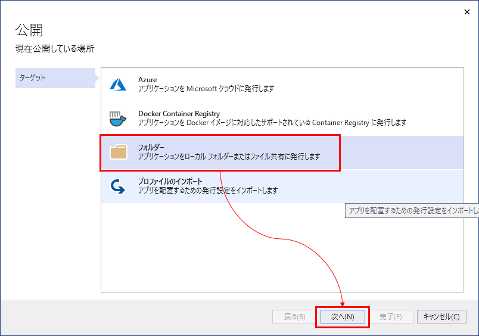
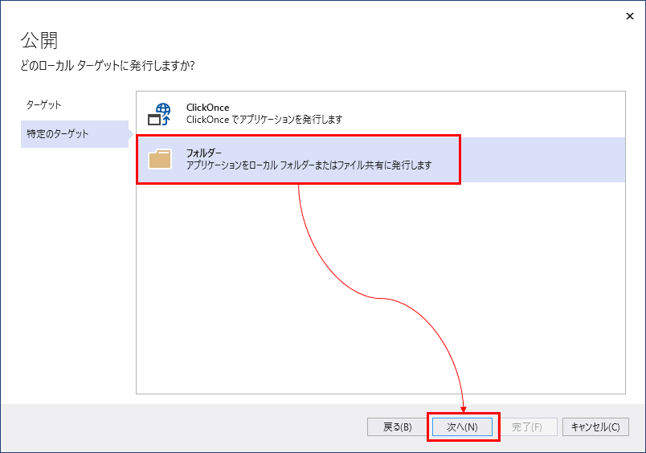
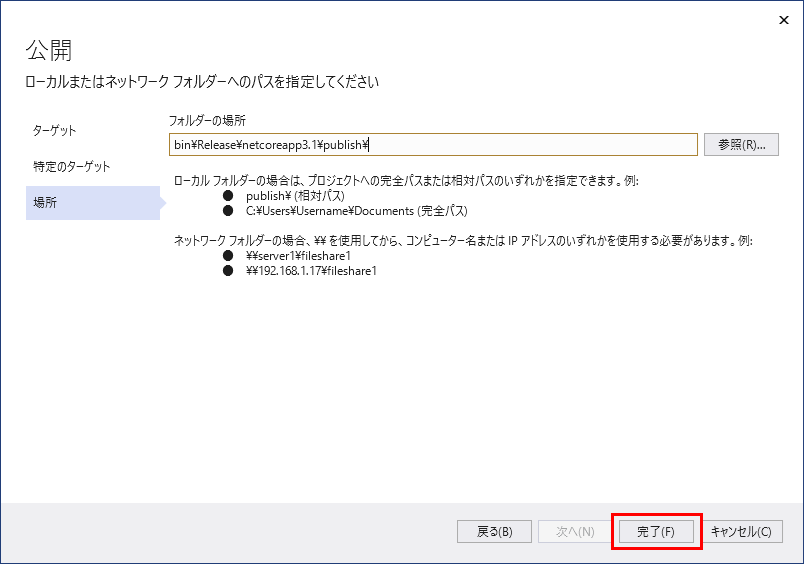
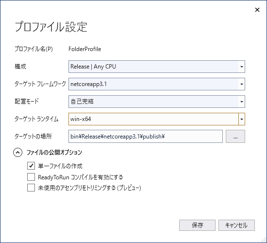
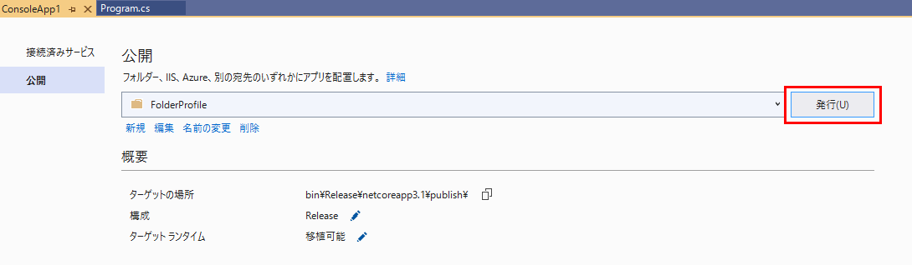
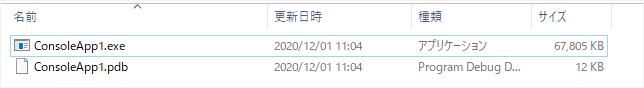

ソリューションエクスプローラーで、プロジェクト名のところで右クリック→「発行」をクリック。
初めて発行を行う場合、詳細の設定画面が出てくる。
今回はフォルダへ発行したいので、「フォルダー」をクリックして「次へ」。

ClickOnce かフォルダーに単純に実行ファイルを作るかどうかを選択する。今回は「フォルダー」をクリックして「次へ」。

発行先を指定して「完了」。

発行の設定が作成され、発行できる状態になる。
ここで「構成」または「ターゲットランタイム」の鉛筆アイコンをクリックすると、さらに設定できる項目が表示される。

* ターゲットフレームワーク - .NET Core のバージョンを指定する。
* 配置モード
  * フレームワーク依存 - ランタイムを含まず、プラットフォーム (WinとかLinuxとか) に依存しないものを発行できる。
  * 自己完結 - ランタイムも含んだものを発行できる。こちらを選ぶと対象プラットフォームが限定される。

今回は、「自己完結」でプラットフォームを「win-x64」に指定。さらに「ファイルの公開オプション」内の「単一ファイルの作成」のチェックを入れた。

「発行」ボタンを押せば発行が実行される。

発行が終わった後、発行先に指定したフォルダにexeファイルが作成されている。

