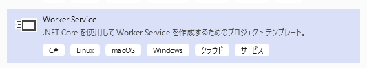
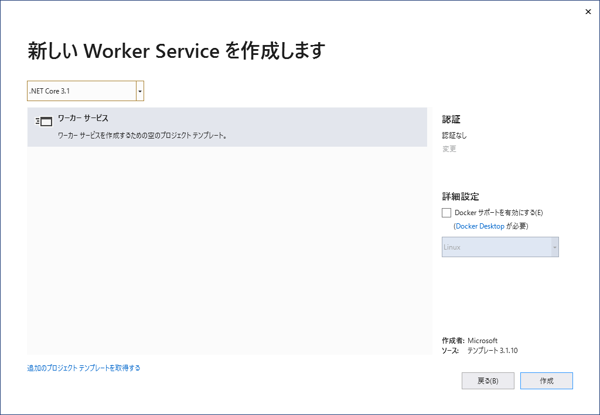
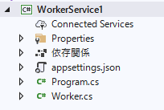
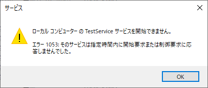

## 概要

前提条件：

* .NET Core 3.1
* Visual Studio 2019 で開発

## プロジェクトの作成
「Worker Service」のテンプレートを使い、プロジェクトを作成する。



プロジェクトを作成するときに下記のような画面が出るが、そのまま「作成」をクリック。



プロジェクトが作成されると、下記のようなファイルたちが作られる。



## Windows サービスに必要な設定をする
このままだと、コンソールアプリとしては起動するものの、Windows サービスとしては起動しない。
このプロジェクトをそのままビルドして Windows サービスとして登録しても、起動しようとしたときに「エラー 1053: そのサービスは指定時間内に開始要求または制御要求に応答しませんでした」というエラーになる。



### NuGet パッケージの追加
下記パッケージをプロジェクトへ追加する。

```
Microsoft.Extensions.Hosting.WindowsService
```

このとき、プロジェクトが最初からインストールしている `Microsoft.Extensions.Hosting` のバージョンが古いと `WindowsService` の追加に失敗することがある。
そのときは、`Microsoft.Extensions.Hosting` のバージョンを最新版へ更新する。

### Program.cs の編集
`Program.cs` を開き、`HostBuilder` のところに `UseWindowsService` メソッドを追加する。

```csharp {hl_lines=[23]}
using Microsoft.Extensions.DependencyInjection;
using Microsoft.Extensions.Hosting;
using System;
using System.Collections.Generic;
using System.Linq;
using System.Threading.Tasks;

namespace WorkerService1
{
    public class Program
    {
        public static void Main(string[] args)
        {
            CreateHostBuilder(args).Build().Run();
        }

        public static IHostBuilder CreateHostBuilder(string[] args) =>
            Host.CreateDefaultBuilder(args)
                .ConfigureServices((hostContext, services) =>
                {
                    services.AddHostedService<Worker>();
                })
                .UseWindowsService();
    }
}
```

## サービスの処理を実装
サービスのビジネスロジックは、`Worker.cs` へ実装する。
`ExecuteAsync` メソッド内にループ処理が書かれているので、この中に処理を書く。
このループはサービスが中断されるまで続くので、同じ処理を定期的に繰り返すことになる。

```csharp {hl_lines=[24,25]}
using Microsoft.Extensions.Hosting;
using Microsoft.Extensions.Logging;
using System;
using System.Collections.Generic;
using System.Linq;
using System.Threading;
using System.Threading.Tasks;

namespace WorkerService1
{
    public class Worker : BackgroundService
    {
        private readonly ILogger<Worker> _logger;

        public Worker(ILogger<Worker> logger)
        {
            _logger = logger;
        }

        protected override async Task ExecuteAsync(CancellationToken stoppingToken)
        {
            while (!stoppingToken.IsCancellationRequested)
            {
                // ここに処理を書く
                _logger.LogInformation("Worker running at: {time}", DateTimeOffset.Now);

                // 1秒待機してループ
                await Task.Delay(1000, stoppingToken);
            }
        }
    }
}
```

## サービスの発行と登録
まず、プロジェクトを「発行」して、リリース版のexeファイルを作成する。その後、出来上がったexeファイルをサービスとして登録する。
次に、コマンドプロンプトを「管理者として実行」し、下記コマンドを実行する。

```
sc create "Service Name" binpath="path_to_exe\service.exe"
```

## 参考
[Create Windows Services. .Net Core 3.0 | by LAI TOCA | Medium](https://tocalai.medium.com/create-windows-services-5a4dcc837c08)

