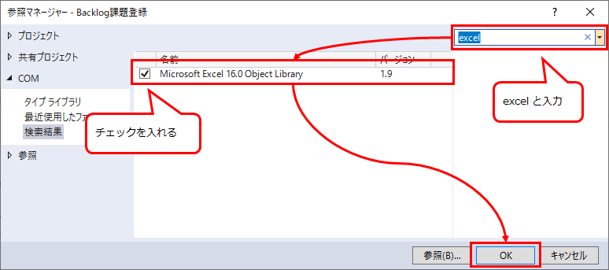
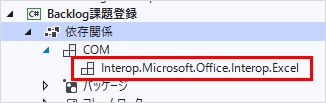
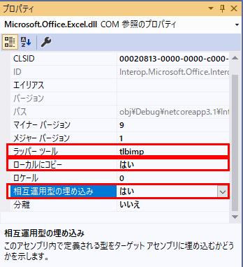

## はじめに

.NET Core のコンソールアプリで、COM経由でExcelを操作できるようにする。

前提条件：

* Visual Studio 2019

参考：

* [.NET core 3.0 and MS Office Interop - Stack Overflow](https://stackoverflow.com/questions/58130446/net-core-3-0-and-ms-office-interop#answer-58130770)
  * .NET Core で COM 参照を追加する方法が回答されている
* [Incorrect COMReference entry when using Office interop · Issue #5735 · dotnet/project-system](https://github.com/dotnet/project-system/issues/5735)
  * csprojファイルの編集内容が書かれている

## COM参照の追加
ソリューションエクスプローラーのプロジェクト名で右クリック → 「COM 参照の追加」をクリック。


参照マネージャーのウィンドウが開く。検索欄に「excel」と入力し、表示された「Microsoft Excel xx.x Object Library」のチェックを入れる。その後、OKボタンをクリック。



ソリューションエクスプローラーの「依存関係」の中に「COM」が追加され、Excelがあるのを確認する。



この時点でコーディングは可能だが、実行すると下記エラーになる。

    System.IO.FileNotFoundException
      HResult=0x80070002
      Message=Could not load file or assembly 'office, Version=15.0.0.0, Culture=neutral, PublicKeyToken=71e9bce111e9429c'. 指定されたファイルが見つかりません。

## csprojファイルの編集
ソリューションエクスプローラーの「依存関係」の中にある「Interop.Microsoft.Office.Interop.Excel」をクリックする。プロパティウィンドウに表示される内容を、下記の通り変更する。



参考サイトでは、`WrappingTool` は `primary` にすると書かれているが、それだと一部の機能が動作しないらしい。`tlbimp` ならOK。

## サンプルコード

```cs
using Microsoft.Office.Interop.Excel;
using System;
using System.Threading.Tasks;
using Range = Microsoft.Office.Interop.Excel.Range;

namespace Test
{
    class Program
    {
        private static readonly string FILE_NAME = "C:/test/xxx.xlsx";

        static async Task Main(string[] args)
        {
            var excel = new Application();
            try
            {
                var book = excel.Workbooks.Open(FILE_NAME, true, true);
                try
                {
                    // シートなどのインデックスは1から始まる
                    Worksheet sheet = (Worksheet)book.Worksheets[1];
                    Range cell = sheet.Cells[1,2];
                    Console.WriteLine((string)cell.Value);
                }
                finally
                {
                    book.Close();
                }
            }
            finally
            {
                excel.Quit();
            }
        }
    }
}
```

## COM オブジェクトの解放
上記サンプルコードからは抜けているが、COM を扱うならオブジェクトの解放を行わなければならない。
Excel であれば、Workbook, Sheet, Range など、触れたオブジェクト全てを明示的に開放しなければいけない。

参考：[.NETを使った別プロセスのOfficeの自動化が面倒なはずがない―そう考えていた時期が俺にもありました。 - Qiita](https://qiita.com/mima_ita/items/aa811423d8c4410eca71)

それらをラップしてくれるライブラリ [NetOffice](https://netoffice.io/) もあるが、2021年4月の時点では .NET Core 3.1 がサポートされていない。.NET Framework であればサポートされている。
