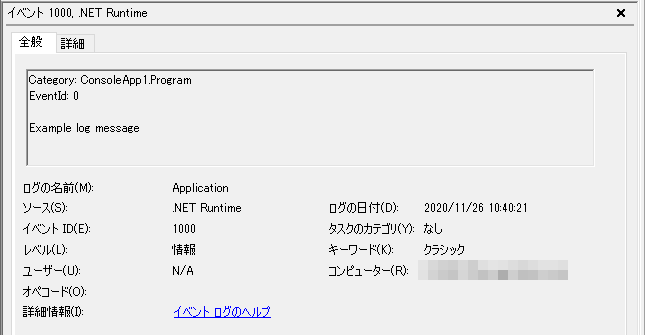
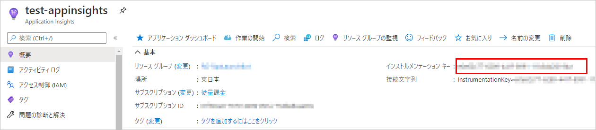

## 概要

前提条件：

* .NET Core 3.1
* Visual Studio 2019 で開発

ASP.NET なら初めから使える(っぽい)ログ出力の機能を、コンソールアプリで使用する方法。

`Microsoft.Extensions.Logging` パッケージを使用するが、一番お手軽(と思われる)なファイルへの出力機能がない。
コンソール出力やイベントログへの出力はできる。

参考：[.NET Core および ASP.NET Core でのログ記録 | Microsoft Docs](https://docs.microsoft.com/ja-jp/aspnet/core/fundamentals/logging/?view=aspnetcore-5.0#built-in-logging-providers)

## NuGet パッケージの追加

下記パッケージをプロジェクトに追加する。

`Microsoft.Extensions.Logging`

これと併せて、使用したいプロバイダー(出力先)ごとにパッケージを追加する。

* `Microsoft.Extensions.Logging.Console` - コンソール
* `Microsoft.Extensions.Logging.EventLog` - イベントログ
* `Microsoft.Extensions.Logging.ApplicationInsights` - Azure の AppInsights
* など

## コンソールへログ出力
下記2つのパッケージをプロジェクトへ追加する。

```
Microsoft.Extensions.Logging
Microsoft.Extensions.Logging.Console
```

下記がロガーの準備とログ出力のサンプル。

```csharp
using Microsoft.Extensions.Logging;

namespace ConsoleApp1
{
    class Program
    {
        public static void Main(string[] args = null)
        {
            using var loggerFactory = LoggerFactory.Create(builder =>
            {
                builder
                    .AddFilter("Microsoft", LogLevel.Warning)
                    .AddFilter("System", LogLevel.Warning)
                    .AddFilter("ConsoleApp1.Program", LogLevel.Debug)
                    .AddConsole();
            });
            ILogger logger = loggerFactory.CreateLogger<Program>();
            logger.LogInformation("Example log message");
        }
    }
}
```

このサンプルを実行すると、下記のログがコンソール上に出力される。

```
info: ConsoleApp1.Program[0]
      Example log message
```

## イベントログへ出力
下記2つのパッケージをプロジェクトへ追加する。

```
Microsoft.Extensions.Logging
Microsoft.Extensions.Logging.EventLog
```

下記がロガーの準備とログ出力のサンプル。

```csharp
using Microsoft.Extensions.Logging;

namespace ConsoleApp1
{
    class Program
    {
        public static void Main(string[] args = null)
        {
            using var loggerFactory = LoggerFactory.Create(builder =>
            {
                builder
                    .AddFilter("Microsoft", LogLevel.Warning)
                    .AddFilter("System", LogLevel.Warning)
                    .AddFilter("ConsoleApp1.Program", LogLevel.Debug)
                    .AddEventLog();
            });
            ILogger logger = loggerFactory.CreateLogger<Program>();
            logger.LogInformation("Example log message");
        }
    }
}
```

イベントビューアの「Windows ログ」→「Application」の中にログが記録される。



`AddEventLog` メソッドの引数でログのソース名などを指定できるが、ソースは事前に登録が必要。
登録するには、PowerShell のコマンドを実行するのが一番手っ取り早い方法と思われる。

## Application Insights へ出力
https://docs.microsoft.com/en-us/azure/azure-monitor/app/worker-service

### NuGet パッケージの追加
`Microsoft.ApplicationInsights.WorkerService` をプロジェクトへ追加する。

### appsettings.json の編集
Application Insights へ接続するためのインストルメンテーション キーをAzure ポータイルサイトでコピーする。



コピーした値を appsettings.json へ記載する。
また、Application Insights 用のログ出力設定も、`ApplicationInsights` の中に記述できる。

```json
{
  "ApplicationInsights": {
    "InstrumentationKey": "YOUR-INSTRUMENTATION-KEY",
    "LogLevel": {
      "Default": "Warning"
    }
  }
}
```

### Program.cs の編集
汎用ホストを使っている場合、`ConfigureServices` メソッド内で、`AddApplicationInsightsTelemetryWorkerService` メソッドを呼び出す。

```csharp {hl_lines=["14"]}
using Microsoft.Extensions.DependencyInjection;
using Microsoft.Extensions.Hosting;

namespace ConsoleApp1
{
    class Program
    {
        public static void Main(string[] args = null)
        {
            var builder = Host.CreateDefaultBuilder(args)
                .ConfigureServices((hostContext, services) =>
                {
                    services.AddHostedService<TestService>();
                    services.AddApplicationInsightsTelemetryWorkerService();
                });

            builder.Build().Run();
        }
    }
}
```

### ログ出力
ログ出力自体は、他のプロバイダーと同じ。上記設定が済んでいれば Application Insights へログが送られる。
