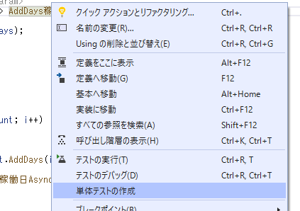
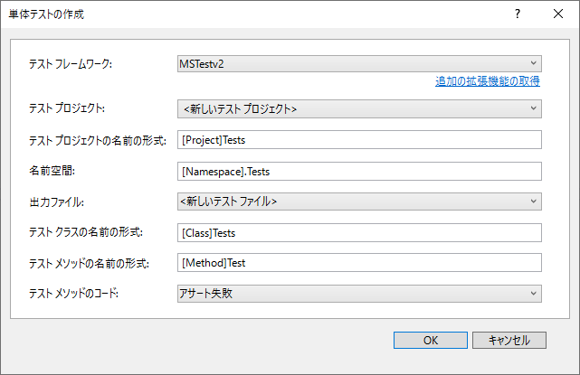
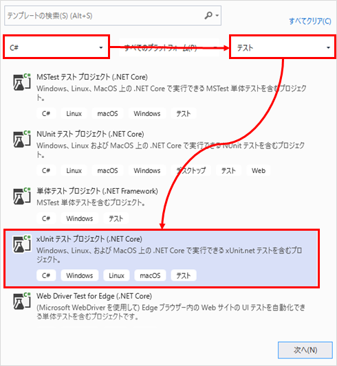
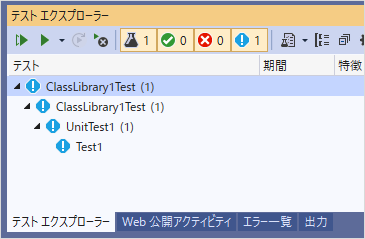
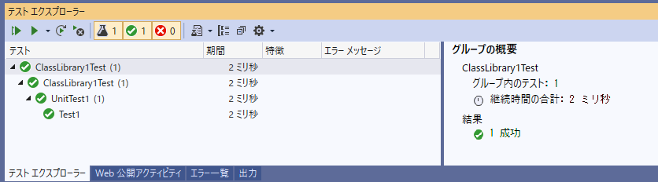
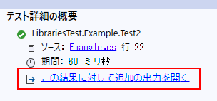

## はじめに
.NET Core で単体テストをする方法について記載する。

前提条件：

* Visual Studio 2019 Community 版
* xUnit v2.4.1
* .NET Core 3.1
* C#

## コードからテストメソッドを生成する
参考：[Create unit test method stubs - Visual Studio | Microsoft Docs](https://docs.microsoft.com/en-us/visualstudio/test/create-unit-tests-menu)

コード上のメソッド、型名、名前空間のいずれかで右クリック→「単体テストの作成」をクリック。



ダイアログが開き、どのようなテストプロジェクトやクラスを作成するか設定できる。



このときテストフレームワークを選択できるが、既定のままだと選択肢が「MSTest v2」しかない。
それ以外のテストフレームワークを使用したい場合は、マーケットプレイスから拡張機能をインストールする必要がある。

* [NUnit用拡張機能](https://marketplace.visualstudio.com/items?itemName=NUnitDevelopers.TestGeneratorNUnitextension)
* [xUnit用拡張機能](https://marketplace.visualstudio.com/items?itemName=BradWilson.xUnitnetTestExtensions)

(どちらも最終更新日が2015年とか2018年で止まっているところが気になる)

ただし、自分でテストプロジェクトやコードを作成するのであれば、いずれのテストフレームワークを使うにしても拡張機能のインストールは必須ではない。

## Get Started
### テストプロジェクトを作成する
xUnit を使ったテストプロジェクトの作成手順を記載する。

新しいプロジェクトを作成するときのダイアログで、カテゴリを「C#」→「テスト」で抽出すると、「xUnit テスト プロジェクト」が表示されるので、それを選択してプロジェクトを作成する。



作成されたプロジェクトを確認すると、空のテストが1つだけ記述された `UnitTest1.cs` も一緒に作成されている。

```cs
using System;
using Xunit;

namespace ClassLibrary1Test
{
    public class UnitTest1
    {
        [Fact]
        public void Test1()
        {

        }
    }
}
```

`Test1` メソッドに `[Fact]` という属性が付いていて、これが1つのテストの単位である。

この状態でソリューション全体をビルドする。

### テストを実行する
ビルドが成功したあと、メニューの「テスト」→「テスト エクスプローラー」をクリック。
テストエクスプローラーが表示され、先ほど作成されたテストが表示されているのが分かる。



テストエクスプローラーの  ボタンを押すと、エクスプローラーに表示されているすべてのテストが実行される。
実行後は、結果がエクスプローラーに表示される。



これがテストプロジェクト作成～実行のざっくりとした流れになる。

## テストを作成する
テストプロジェクトにクラスを作成し、public で引数、戻り値なしのメソッドを定義する。
そのメソッドに `[Fact]` という属性を付けると、テスト時に実行するメソッドになる。

```cs
using ClassLibrary1;
using System;
using Xunit;

namespace ClassLibrary1Test
{
    public class UnitTest1
    {
        [Fact]
        public void Test1()
        {
            Class1 library = new Class1();
            var actual = library.Add(1, 2);
            var expected = 3;

            Assert.Equal(expected, actual);
        }

        [Fact]
        public void Test2()
        {
            Class1 library = new Class1();
            var actual = library.Add(2, 3);
            var expected = 5;

            Assert.Equal(expected, actual);
        }
    }
}
```

テストメソッドに付ける属性は `[Fact]` と `[Theory]` の2種類がある。
`[Fact]` は1パターンのテストしかできないが、`[Theory]` は引数を与えて複数パターンのテストができる。

```cs
[Theory]
[InlineData(3, 4, 7)]
[InlineData(4, 5, 9)]
public void Test3(int a, int b, int expected)
{
    Class1 library = new Class1();
    var actual = library.Add(a, b);

    Assert.Equal(expected, actual);
}
```

テストメソッドに引数を定義し、`[InlineData]` 属性で引数に渡す値を指定する。そうすると指定した分テストが実行される。
値の指定方法はもう一つあって、`[MemberData]` 属性を使うと、テストクラスのメンバー変数を指定できる。

```cs
public class TestClass
{
    public static List<Object[]> param = new List<Object[]>(){
        new object[]{1, 2, 3},
        new object[]{2, 3, 5},
        new object[]{3, 4, 7},
    };

    [Theory]
    [MemberData(nameof(param))]
    public void Test4(int a, int b, int expected)
    {
        Assert.Equal(expected, (a + b));
    }
}
```

## 初期処理と終了処理
テストメソッドに初期処理を実装する場合、テストクラスのコンストラクタを定義してそこに初期処理を記述する。
終了処理を実装する場合は、テストクラスに `IDisposable` インターフェイスを実装して `Dispose` メソッドに記述する。
この初期処理＆終了処理は、テストメソッドが実行される度に実行される。

```cs
using ClassLibrary1;
using System;
using Xunit;

namespace ClassLibrary1Test
{
    public class UnitTest1 : IDisposable
    {
        private Class1 library = null;

        public UnitTest1()
        {
            library = new Class1();
        }

        public void Dispose()
        {
            library = null;
        }

        [Fact]
        public void Test1()
        {
            var actual = library.Add(1, 2);
            var expected = 3;

            Assert.Equal(expected, actual);
        }

        [Fact]
        public void Test2()
        {
            var actual = library.Add(2, 3);
            var expected = 5;

            Assert.Equal(expected, actual);
        }
    }
}
```

これに対し、テストクラス1つに対して最初の1回だけ初期処理＆終了処理を実行させたい場合は、 `IClassFixture<T>` インターフェイスを使う。

まず、Fixture クラスを作る。Fixture クラスのコンストラクタが初期処理となり、Disposeメソッドが終了処理となる。

```cs
using System;
using System.Collections.Generic;
using System.Text;

namespace ClassLibrary1Test
{
    public class UnitTest1Fixture : IDisposable
    {
        public List<string> list { get; set; }

        public UnitTest1Fixture()
        {
            list = new List<string>();
            list.Add("test1");
            list.Add("test2");
            list.Add("test3");
        }

        public void Dispose()
        {
            list = null;
        }
    }
}
```

テストクラスの方では、`IClassFixture<T>` インターフェイス を実装する。
`<T>` は Fixture クラスを指定する。もしテストクラスで Fixture クラスのインスタンスが必要な場合は、コンストラクタの引数に Fixture クラスを追加する。

```cs
using ClassLibrary1;
using System;
using Xunit;

namespace ClassLibrary1Test
{
    public class UnitTest1 : IClassFixture<UnitTest1Fixture>
    {
        private Class1 library = null;

        public UnitTest1(UnitTest1Fixture fixture)
        {
            library = fixture.library;
        }

        [Fact]
        public void Test1()
        {
            var actual = library.Add(1, 2);
            var expected = 3;

            Assert.Equal(expected, actual);
        }

        [Fact]
        public void Test2()
        {
            var actual = library.Add(2, 3);
            var expected = 5;

            Assert.Equal(expected, actual);
        }

    }
}
```

## ログ出力
テスト対象となるアプリにて、ログ出力は `Microsoft.Extensions.Logging` を使うことが多いが、
xUnit はテスト対象クラスが出力したログ(コンソール出力)はキャプチャしてくれない (正確にはv2からキャプチャしなくなったらしい) 。
テストクラス、もしくは Fixture など xUnit で使う他のクラスでコンソール出力する手段は用意されているが、
xUnit 用の Logger は用意されていないので、自分で作る必要がある。
以下に自作の Logger, ILoggerProvider のサンプルを記載する。

```cs
public class XunitLoggerProvider : ILoggerProvider
{
    private readonly ITestOutputHelper _testOutputHelper;

    public XunitLoggerProvider(ITestOutputHelper testOutputHelper)
    {
        _testOutputHelper = testOutputHelper;
    }

    public ILogger CreateLogger(string categoryName)
        => new XunitLogger(_testOutputHelper, categoryName);

    public void Dispose()
    { }
}

public class XunitLogger : ILogger
{
    private readonly ITestOutputHelper _testOutputHelper;
    private readonly string _categoryName;

    public XunitLogger(ITestOutputHelper testOutputHelper, string categoryName)
    {
        _testOutputHelper = testOutputHelper;
        _categoryName = categoryName;
    }

    public IDisposable BeginScope<TState>(TState state)
        => NoopDisposable.Instance;

    public bool IsEnabled(LogLevel logLevel)
        => true;

    public void Log<TState>(LogLevel logLevel, EventId eventId, TState state, Exception exception, Func<TState, Exception, string> formatter)
    {
        _testOutputHelper.WriteLine($"{_categoryName} [{eventId}] {formatter(state, exception)}");
        if (exception != null)
            _testOutputHelper.WriteLine(exception.ToString());
    }

    private class NoopDisposable : IDisposable
    {
        public static NoopDisposable Instance = new NoopDisposable();
        public void Dispose()
        { }
    }
}
```

次に、Test クラスのサンプルを記載する。

```cs
using Microsoft.Extensions.Logging;
using Xunit;
using Xunit.Abstractions;

public class Example
{
    private readonly ILogger<Example> _logger;

    public Example(ITestOutputHelper testOutputHelper)
    {
        var factory = LoggerFactory.Create(builder =>
        {
            builder.AddProvider(new XunitLoggerProvider(testOutputHelper));
        });
        _logger = factory.CreateLogger<Example>();
    }

    [Fact]
    public void Test2()
    {
        _logger.LogInformation("test1");
        _logger.LogDebug("test2");
    }
}
```

ログは「テスト エクスプローラ」で確認する。テストエクスプローラでテストメソッドをクリックし、詳細を見ると出力を確認するリンクが出ている。



ここをクリックするとログが表示される。

参考：[c# - .net core 2.0 ConfigureLogging xunit test - Stack Overflow](https://stackoverflow.com/questions/46169169/net-core-2-0-configurelogging-xunit-test)
