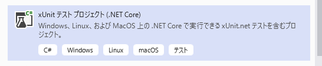

## はじめに
.NET Core で単体テストをする方法について記載する。

前提条件：

* Visual Studio 2019 Community 版
* C#

## コードからテストメソッドを生成する
参考：[Create unit test method stubs - Visual Studio | Microsoft Docs](https://docs.microsoft.com/en-us/visualstudio/test/create-unit-tests-menu)

コード上のメソッド、型名、名前空間のいずれかで右クリック→「単体テストの作成」をクリック。


ダイアログが開き、どのようなテストプロジェクトやクラスを作成するか設定できる。


このときテストフレームワークを選択できるが、既定のままだと選択肢が「MSTest v2」しかない。
それ以外のテストフレームワークを使用したい場合は、マーケットプレイスから拡張機能をインストールする必要がある。

* [NUnit用拡張機能](https://marketplace.visualstudio.com/items?itemName=NUnitDevelopers.TestGeneratorNUnitextension)
* [xUnit用拡張機能](https://marketplace.visualstudio.com/items?itemName=BradWilson.xUnitnetTestExtensions)

(どちらも最終更新日が2015年とか2018年で止まっているところが気になる)

ただし、自分でテストプロジェクトやコードを作成するのであれば、いずれのテストフレームワークを使うにしても拡張機能のインストールは必須ではない。

## テストプロジェクトを作成する
xUnit を使ったテストプロジェクトの作成手順を記載する。

新しいプロジェクトの作成時に、テンプレートで「xUnit テスト プロジェクト」を選択してプロジェクトを作成する。



## テストを作成する
テストプロジェクトに新しいクラスを作成し、public で引数、戻り値なしのメソッドを定義する。
そのメソッドに `[Fact]` という属性を付けると、テスト時に実行するメソッドになる。

```cs
public class UnitTest1
{
    [Fact]
    public void Test1()
    {
        Assert.Equal(3, (1 + 2));
    }
}
```

テストメソッドに付ける属性は `[Fact]` と `[Theory]` の2種類がある。
`[Fact]` は1パターンのテストしかできないが、`[Theory]` は引数を与えて複数パターンのテストができる。

```cs
[Theory]
[InlineData(1, 2, 3)]
[InlineData(2, 3, 5)]
[InlineData(3, 4, 7)]
public void Test2(int a, int b, int expected)
{
    Assert.Equal(expected, (a + b));
}
```

テストメソッドに引数を定義し、`[InlineData]` 属性で引数に渡す値を指定する。そうすると指定した分テストが実行される。
値の指定方法はもう一つあって、`[MemberData]` 属性を使うと、テストクラスのメンバー変数を指定できる。

```cs
public class TestClass
{
    public static List<Object[]> param = new List<Object[]>(){
        new object[]{1, 2, 3},
        new object[]{2, 3, 5},
        new object[]{3, 4, 7},
    };

    [Theory]
    [MemberData(nameof(param))]
    public void Test2(int a, int b, int expected)
    {
        Assert.Equal(expected, (a + b));
    }
}
```
