## はじめに
Excel で集計表を作る時に、管理しやすい作り方を記載する。
今回は例として、従業員の残業時間の一覧表を挙げる。

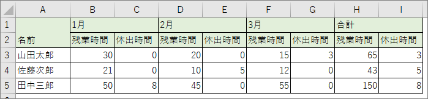

この表に直接残業時間などを入力しても良いが、Excelのデータは「入力用」「集計用」「表示用」の3つに分けた方がよい。
この分け方には以下のメリットがある：

* 「入力用」はシンプルなデータとして管理するので、他の視点で集計したくなったときに対応しやすい。
* 入力作業が簡素化できるので、VBAなどで自動化する際もコーディングしやすくなる。

## 「入力用」シート
最終的に見せたい表の元ネタとなるデータを管理するシートのこと。

先ほど挙げたサンプルの表は、名前が縦に並び、年月と残業時間が横に並んでいた。しかし、入力用シートで管理する際は、「年月」という列を追加し月ごとの残業時間を縦に並べる。

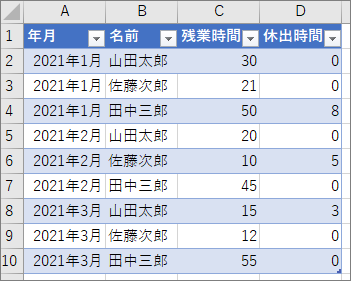

端的に言えば、正規化したテーブルを作成すればよい。

こうしておけば、月ごとにデータが増えても、新しい行を追加していくだけになる。
年月が横に並んでいる場合、1月はB列、2月はD列など、月ごとに入力するべき列が変わってしまう。手作業であればあまり負担だと感じない作業だが、VBAで自動化しようとすると手間が少しかかる。

なお、テーブルを作成する手順は下記の通り：

1. ヘッダー行とそれに続くデータ行を数行作成し、その範囲を選択する。
1. メニューの「挿入」タブ → 「テーブル」をクリック。
1. 「テーブルの作成」ウィンドウが表示されるので、範囲を確認し、「先頭行を見出しとして使用する」にチェックを入れ、OK をクリックする。

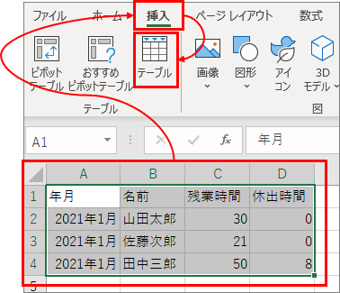

テーブルに設定された範囲が青い枠線で囲まれる。

テーブルの次の行にデータを入力すると、自動的にテーブルの範囲が拡張される。手動で範囲を変更したい場合は、右下の青い塊(？)をドラッグする。

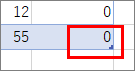

また、テーブルの範囲内のセルを選択すると、メニューに「テーブル デザイン」タブが現れる。
テーブルの色々な設定が変更できるが、中でも「テーブル名」は参照に使うこともあるので、分かりやすい名前を設定しておくとよい。

テーブルをVBAで扱うには、ListObject などを使う。使い方は [別ページ]() にまとめた。

## 「集計用」シート
入力用シートで作ったデータはピボットテーブルで集計する。

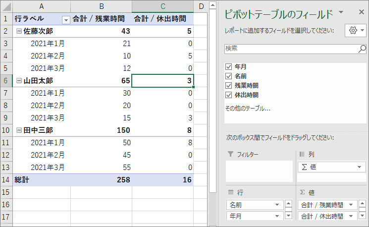

今回のサンプルではデータを集計する必要性が薄いが、それでも一度データをピボットテーブルにしておく利点がある (詳しくは「表示用」シートの章で解説)。

### 複数テーブルを集計する
ピボットテーブルにはリレーションを設定したテーブルを結合して集計する機能もある。

例えば、部門ごとの残業時間集計を求めたい場合、残業時間のテーブルとは別に、従業員ごとの所属部門のテーブルを用意する。

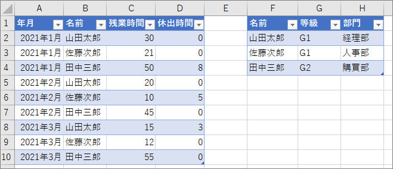

次に、「データ」タブの「リレーションシップ」をクリックする。

「リレーションシップの管理」ウィンドウが表示されるので、「新規作成」をクリックする。

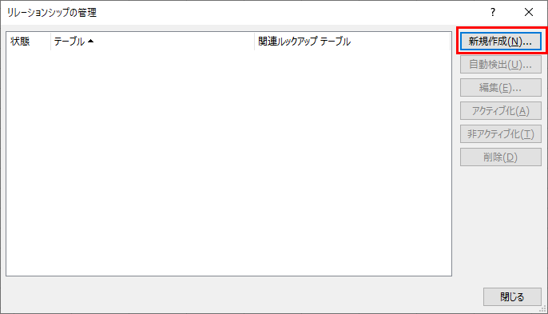

「リレーションシップの作成」ウィンドウが表示されるので、結合する列の主となるテーブルを「関連テーブル」に設定し、従となるテーブルを「テーブル」に設定する (従が上段) 。
今回のサンプルでは、残業時間テーブルが「テーブル」になり、社員情報テーブルが「関連テーブル」になる。

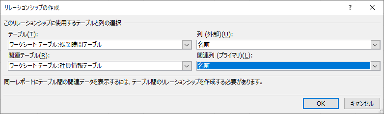

次に、メニューの「挿入」タブ → 「ピボットテーブル」をクリックする。「ピボットテーブルの作成」ウィンドウが表示されるので、「このブックのデータモデルを使用する」を選択し、OKをクリックする。

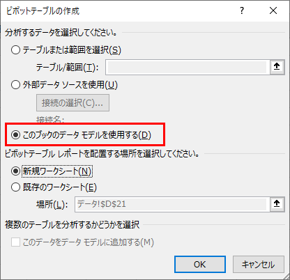

すると、ピボットテーブルに追加できるフィールドに、リレーションシップを設定した2つのテーブルが表示される。

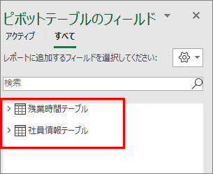

この状態で、「部門」を行ラベルに設定すると、部門ごとの集計ができる。

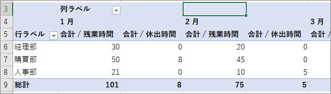

## 「表示用」シート
見た目が整った、人に見せるための表を作る。

データ部分は GETPIVOTDATA 関数を使い、「集計用」シートから取得する。

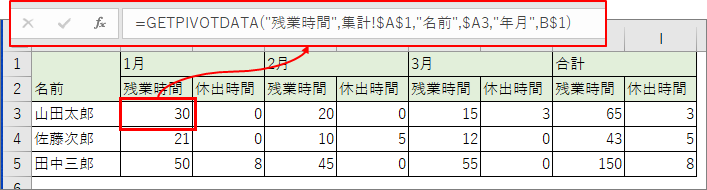

この関数であれば複数のフィールドを条件にして値を取得できるので、VLOOKUP 関数より使い勝手が良いと思う。

## 集計表を運用する
月ごとに残業時間のデータを追加する際は、「入力用」シートにデータを追加し、「集計用」シートのピボットテーブルを更新すればよい。
例えば「表示用」シートの見た目を変更する必要が出てきても、データは残っているので気兼ねなく変更できる。
このようにデータを蓄積し、集計し、報告する必要があるExcelを作る時は、この方法を頭に入れておくと効率の良い運用ができると思う。
