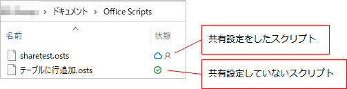
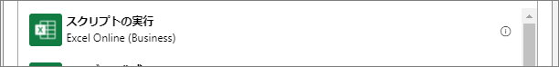

## はじめに
Office スクリプトは、Web 版 Excel で使用できるスクリプトの仕組み。VBA の Web 版と捉えられる。
言語は TypeScript。

Office スクリプトを使うには、Office 365 の商用または教育向けライセンスが必要。もしOffice スクリプトを使えるなら、Web 版 Excel を開いたときにリボンに「自動化」タブが表示される。


表示されない場合、ライセンスを持っていないか、持っていたとしても組織の管理者が機能を制限している可能性がある。

Office スクリプトの利点：

* マクロを Web 版で実行できる
* Power Automate や Azure Logic Apps から呼び出せる。
  * Power Automate で Excel のデータを色々いじりたいときは、Office スクリプトに実装し、Power Automate から呼び出すだけにした方が効率がいい場合がある。さらには、細かい処理を Power Automate で一生懸命作るよりも、まるっと Office Script に書いてしまうという使い方もできるかもしれない。
* 一つのスクリプトを色々なブックへ使いまわせる。
  * スクリプトはユーザー個人ごとに保存され、それを色々なブックで使うイメージ。

Office スクリプトのデメリット：

* デスクトップアプリでは利用できない。
* 共有設定をしない限りスクリプト作成者本人しか使用できない。
  * スクリプトはブックには含まれず、ユーザー個人の OneDrive に保存されるため.

## 始め方
Web 版 Excel で新しいファイルを作成するか、OneDrive または SharePoint 上に作成した Excel ファイルを Web 版で開いてもいい。
リボンに「自動化」タブがあるので、クリックする。
画面右側に表れるウィンドウで、スクリプトの管理を行う。

## スクリプトの基本
[Scripting fundamentals for Office Scripts in Excel on the web - Office Scripts | Microsoft Docs](https://docs.microsoft.com/en-us/office/dev/scripts/develop/scripting-fundamentals)

### main 関数
すべてのスクリプトには、main 関数が必要。この関数がスクリプトのエントリーポイントになる。

```typescript
function main(workbook: ExcelScript.Workbook) {
  // ここに処理を書く
}
```
[Office Scripts API reference - Office Scripts | Microsoft Docs](https://docs.microsoft.com/en-us/javascript/api/office-scripts/overview?view=office-scripts)

## スクリプトが保存される場所

[Office Scripts file storage and ownership - Office Scripts | Microsoft Docs](https://docs.microsoft.com/en-us/office/dev/scripts/overview/script-storage)

VBA と違い、Office Script はブックとは別の場所に保存される。

スクリプトは、スクリプトを作成したユーザーの OneDrive に保存される。そのため、共有設定をしない限り、他の人はそのスクリプトを編集したり実行することはできない。



共有設定をしても保存場所は変わらないため、スクリプト作成者のアカウントを削除するとスクリプトも一緒に削除されると考えられる。
複数人でスクリプトを共有する場合は、バックアップを共有フォルダ (SharePoint とか) に取っておくと良いかもしれない。


## エディタ
[Office Scripts Code Editor environment - Office Scripts | Microsoft Docs](https://docs.microsoft.com/en-us/office/dev/scripts/overview/code-editor-environment)

下記がスクリプトの編集画面。


VS Code がベースになっているので、VS Code みたいに IntelliSense が使えたりする。

### 文字を大きくする
エディタの文字が小さくて見づらい場合は、大きくすることができる。

1. F1 キーを押してコマンドパレットを表示する。
1. Font と入力し、「Editor Font Zoom In」を選ぶ。
1. 文字が少し大きくなる。もっと大きくしたい場合は、1～3の手順を繰り返す。


## Power Automate から実行する

1. アクションの一覧から「Excel Online (Business)」を選ぶ。<br>
1. 「スクリプトの実行」を選ぶ。<br>
1. スクリプトを書いた Excel ファイルを指定すると、「スクリプト」のリストがファイルに定義したスクリプトの一覧になる。
1. さらにスクリプトを選択すると、そのスクリプトの main 関数に追加した引数が入力項目として現れる。<br>

## サンプル

### 日付のシリアル値→JavaScriptの日付型の変換
日付が格納されたセルの値を取ると、シリアル値になっている。
これを JavaScript の日付型に変換するサンプル。

```typescript
/**
 * 日付シリアル値をJavaScriptの日付型へ変換する
 */
function convertSerialToDate(dateSerial: number) {
  let milliseconds = Math.round((dateSerial - 25569) * 86400 * 1000);
  milliseconds -= (9 * 60 * 60 * 1000);  // タイムゾーンの調整
  let javaScriptDate = new Date(milliseconds);
  
  return javaScriptDate;
}
```

Excel の日付シリアル値は 1900-01-01 から 1ずつ増える。対して JavaScript の `new Date(ミリ秒)` は、1970-01-01(UTC) から増えたミリ秒を指定する。
25569 は 1900-01-01 ～ 1970-01-01 の日数。

そして、コンストラクタに指定するミリ秒は UTC が基準であるのに対して Excel にはタイムゾーンがないため、JST で書かれた日付のシリアル値をそのまま足すと9時間早くなってしまう。
その差を調整するために9時間分のミリ秒を引いている。この調整は、Excel の日付がどのタイムゾーンを前提として記載されているかによって変わる。

### JavaScriptの日付型→日付のシリアル値の変換
先ほどのサンプルとは逆に、日付型からシリアル値へ変換するサンプル。

```js
/**
 * JavaScriptの日付型を、Excelの日付シリアル値へ変換する
 */
function convertDateToSerial(dt: Date) {
  let seconds = dt.getHours() * 60 * 60;
  seconds += dt.getMinutes() * 60;
  seconds += dt.getSeconds();

  let serial = Math.round(dt.getTime() / 1000 / 86400 + 25569);

  serial += seconds / 86400;
  serial = Math.round(serial * 100000) / 100000; // 小数点以下5桁を残して四捨五入
  
  return serial;
}
```

日数については、先ほどのサンプルの反対の計算を行う。
時刻は例えば PM 0:00 の場合は 0.5 となるため、0時からの秒数 / 24時間の秒数 で求めている。

JavaScript の getHours() などは実行環境のローカル時刻を返す。このサンプルではそれを意図したものとして、タイムゾーンの変換は行っていない。

### 土日祝日を避けて日付を加減算する
「稼働日ベースで10日前」という感じの計算をするためのサンプル。
スクリプトを実行するブックに、「祝日リスト」というテーブルがあることが前提。

↓ 祝日リストのサンプル  


```js
/**
 * 日付に日数を加算する。
 * 土日祝日は日数から除外する。つまり稼働日のみで日数を加算。
 */
function addDaysAndSkipHolidays(workbook: ExcelScript.Workbook, dateSerial: number, daysAdd: number) {

  let table = getHolidayTable(workbook);
  let dataRange = table.getRangeBetweenHeaderAndTotal();
  let holidays = dataRange.getValues();

  let increment = 1;
  let count = daysAdd;

  if (daysAdd < 0) {
    increment = -1;
    count *= -1;
  }

  let result = dateSerial;

  for (let i=0; i<count; i++) {
    result += increment;
    // 休日のスキップ
    result = skipHolidays(holidays, result, increment);
  }

  return result;
}

/**
 * 引数の日付シリアル値が土日祝の場合、その分だけ日付をずらす
 */
function skipHolidays(holidays: (string | number | boolean)[][], dtSerial: number, increment: number) {
  
  let result = dtSerial;
  let dt = convertDate(result);

  // 土日祝のいずれかの場合、1日ずらして再帰呼び出し
  if (dt.getDay() == 0 
      || dt.getDay() == 6 
      || isExtraHoliday(holidays, dtSerial)) {
    result += increment;
    result = skipHolidays(holidays, result, increment);
  }

  return result;
}

/**
 * 引数の日付シリアル値が祝日かどうか判定する
 */
function isExtraHoliday(holidays: (string | number | boolean)[][], dtSerial: number) {
  let holidayCount = holidays.length;

  for (let i = 0; i < holidayCount; i++) {
    let holidaySerial = holidays[i][0] as number;
    if (dtSerial == holidaySerial) {
      return true;
    }
  }
  return false;
}

/**
 * ブックから「祝日リスト」という名前のテーブルを探す
 */
function getHolidayTable(workbook: ExcelScript.Workbook) {
  let worksheets = workbook.getWorksheets();
  for (let sheet of workbook.getWorksheets()) {
    for (let table of sheet.getTables()) {
      if (table.getName() == "祝日リスト") {
        return table;
      }
    }
  }
  return null;
}

/**
 * 日付シリアル値をJavaScriptの日付型へ変換する
 */
function convertDate(dateSerial: number) {
  let milliseconds = Math.round((dateSerial - 25569) * 86400 * 1000);
  milliseconds -= (9 * 60 * 60 * 1000);  // タイムゾーンの調整
  let javaScriptDate = new Date(milliseconds);
  
  return javaScriptDate;
}
```

### テーブルにフィルタを設定し結果を取得する

```typescript
function main(workbook: ExcelScript.Workbook)
{
  let sheet = workbook.getWorksheet("Sheet1");
  let table = sheet.getTable("テーブル1");
  
  // フィルタ
  table.clearFilters();
  let column = table.getColumnByName("列1");
  column.getFilter().applyValuesFilter(["検索したい値"]);

  // 結果を取得
  let range = table.getRange().getVisibleView();
  if (range.getRowCount() == 0) {
    return;
  }

  // values は Object[][] 型。1行目にヘッダー、2行目以降にデータ行。
  console.log(range.getValues());
}
```

### テーブルをJSONへ変換する

```javascript
function main(workbook: ExcelScript.Workbook): TableData[] {
  const table = workbook.getWorksheet("Sheet1").getTable("テーブル1");
  // テーブルの値を表示されているテキストの形式で取得
  const texts = table.getRange().getTexts();
  
  let result = convertToJson(texts);

  console.log(result);
}

// テーブルの値(二次元配列)をJSONにする。
function convertToJson(values: Object[][]) {
  let result = {};

  if (values == null || values.length < 2) {
    return null;
  }

  // 1行目はヘッダー行なので2行目から始める
  for (let i:number = 1; i<values.length; i++) {
    for (let j:number = 0; j<values[i].length; j++) {
      let key = values[0][j] as string;
      let value = values[i][j];

      result[key] = value;
    }
  }

  return result;
}
```

