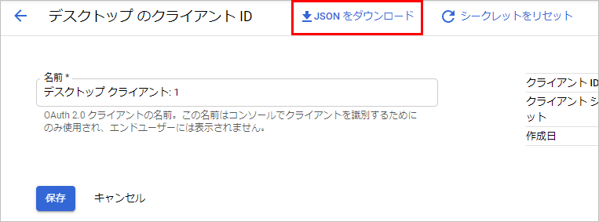
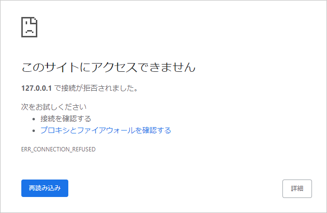

## はじめに
.NET Core のアプリケーションからGoogle APIを呼び出すときに使えるライブラリがある。

参考：[API Client Library for .NET  |  Google Developers](https://developers.google.com/api-client-library/dotnet)

NuGet で公開されているパッケージは、[ここから](https://www.nuget.org/packages?q=google.apis&prerelease=true&sortOrder=relevance)検索できる。

### 前提条件

* Windows 10
* .NET Core 3.1
* C#

## コンソールアプリでOAuth認証を使う

まず、.NET Core のコンソールアプリを作る。

```
dotnet new console -n TestProject
```

プロジェクトフォルダで下記を実行し、Google のライブラリをインストールする。

```
dotnet add package Google.Apis
dotnet add package Google.Apis.Auth
```

Google Cloud Platform からjsonファイルをダウンロードし、プロジェクトルートフォルダに置く。



その際、ファイル名を`client_secret.json`などにしておく。
また、このファイルはうっかりGitHubへコミットしたり、本番環境へリリースしないように気を付ける。

コードのサンプルは下記の通り。

```csharp
using System;
using System.Threading;
using System.Threading.Tasks;
using Google.Apis.Auth.OAuth2;
using Google.Apis.Util.Store;
using Google.Apis.Fitness.v1;
using System.IO;

namespace TestProject
{
	class Program
	{
		[STAThread]
		static void Main(string[] args)
		{
			new Program().Run().Wait();
		}

		private async Task Run()
		{
			UserCredential credential;
			using (var stream = new FileStream("client_secret.json", FileMode.Open, FileAccess.Read))
			{
				credential = await GoogleWebAuthorizationBroker.AuthorizeAsync(
					GoogleClientSecrets.Load(stream).Secrets,
					new[] { FitnessService.Scope.FitnessActivityRead, FitnessService.Scope.FitnessActivityWrite },
					"user", CancellationToken.None, new FileDataStore("TestProject"));
			}
			// この後APIを呼び出す
		}
	}
}
```

このサンプルでは、`GoogleWebAuthorizationBroker.AuthorizeAsync`メソッドを実行して、`UserCredential` の新しいインスタンスを取得している。
`AuthorizeAsync`メソッドでは、以下の引数を指定する。

* クライアントシークレット。または、クライアントシークレットを保存したファイルのStream。
* アプリケーションで要求するスコープ。各サービスごとに `XXXService` というクラスがあり、それぞれ `Scope` という列挙体を持っているのでそれを使用できる。
* 認証を行うユーザーのID。
* Cancellation Token。
* アクセストークンの保管場所。サンプルでは、`%AppData%\TestProject` フォルダを指定している。

サンプルを実行するとブラウザが起動し、ユーザーにこのアプリを許可するか確認するページが開く。
アクセスを許可すると、`127.0.0.1`へリダイレクトされるが、Webサーバーを起動しているわけではないので、読み込めないエラーになる。



これでもアクセストークンの保存には成功している。


