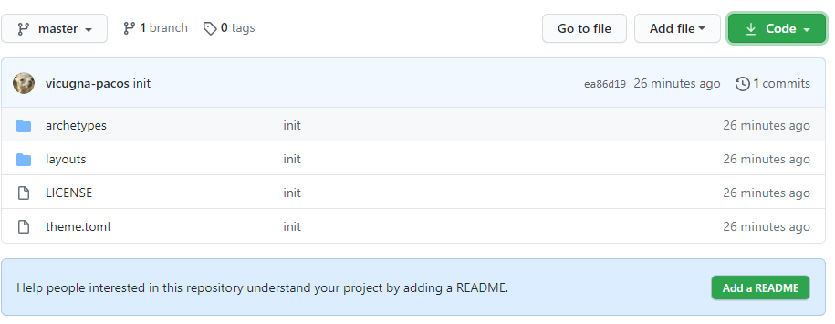

## はじめに
Hugoのテーマを作るときに、まずやること。  
Hugo バージョン：v0.74.3

## テーマをテストするためのサイトを用意する
まずテーマを表示するためのサイトを作成する。公式で用意されているサンプル用のサイトを使うのが手っ取り早い。

gohugoio/hugoBasicExample: Example site to use with Hugo & Hugo Themes  
https://github.com/gohugoio/hugoBasicExample

ただこのサンプルが、自分が作りたいサイトの構造と合っているか分からないし、サイトの内容を把握できていないとテーマの動きも把握しづらいので、
自分で空サイトを作成し、mdファイルをいくつか作ってから取り掛かるのも良いかもしれない。

### 空のテーマを作る
サイト用フォルダで、下記コマンドを実行する。

```
hugo new theme [テーマ名]
```

`themes`フォルダにテーマ名のフォルダが作成され、基本的なファイル達も作成されている。

以下、作成されるファイルの一覧：

    テーマ名フォルダ
    ├ archetypes
    │   └ default.md
    ├ layouts
    │   ├ _default
    │   │   ├ baseof.html  <- 全てのページのベースになるファイル
    │   │   ├ list.html  <- セクションページ
    │   │   └ single.html  <- 単体ページ
    │   ├ partials
    │   │   ├ footer.html
    │   │   ├ head.html
    │   │   └ header.html
    │   ├ 404.html
    │   └ index.html     <- トップページ
    ├ static
    │   ├ css
    │   └ js
    ├ LICENSE
    └ theme.toml

### テーマをGitリポジトリにする
テーマ名のフォルダを、サイトとは別のGitリポジトリにする。
そうすることで、他のサイトにもテーマを使えるようになる。



テーマの再利用は特に考えていないなら、サイトの一部としてリポジトリへコミットする。

## テーマを使うよう設定する
`config.toml` へ以下を追記し、サイトへテーマを適用する。

```toml
theme = "テーマ名フォルダ"
```

