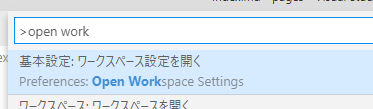

## はじめに
Hugo で作るサイトの Markdown を書くツールとして、VS Code を使う場合にあると便利な拡張機能などの紹介。
Hugo のために作られた拡張機能はいくつかあるようだが、ひとまずは使わずにいる。

## Hugo コマンドを実行
Hugo サイトにしたフォルダで VS Code を起動していれば、VS Code のターミナルから Hugo コマンドを実行できる。
ターミナルにフォーカスを移すには、`Ctrl` + `@` を押す。

## 拡張機能 Paste Image の追加
クリップボードにある画像を Markdown へ貼り付けられる。実際の画像はファイルとして保存され、Markdown には画像へのリンクが挿入される。

[VS Marketplace リンク](https://marketplace.visualstudio.com/items?itemName=mushan.vscode-paste-image)

画像を貼り付けるときは、`Ctrl` + `Alt` + `V` を押す。画像は、貼り付け先のファイルがあるフォルダに保存される。

## 拡張機能 Insert Date String の追加
Markdown の Front Matter に日付を書きたいときなど、現在日付をショートカットキー一つで挿入できるようにする。

[VS Marketplace リンク](https://marketplace.visualstudio.com/items?itemName=jsynowiec.vscode-insertdatestring)

`Ctrl` + `Shift` + `I` で日時が挿入される。
既定のままだと日時の形式が Hugo に適したものではないため、設定を変更するとよい。

設定を開くには `F1` を押してから「Open Workspace Settings」と入力して出てきたものをクリック。

これで変更できるのはワークスペースのみで有効な設定なので、もし全体的に設定変更したい場合は、「Open User Settings」などを選ぶ。

開いた設定画面で、左側の「拡張機能」から「Insert Date String」を選択する。
「Insert Date String: Format」の部分に `YYYY-MM-DDThh:mm:ssZZZ` と入力して設定画面を閉じる。

これで形式の変更は完了。

## Markdownのプレビュー
VS Code 上でも、Markdownをプレビューできる。
Markdownファイルを開いた状態で、`Ctrl` + `K` → `V` と押す(Vを押すときはCtrlから手を離す)。
すると、エディタの右半分がプレビュー画面になる。
Hugo 上で確認する場合と細かいところは異なるが、簡単にプレビューを確認するときに役に立つと思う。

