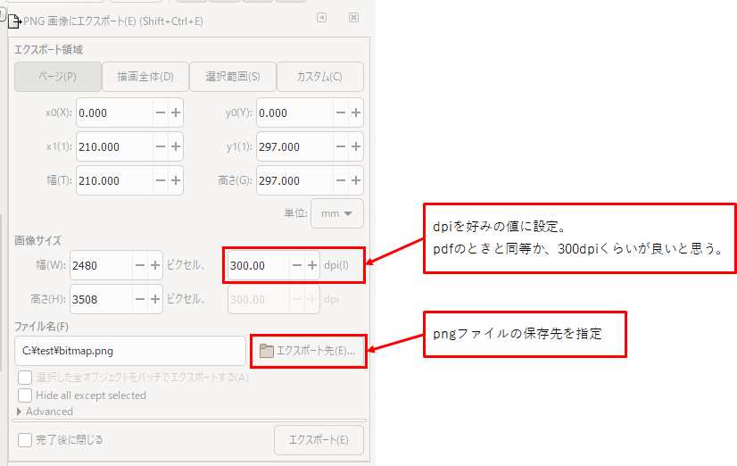

## 概要
PDFファイルをpngなどの画像へ変換する方法。

フリーの画像編集ソフト「Inkscape」を使う。
(使用したバージョン：1.0.1)

仕事でOCRサービスを使っているが、スキャンした書類から文字を消して白紙を作ったり、2ページ目を取り出したりしたいとき、pdfを画像にしたくなる。
Acrobat Readerでは変換できず、製品を買わなきゃいけないし、Webサイトのサービスは機密情報があると使いづらい。

ちなみに、同じことが「GIMP」でも可能。両方試してみた結果、扱いやすそうなInkscapeを使うことにした。

## 手順

Inkscapeをダウンロードする。

[Draw Freely | Inkscape](https://inkscape.org/ja/)

ダウンロード後、インストールする。

インストール後、起動する。

### pdfファイルを開く
メニューの「ファイル」→「開く」でpdfファイルを選ぶ。

PDFインポート設定の画面が出てくるので、「Puppler/Cairo import」か「Internal import」のどちらかを選ぶ。

特に加工する必要がない場合、選んだほうで不満があればもう一つの選択肢を選ぶ、くらいで良いと思う。

### PNGとして保存する
メニューの「ファイル」→「PNG画像にエクスポート」を選ぶ。

画面右側にエクスポートの画面が出てくる。

基本的には「ページ」を対象として、dpiをいじりつつエクスポートするのが良いと思う。

