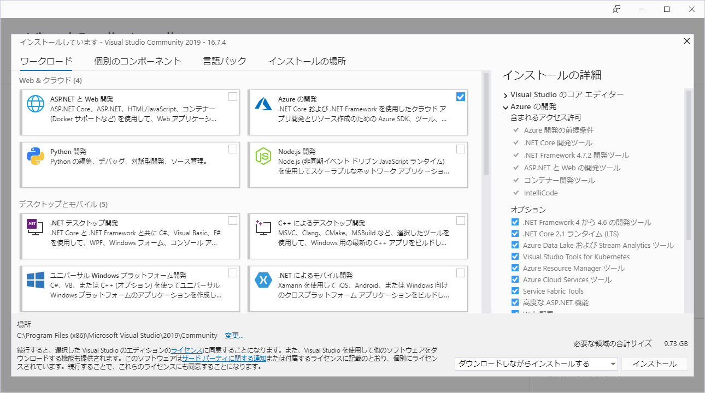

## はじめに
Azureの学習をしてみようと思うと、言語はやはりC#かなと思って.NET Coreを触ってみた。

環境などの前提条件：

* Windows 10
* Visual Studio 2019 Community 版で開発

## Visual Studio のインストール
開発ツールは Visual Studio が良いらしい。VS Code でも頑張れるが、効率が落ちるっぽい。
下記Webサイトで、Visual Studio の Community 版をダウンロードする。Community 版は、個人開発の用途であれば無料で使用可能。

[Download Visual Studio 2019 for Windows & Mac](https://visualstudio.microsoft.com/ja/downloads/)

ダウンロードしたインストーラを起動すると、インストールするワークロード(用途みたいなもの)を選択する画面がでる。

今回は Azure に乗せるアプリの開発が目的なので、「Azureの開発」にチェックを入れてインストールした。

## 製品利用統計情報収集のオプトアウト
.NET Core SDKをインストールすると、既定で利用情報の送信が有効になっている。
これをオプトアウトしたい場合は、Windowsの環境変数に`DOTNET_CLI_TELEMETRY_OPTOUT`を追加し、値を`1`または`true`にする。

